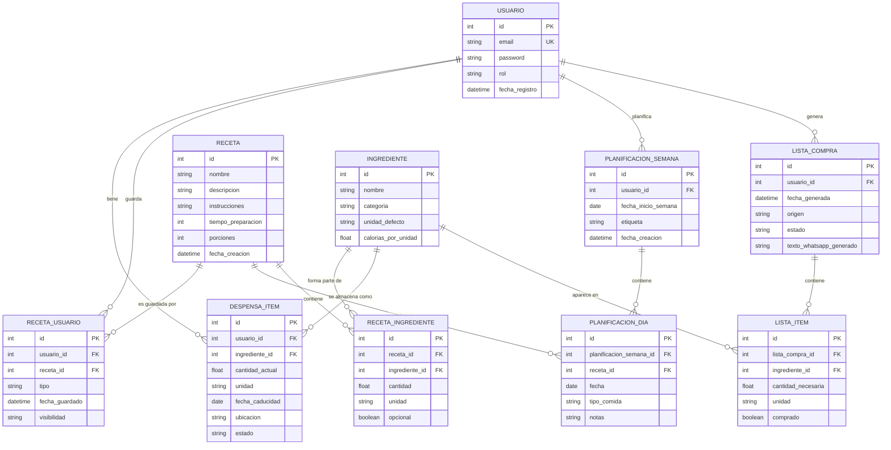

# Despiensa - Backend API REST (DWES)

Aplicación backend desarrollada con **Spring Boot + JPA/Hibernate + MySQL** para la gestión inteligente de despensa y recetas.

---

## 📑 Índice

### **Entrega 1: Modelo de Datos**

1. [1.1 Modelo de Datos - Diagrama E/R](#11-modelo-de-datos---diagrama-er)
2. [1.2 Entidades JPA](#12-entidades-jpa)
3. [1.3 DTOs Iniciales](#13-dtos-iniciales)
4. [1.4 Repositorios](#14-repositorios)

### **Entrega 2: Controladores y Servicios**
*(Por documentar)*

### **Entrega Seguridad: Autenticación y Autorización**
*(Por documentar)*

---

## 1.1 Modelo de Datos - Diagrama E/R

### Descripción del Dominio

El sistema **Despiensa** gestiona la despensa de un usuario, las recetas disponibles, la planificación semanal de comidas y la generación de listas de compra. El modelo está diseñado para permitir:

- Almacenar y gestionar ingredientes en la despensa personal.
- Consultar recetas y sus ingredientes necesarios.
- Guardar recetas favoritas o personalizadas por usuario.
- Planificar comidas por días de la semana.
- Generar listas de compra automáticamente basadas en la planificación.
- Alertar sobre caducidad de productos (futuro).

---

### Diagrama E/R (Modelo Conceptual)

---

### Justificación del Diseño

#### **USUARIO**
- Centro del sistema: cada usuario tiene su propia despensa, recetas y planificación independientes.
- Incluye autenticación (email, password) y autorización (rol).
- Relaciones 1:N con entidades que pertenecen al usuario.

#### **RECETA e INGREDIENTE**
- Relación N:M: una receta puede tener muchos ingredientes y un ingrediente aparece en muchas recetas.
- Tabla intermedia **RECETA_INGREDIENTE** permite almacenar cantidad y unidad por receta.

#### **RECETA_USUARIO**
- Relación N:M entre USUARIO y RECETA.
- Permite guardar recetas favoritas, propias o compartidas con metadata como fecha de guardado.

#### **DESPENSA_ITEM**
- Almacena los ingredientes que el usuario tiene actualmente.
- Incluye fecha de caducidad, ubicación y estado para alertas y búsquedas.

#### **PLANIFICACION_SEMANA y PLANIFICACION_DIA**
- Relación 1:N: una semana contiene varios días con comidas.
- Cada día puede tener una receta asignada por tipo de comida (desayuno, comida, cena).

#### **LISTA_COMPRA y LISTA_ITEM**
- Relación 1:N: una lista contiene múltiples items.
- Se genera automáticamente a partir de la planificación semanal.
- Campo `comprado` permite marcar items mientras se compra.

#### **Relaciones Bidireccionales vs Unidireccionales**
- Mantenidas principalmente **unidireccionales** (USUARIO → sus entidades) para evitar ciclos y mantener claridad.
- Solo se añaden navegaciones bidireccionales cuando sea realmente necesario (ej: para consultas frecuentes).

---

### Tipos de Datos y Enums

| Entidad | Campo | Tipo | Notas |
|---------|-------|------|-------|
| USUARIO | rol | ENUM | `ROLE_USER`, `ROLE_ADMIN` |
| DESPENSA_ITEM | ubicacion | ENUM | `NEVERA`, `CONGELADOR`, `DESPENSA`, `MOSTRADOR` |
| DESPENSA_ITEM | estado | ENUM | `OK`, `PROXIMO_A_CADUCAR`, `CADUCADO` |
| PLANIFICACION_DIA | tipo_comida | ENUM | `DESAYUNO`, `COMIDA`, `CENA` |
| LISTA_COMPRA | estado | ENUM | `PENDIENTE`, `COMPRADA` |
| RECETA_USUARIO | tipo | ENUM | `FAVORITA`, `PROPIA` |

---

### Convenciones de Base de Datos

- **Nombre de tablas**: `snake_case` (ej: `despensa_item`, `receta_usuario`)
- **Claves primarias**: `id` (auto-increment)
- **Claves foráneas**: `{entidad}_id` (ej: `usuario_id`, `receta_id`)
- **Campos únicos**: `email` en USUARIO
- **Fechas**: `LocalDate` o `LocalDateTime` según contexto
- **Booleans**: almacenados como TINYINT(1) en MySQL

---

## 1.2 Entidades JPA

### Arquitectura y Convenciones

Las entidades JPA se encuentran en el paquete `com.example.backend.model` siguiendo estas convenciones:

- **Anotaciones JPA**: `@Entity`, `@Table`, `@Id`, `@GeneratedValue`, `@ManyToOne`, `@OneToMany`, `@JoinColumn`, etc.
- **Validación**: Anotaciones de Jakarta Validation (`@NotNull`, `@NotBlank`, `@Email`, `@Size`, etc.)
- **Lombok**: `@Data`, `@NoArgsConstructor`, `@AllArgsConstructor`, `@Builder` para reducir boilerplate
- **Relaciones**: Principalmente **unidireccionales** para evitar ciclos; `FetchType.LAZY` por defecto
- **Exclusiones Lombok**: `@ToString.Exclude` y `@EqualsAndHashCode.Exclude` en colecciones para evitar problemas con proxies de Hibernate

### Entidades Creadas (10 total)

1. **Usuario** - Centro del sistema (email, password, rol, fechaRegistro)
2. **Receta** - Catálogo de recetas (nombre, instrucciones, tiempoPreparacion, porciones)
3. **Ingrediente** - Catálogo de ingredientes (nombre, categoría, unidadDefecto, calorías)
4. **RecetaIngrediente** - N:M Receta ↔ Ingrediente (cantidad, unidad, opcional)
5. **RecetaUsuario** - N:M Usuario ↔ Receta (tipo: FAVORITA|PROPIA)
6. **DespensaItem** - Items en despensa (cantidadActual, fechaCaducidad, ubicación, estado)
7. **PlanificacionSemana** - Agrupa planificación semanal (fechaInicio, etiqueta)
8. **PlanificacionDia** - Comida planificada (fecha, tipoComida, receta)
9. **ListaCompra** - Listas de compra (origen, estado, textoWhatsapp)
10. **ListaItem** - Items de compra (cantidad, unidad, comprado)

### Tipos Enumerados

| Entidad | Enum | Valores |
|---------|------|---------|
| Usuario | Rol | ROLE_USER, ROLE_ADMIN |
| RecetaUsuario | TipoRecetaUsuario | FAVORITA, PROPIA |
| DespensaItem | UbicacionDespensa | NEVERA, CONGELADOR, DESPENSA, MOSTRADOR |
| DespensaItem | EstadoDespensaItem | OK, PROXIMO_A_CADUCAR, CADUCADO |
| PlanificacionDia | TipoComida | DESAYUNO, ALMUERZO, COMIDA, MERIENDA, CENA |
| ListaCompra | EstadoListaCompra | PENDIENTE, COMPRADA |

---

## 1.3 DTOs Iniciales

### Estrategia de DTOs

Los DTOs (Data Transfer Objects) se encuentran en el paquete `com.example.backend.dto` y siguen estas convenciones:

- **Request DTOs**: Para operaciones de creación/actualización (`CreateRequest`, `UpdateRequest`)
- **Response DTOs**: Para devolver datos al cliente (`Response`)
- **Validación**: Anotaciones Jakarta Validation en Request DTOs
- **Composición**: Response DTOs anidan otras Response para relaciones (evitando ciclos)
- **Proyección**: Los DTOs seleccionan qué campos exponer (seguridad: no incluir passwords)

### DTOs por Entidad (26 total)

| Entidad | DTOs | Propósito |
|---------|------|-----------|
| Usuario | UsuarioCreateRequest, UsuarioResponse | Registro y obtener datos |
| Receta | RecetaCreateRequest, RecetaResponse, RecetaDetailedResponse | Crear, obtener básico y con ingredientes |
| Ingrediente | IngredienteCreateRequest, IngredienteResponse | Crear e información |
| RecetaIngrediente | RecetaIngredienteCreateRequest, RecetaIngredienteResponse | Agregar a receta e información |
| RecetaUsuario | RecetaUsuarioCreateRequest, RecetaUsuarioResponse | Guardar receta e información |
| DespensaItem | DespensaItemCreateRequest, DespensaItemUpdateRequest, DespensaItemResponse | Operaciones CRUD |
| PlanificacionSemana | PlanificacionSemanaCreateRequest, PlanificacionSemanaResponse | Crear y obtener con días |
| PlanificacionDia | PlanificacionDiaCreateRequest, PlanificacionDiaResponse | Crear y obtener |
| ListaCompra | ListaCompraCreateRequest, ListaCompraResponse | Crear y obtener con items |
| ListaItem | ListaItemCreateRequest, ListaItemResponse | Agregar a lista e información |

---

## 1.4 Repositorios

### Arquitectura y Estrategia

Los repositorios JPA se encuentran en el paquete `com.example.backend.repository` y extienden `JpaRepository` para:

- Operaciones CRUD básicas (heredadas de JpaRepository)
- Consultas personalizadas con `@Query` (JPQL y nativas)
- Consultas derivadas (method names)
- Paginación y ordenación
- Agregaciones y conteos

### Repositorios Creados (10 total)

#### 1. **UsuarioRepository**
Consultas personalizadas:
- `findByEmail(email)` - Búsqueda por email (autenticación)
- `existsByEmail(email)` - Verificación de unicidad
- `findByRol(rol)` - Listar usuarios por rol

---

#### 2. **RecetaRepository**
Consultas personalizadas:
- `findByNombreContainingIgnoreCase(nombre)` - Búsqueda parcial
- `findByNombreContainingIgnoreCase(nombre, Pageable)` - Con paginación
- `findRecetasRapidas(minutos)` - Recetas por tiempo de preparación
- `findByPorciones(porciones)` - Filtro por porciones
- `findAllOrderByFechaCreacionDesc()` - Ordenado por fecha

---

#### 3. **IngredienteRepository**
Consultas personalizadas:
- `findByNombreContainingIgnoreCase(nombre)` - Búsqueda parcial
- `findByCategoria(categoria)` - Filtro por categoría
- `findByNombreIgnoreCase(nombre)` - Búsqueda exacta case-insensitive
- `existsByNombreIgnoreCase(nombre)` - Verificación de existencia
- `findAllOrderByNombre()` - Ordenado alfabéticamente
- `findDistinctCategories()` - Todas las categorías únicas

---

#### 4. **RecetaIngredienteRepository**
Consultas personalizadas:
- `findByRecetaId(recetaId)` - Ingredientes de una receta
- `countByRecetaId(recetaId)` - Número de ingredientes
- `findIngredientesOpcionalesByRecetaId(recetaId)` - Solo opcionales
- `findByIngredienteId(ingredienteId)` - Recetas que contienen ingrediente
- `countRecetasByIngredienteId(ingredienteId)` - Número de recetas
- `existsByRecetaIdAndIngredienteId(recetaId, ingredienteId)` - Verificación

---

#### 5. **RecetaUsuarioRepository**
Consultas personalizadas:
- `findByUsuarioId(usuarioId)` - Recetas guardadas por usuario
- `findFavoritasByUsuarioId(usuarioId)` - Solo favoritas
- `findPropiasByUsuarioId(usuarioId)` - Solo propias
- `findByUsuarioIdAndRecetaId(usuarioId, recetaId)` - Búsqueda específica
- `existsByUsuarioIdAndRecetaId(usuarioId, recetaId)` - Verificación
- `countByUsuarioId(usuarioId)` - Total guardadas
- `countFavoritasByUsuarioId(usuarioId)` - Total favoritas
- `countUsuariosByRecetaId(recetaId)` - Popularidad de receta

---

#### 6. **DespensaItemRepository**
Consultas personalizadas:
- `findByUsuarioId(usuarioId)` - Items de la despensa
- `findByUsuarioId(usuarioId, Pageable)` - Con paginación
- `findByUsuarioIdAndIngredienteId(usuarioId, ingredienteId)` - Item específico
- `findCaducadosByUsuarioId(usuarioId)` - Productos caducados
- `findProximoCaducarByUsuarioId(usuarioId)` - Próximos a caducar
- `findOkByUsuarioId(usuarioId)` - Productos en buen estado
- `findByUsuarioIdAndUbicacion(usuarioId, ubicacion)` - Por ubicación
- `findCaducadosAntesDeFecha(usuarioId, fecha)` - Caducados antes de fecha
- `findByUsuarioIdAndIngredienteNombre(usuarioId, nombre)` - Búsqueda por nombre
- `countByUsuarioId(usuarioId)` - Total de items

---

#### 7. **PlanificacionSemanaRepository**
Consultas personalizadas:
- `findByUsuarioId(usuarioId)` - Planificaciones del usuario
- `findByUsuarioId(usuarioId, Pageable)` - Con paginación
- `findMostRecentByUsuarioId(usuarioId)` - Más reciente
- `findByUsuarioIdAndFechaInicio(usuarioId, fechaInicio)` - Por fecha
- `findByUsuarioIdAndFechaRange(usuarioId, fechaInicio, fechaFin)` - Rango de fechas
- `countByUsuarioId(usuarioId)` - Total de planificaciones
- `findByUsuarioIdAndEtiqueta(usuarioId, etiqueta)` - Por etiqueta

---

#### 8. **PlanificacionDiaRepository**
Consultas personalizadas:
- `findByPlanificacionSemanaId(planificacionSemanaId)` - Días de una semana
- `findByPlanificacionSemanaIdAndFechaAndTipoComida(...)` - Día específico
- `findByPlanificacionSemanaIdAndFecha(...)` - Comidas de un día
- `findByPlanificacionSemanaIdAndTipoComida(...)` - Comidas de un tipo
- `findWithRecetaByPlanificacionSemanaId(...)` - Solo con receta
- `findWithoutRecetaByPlanificacionSemanaId(...)` - Solo sin receta
- `countWithReceta(planificacionSemanaId)` - Número con receta
- `findDistinctRecetasByPlanificacionSemanaId(...)` - Recetas únicas

---

#### 9. **ListaCompraRepository**
Consultas personalizadas:
- `findByUsuarioId(usuarioId)` - Listas del usuario
- `findByUsuarioId(usuarioId, Pageable)` - Con paginación
- `findPendientesByUsuarioId(usuarioId)` - Listas pendientes
- `findCompradasByUsuarioId(usuarioId)` - Listas compradas
- `findMostRecentByUsuarioId(usuarioId)` - Más reciente
- `findMostRecentPendienteByUsuarioId(usuarioId)` - Última pendiente
- `findByUsuarioIdAndOrigen(usuarioId, origen)` - Por origen
- `findByUsuarioIdAndFechaRange(usuarioId, fechaInicio, fechaFin)` - Rango de fechas

---

#### 10. **ListaItemRepository**
Consultas personalizadas:
- `findByListaCompraId(listaCompraId)` - Items de una lista
- `findNotCompradosByListaCompraId(listaCompraId)` - Sin comprar
- `findCompradosByListaCompraId(listaCompraId)` - Comprados
- `findByListaCompraIdAndIngredienteId(...)` - Item específico
- `countByListaCompraId(listaCompraId)` - Total de items
- `countNotCompradosByListaCompraId(listaCompraId)` - Sin comprar
- `countCompradosByListaCompraId(listaCompraId)` - Comprados
- `existsByListaCompraIdAndIngredienteId(...)` - Verificación
- `getPorcentajeComprado(listaCompraId)` - Porcentaje comprado (SQL nativa)

---

## Resumen de Entrega 1

**Diagrama E/R** - Mermaid con 10 entidades y relaciones  
**Entidades JPA** - 10 clases con Lombok y validación  
**DTOs Iniciales** - 26 DTOs (Request/Response)  
**Repositorios** - 10 repositorios con 80+ consultas personalizadas  

**Próximo paso**: Entrega 2 - Controladores y Servicios

---

## Entrega 2: Controladores y Servicios
*(Por documentar)*

## Entrega Seguridad: Autenticación y Autorización
*(Por documentar)*

