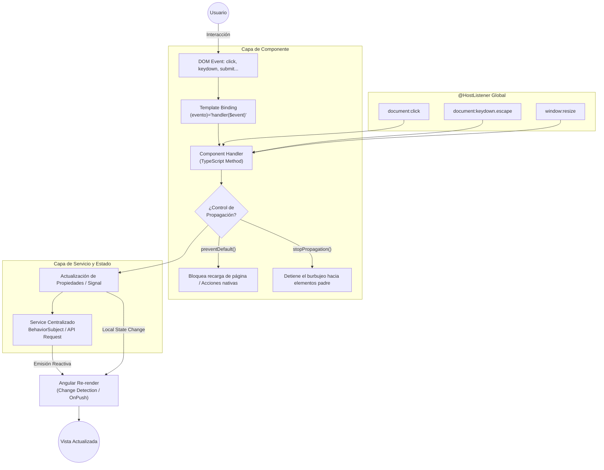
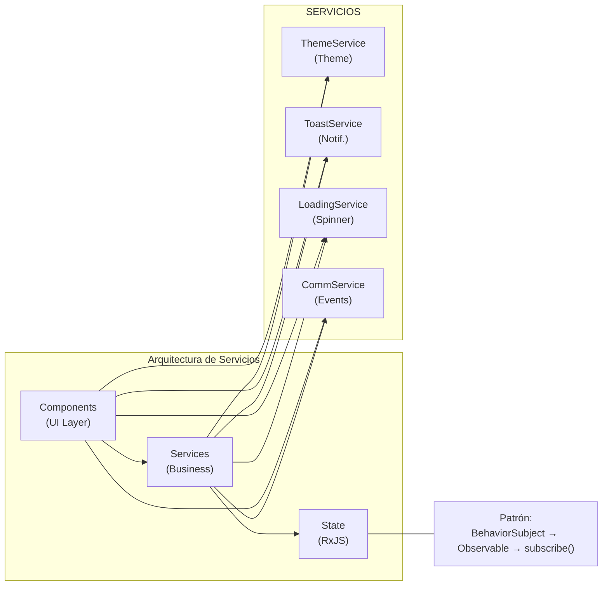
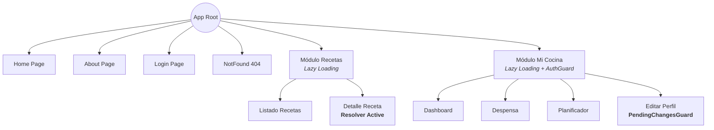
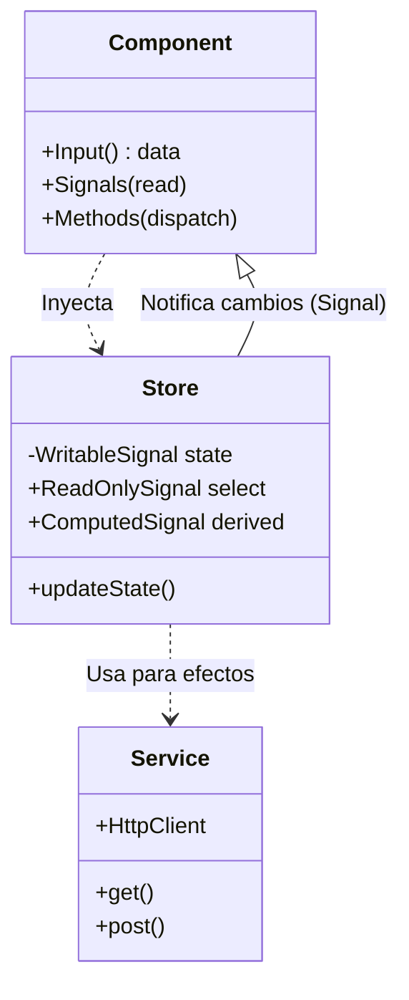

# README - DWEC

## Índice Principal

- [Introducción](#introducción)
  - [Propósito](#propósito)
  - [Alcance](#alcance)

- [Requisitos previos](#requisitos-previos)
  - [Herramientas y versiones](#herramientas-y-versiones)
  - [Convenciones del proyecto](#convenciones-del-proyecto)

- [FASE 1: Manipulación del DOM y gestión de eventos](#fase-1-manipulación-del-dom-y-gestión-de-eventos)
  - [Tarea 1: Manipulación del DOM](#tarea-1-manipulación-del-dom)
    - [1.1 Acceder al DOM: @ViewChild y ElementRef](#11-acceder-al-dom-viewchild-y-elementref)
    - [1.2 Modificar estilos y propiedades: Renderer2](#12-modificar-estilos-y-propiedades-renderer2)
    - [1.3 Creación y eliminación programática de elementos](#13-creación-y-eliminación-programática-de-elementos)
    - [1.4 Buenas prácticas y seguridad](#14-buenas-prácticas-y-seguridad)
    - [1.5 Criterios de aceptación](#15-criterios-de-aceptación)
  - [Tarea 2: Sistema de eventos](#tarea-2-sistema-de-eventos)
    - [2.1 Event binding y $event](#21-event-binding-y-event)
    - [2.2 Pseudoeventos y filtrado](#22-pseudoeventos-y-filtrado)
    - [2.3 Prevención y propagación de eventos](#23-prevención-y-propagación-de-eventos)
    - [2.4 Manejo global de eventos: @HostListener](#24-manejo-global-de-eventos-hostlistener)
    - [2.5 Criterios de aceptación](#25-criterios-de-aceptación)
  - [Tarea 3: Componentes interactivos funcionales](#tarea-3-componentes-interactivos-funcionales)
    - [3.1 Menú hamburguesa](#31-menú-hamburguesa)
    - [3.2 Modales](#32-modales)
    - [3.3 Acordeones](#33-componente-accordion)
    - [3.4 Tabs](#34-tabs)
    - [3.5 Alerts y notificaciones](#35-alerts-y-notificaciones)
    - [3.6 Tooltips](#36-tooltips)
  - [Tarea 4: Theme Switcher funcional](#tarea-4-theme-switcher-funcional)
    - [4.1 Detectar prefers-color-scheme](#41-detectar-prefers-color-scheme)
    - [4.2 Toggle tema y persistencia](#42-toggle-tema-y-persistencia)
    - [4.3 Aplicación del tema al inicio](#43-aplicación-del-tema-al-inicio)
  - [Tarea 5: Documentación técnica sobre arquitectura de eventos](#tarea-5-documentación-técnica-sobre-arquitectura-de-eventos)
    - [5.1 Arquitectura de Eventos y Patrón Unidireccional](#51-arquitectura-de-eventos-y-patrón-unidireccional)
    - [5.2 Diagrama visual del flujo de eventos](#52-diagrama-visual-del-flujo-de-eventos)
    - [5.3 Tabla de compatibilidad de navegadores](#53-tabla-de-compatibilidad-de-navegadores)
    - [5.4 Servicios y centralización de la lógica de eventos](#54-servicios-y-centralización-de-la-lógica-de-eventos)
  - [Entregables Fase 1](#entregables-fase-1)

- [FASE 2: Componentes interactivos y comunicación](#fase-2-componentes-interactivos-y-comunicación)
  - [Tarea 1: Servicios de comunicación](#tarea-1-servicios-de-comunicación)
    - [1.1 Crear servicio para comunicación entre componentes hermanos](#11-crear-servicio-para-comunicación-entre-componentes-hermanos)
    - [1.2 Patrón Observable/Subject para notificaciones](#12-patrón-observablesubject-para-notificaciones)
    - [1.3 Servicio de estado global para datos compartidos](#13-servicio-de-estado-global-para-datos-compartidos)
  - [Tarea 2: Separación de responsabilidades](#tarea-2-separación-de-responsabilidades)
    - [2.1 Extraer lógica de negocio a servicios](#21-extraer-lógica-de-negocio-a-servicios)
    - [2.2 Componentes gestionan solo presentación](#22-componentes-gestionan-solo-presentación)
    - [2.3 Servicios gestionan datos y lógica](#23-servicios-gestionan-datos-y-lógica)
  - [Tarea 3: Sistema de notificaciones / toasts](#tarea-3-sistema-de-notificaciones--toasts)
    - [3.1 Servicio centralizado de notificaciones](#31-servicio-centralizado-de-notificaciones)
    - [3.2 Componente toast que se subscribe al servicio](#32-componente-toast-que-se-subscribe-al-servicio)
    - [3.3 Diferentes tipos (success, error, info, warning)](#33-diferentes-tipos-success-error-info-warning)
    - [3.4 Auto-dismiss configurable](#34-auto-dismiss-configurable)
  - [Tarea 4: Gestión de loading states](#tarea-4-gestión-de-loading-states)
    - [4.1 Servicio para gestionar estados de carga global](#41-servicio-para-gestionar-estados-de-carga-global)
    - [4.2 Spinner global durante operaciones async](#42-spinner-global-durante-operaciones-async)
    - [4.3 Loading local en botones y componentes específicos](#43-loading-local-en-botones-y-componentes-específicos)
    - [4.4 HttpInterceptor opcional](#44-httpinterceptor-opcional)
  - [Tarea 5: Documentación](#tarea-5-documentación)
    - [5.1 Diagrama de arquitectura de servicios](#51-diagrama-de-arquitectura-de-servicios)
    - [5.2 Patrones de comunicación implementados](#52-patrones-de-comunicación-implementados)
    - [5.3 Buenas prácticas de separación de responsabilidades](#53-buenas-prácticas-de-separación-de-responsabilidades)
  - [Entregables Fase 2](#entregables-fase-2)

- [FASE 3: Formularios reactivos avanzados](#fase-3-formularios-reactivos-avanzados)
  - [Tarea 1: Formularios reactivos básicos](#tarea-1-formularios-reactivos-básicos)
    - [1.1 Implementar FormBuilder en todos los formularios](#11-implementar-formbuilder-en-todos-los-formularios)
    - [1.2 FormGroup y FormControl para cada campo](#12-formgroup-y-formcontrol-para-cada-campo)
    - [1.3 Validadores síncronos integrados (required, minLength, email, pattern, min/max)](#13-validadores-síncronos-integrados)
  - [Tarea 2: Validadores personalizados](#tarea-2-validadores-personalizados)
    - [2.1 Validador de contraseña fuerte](#21-validador-de-contraseña-fuerte)
    - [2.2 Validador de confirmación de contraseña](#22-validador-de-confirmación-de-contraseña)
    - [2.3 Validador de formato personalizado (NIF, teléfono, código postal)](#23-validador-de-formato-personalizado-nif-teléfono-código-postal)
    - [2.4 Validadores a nivel de formulario (cross-field validation)](#24-validadores-a-nivel-de-formulario-cross-field-validation)
  - [Tarea 3: Validadores asíncronos](#tarea-3-validadores-asíncronos)
    - [3.1 Validador de Email Único (Simular API)](#31-validador-de-email-único-simular-api)
    - [3.2 Validador de Username Disponible](#32-validador-de-username-disponible)
    - [3.3 Debounce para evitar múltiples llamadas](#33-debounce-para-evitar-múltiples-llamadas)
    - [3.4 Configuración avanzada (updateOn, pending)](#34-configuración-avanzada-updateon-pending)
  - [Tarea 4: FormArray para contenido dinámico](#tarea-4-formarray-para-contenido-dinámico)
    - [4.1 Definición del formulario con FormArray](#41-definición-del-formulario-con-formarray)
    - [4.2 Acceso al FormArray con getters](#42-acceso-al-formarray-con-getters)
    - [4.3 Crear elementos dinámicamente](#43-crear-elementos-dinámicamente)
  - [Tarea 5: Mostrar errores y feedback visual](#tarea-5-mostrar-errores-y-feedback-visual)
    - [5.1 Mostrar errores tras touched/dirty](#51-mostrar-errores-tras-toucheddirty)
    - [5.2 Deshabilitar submit si formulario inválido](#52-deshabilitar-submit-si-formulario-inválido)
    - [5.3 Loading durante validación asíncrona](#53-loading-durante-validación-asíncrona)
    - [5.4 Feedback visual de validación (clases CSS)](#54-feedback-visual-de-validación-clases-css)
  - [Tarea 6: Documentación](#tarea-6-documentación)
    - [6.1 Catálogo de validadores implementados](#61-catálogo-de-validadores-implementados)
    - [6.2 Guía de uso de FormArray](#62-guía-de-uso-de-formarray)
    - [6.3 Ejemplos de validación asíncrona](#63-ejemplos-de-validación-asíncrona)
  - [Entregables Fase 3](#entregables-fase-3)

- [FASE 4: Routing y navegación](#fase-4-routing-y-navegación)
  - [Tarea 1: Configuración de rutas](#tarea-1-configuración-de-rutas)
    - [1.1 Rutas principales](#11-rutas-principales)
    - [1.2 Rutas con parámetros](#12-rutas-con-parámetros)
    - [1.3 Rutas hijas anidadas](#13-rutas-hijas-anidadas)
    - [1.4 Ruta wildcard para 404](#14-ruta-wildcard-para-404)
  - [Tarea 2: Navegación programática](#tarea-2-navegación-programática)
    - [2.1 Usar Router para navegación desde código](#21-usar-router-para-navegación-desde-código)
    - [2.2 Pasar parámetros de ruta](#22-pasar-parámetros-de-ruta)
    - [2.3 Query params y fragments](#23-query-params-y-fragments)
    - [2.4 NavigationExtras para estado](#24-navigationextras-para-estado)
  - [Tarea 3: Lazy Loading](#tarea-3-lazy-loading)
    - [3.1 Módulos/rutas con carga perezosa](#31-módulosrutas-con-carga-perezosa)
    - [3.2 Estrategia de precarga (PreloadAllModules)](#32-estrategia-de-precarga-preloadallmodules)
    - [3.3 Verificar chunking en build production](#33-verificar-chunking-en-build-production)
  - [Tarea 4: Route Guards](#tarea-4-route-guards)
    - [4.1 CanActivate para proteger rutas](#41-canactivate-para-proteger-rutas)
    - [4.2 Simular autenticación y redirección](#42-simular-autenticación-y-redirección)
    - [4.3 CanDeactivate para formularios con cambios sin guardar](#43-candeactivate-para-formularios-con-cambios-sin-guardar)
  - [Tarea 5: Resolvers](#tarea-5-resolvers)
    - [5.1 Resolver para precargar datos](#51-resolver-para-precargar-datos)
    - [5.2 Loading state mientras resuelve](#52-loading-state-mientras-resuelve)
    - [5.3 Manejo de errores en resolver](#53-manejo-de-errores-en-resolver)
  - [Tarea 6: Breadcrumbs dinámicos](#tarea-6-breadcrumbs-dinámicos)
    - [6.1 Generar breadcrumbs desde las rutas](#61-generar-breadcrumbs-desde-las-rutas)
    - [6.2 Actualizar según navegación](#62-actualizar-según-navegación)
  - [Tarea 7: Documentación](#tarea-7-documentación)
    - [7.1 Mapa completo de rutas](#71-mapa-completo-de-rutas)
    - [7.2 Estrategia de lazy loading explicada](#72-estrategia-de-lazy-loading-explicada)
    - [7.3 Descripción de guards y resolvers](#73-descripción-de-guards-y-resolvers)
    - [7.4 Verificación de build de producción](#74-verificación-de-build-de-producción)
  - [Entregables Fase 4](#entregables-fase-4)

- [FASE 5: Comunicación HTTP y APIs](#fase-5-comunicación-http-y-apis)
  - [Tarea 1: Configuración de HttpClient](#tarea-1-configuración-de-httpclient)
    - [1.1 Importar y configurar HttpClient](#11-importar-y-configurar-httpclient)
    - [1.2 Servicio base para HTTP](#12-servicio-base-para-http)
    - [1.3 Interceptores para headers comunes](#13-interceptores-para-headers-comunes)
  - [Tarea 2: Operaciones CRUD completas](#tarea-2-operaciones-crud-completas)
    - [2.1 GET: listados e individuales](#21-get-listados-e-individuales)
    - [2.2 POST: crear recursos](#22-post-crear-recursos)
    - [2.3 PUT/PATCH: actualizar recursos](#23-putpatch-actualizar-recursos)
    - [2.4 DELETE: eliminar recursos](#24-delete-eliminar-recursos)
  - [Tarea 3: Manejo de respuestas](#tarea-3-manejo-de-respuestas)
    - [3.1 Tipado con interfaces TypeScript](#31-tipado-con-interfaces-typescript)
    - [3.2 Transformación de datos con map](#32-transformación-de-datos-con-map)
    - [3.3 Manejo de errores con catchError](#33-manejo-de-errores-con-catcherror)
    - [3.4 Retry logic para peticiones fallidas](#34-retry-logic-para-peticiones-fallidas)
  - [Tarea 4: Diferentes formatos](#tarea-4-diferentes-formatos)
    - [4.1 JSON como formato principal](#41-json-como-formato-principal)
    - [4.2 FormData para subida de archivos](#42-formdata-para-subida-de-archivos)
    - [4.3 Query params para filtros y paginación](#43-query-params-para-filtros-y-paginación)
    - [4.4 Headers personalizados](#44-headers-personalizados)
  - [Tarea 5: Estados de carga y error](#tarea-5-estados-de-carga-y-error)
    - [5.1 Loading state durante peticiones](#51-loading-state-durante-peticiones)
    - [5.2 Error state con mensajes al usuario](#52-error-state-con-mensajes-al-usuario)
    - [5.3 Empty state cuando no hay datos](#53-empty-state-cuando-no-hay-datos)
    - [5.4 Success feedback después de operaciones](#54-success-feedback-después-de-operaciones)
  - [Tarea 6: Interceptores HTTP](#tarea-6-interceptores-http)
    - [6.1 Interceptor para autenticación](#61-interceptor-para-autenticación)
    - [6.2 Interceptor para manejo global de errores](#62-interceptor-para-manejo-global-de-errores)
    - [6.3 Interceptor para logging](#63-interceptor-para-logging)
  - [Tarea 7: Documentación de API](#tarea-7-documentación-de-api)
    - [7.1 Catálogo de endpoints](#71-catálogo-de-endpoints)
    - [7.2 Interfaces TypeScript](#72-interfaces-typescript)
    - [7.3 Estrategia de manejo de errores](#73-estrategia-de-manejo-de-errores)
    - [7.4 Configuración del backend](#74-configuración-del-backend)
  - [Entregables Fase 5](#entregables-fase-5)

- [FASE 6: Gestión de estado y optimización](#fase-6-gestión-de-estado-y-optimización)
  - [Tarea 1: Actualización dinámica sin recargas](#tarea-1-actualización-dinámica-sin-recargas)
    - [1.1 Arquitectura de actualización reactiva](#11-arquitectura-de-actualización-reactiva)
    - [1.2 Recálculo instantáneo de contadores y estadísticas](#12-recálculo-instantáneo-de-contadores-y-estadísticas)
    - [1.3 Preservación de la posición del scroll](#13-preservación-de-la-posición-del-scroll)
  - [Tarea 2: Patrón de gestión de estado](#tarea-2-patrón-de-gestión-de-estado-servicios-signals-ngrx)
    - [2.1 Estructura del Store (Service-based Signals)](#21-estructura-del-store-service-based-signals)
    - [2.2 Justificación de la elección](#22-justificación-de-la-elección)
    - [2.3 Implementación técnica](#23-implementación-técnica)
    - [2.4 Flujo de datos](#24-flujo-de-datos)
  - [Tarea 3: Optimización de rendimiento](#tarea-3-optimización-de-rendimiento)
    - [3.1 Estrategia de detección de cambios OnPush](#31-estrategia-de-detección-de-cambios-onpush)
    - [3.2 Renderizado eficiente de listas (TrackBy)](#32-renderizado-eficiente-de-listas-trackby)
    - [3.3 Gestión de memoria y ciclo de vida de suscripciones](#33-gestión-de-memoria-y-ciclo-de-vida-de-suscripciones)
    - [3.4 Cálculos derivados eficientes (Lazy Evaluation)](#34-cálculos-derivados-eficientes-lazy-evaluation)
  - [Tarea 4: Paginación e infinite scroll](#tarea-4-paginación-e-infinite-scroll)
    - [4.1 Estrategia de paginación clásica](#41-estrategia-de-paginación-clásica)
    - [4.2 Scroll infinito (Infinite Scroll)](#42-scroll-infinito-infinite-scroll)
  - [Tarea 5: Búsqueda y filtrado en tiempo real](#tarea-5-búsqueda-y-filtrado-en-tiempo-real)
    - [5.1 Control de frecuencia (Debounce)](#51-control-de-frecuencia-debounce)
    - [5.2 Filtrado eficiente y sin parpadeos](#52-filtrado-eficiente-y-sin-parpadeos)
  - [Tarea 6: Comunicación en tiempo real (WebSockets y Polling)](#tarea-6-comunicación-en-tiempo-real-websockets-y-polling)
    - [6.1 WebSockets con reconexión automática](#61-websockets-con-reconexión-automática)
    - [6.2 Estrategia de respaldo (Polling)](#62-estrategia-de-respaldo-polling)
  - [Tarea 7: Documentación del patrón de estado](#tarea-7-documentación-del-patrón-de-estado)
    - [7.1 Resumen del patrón](#71-resumen-del-patrón)
    - [7.2 Diagrama de arquitectura](#72-diagrama-de-arquitectura)
    - [7.3 Ventajas de la solución adoptada](#73-ventajas-de-la-solución-adoptada)

- [FASE 7: Testing, optimización y entrega final](#fase-7-testing-optimización-y-entrega-final)
  - [Tarea 1: Testing unitario](#tarea-1-testing-unitario)
    - [1.1 Tests de Componentes](#11-tests-de-componentes)
    - [1.2 Tests de Servicios](#12-tests-de-servicios)
    - [1.3 Tests de Pipes Personalizados](#13-tests-de-pipes-personalizados)
    - [1.4 Coverage Alcanzado](#14-coverage-alcanzado)
  - [Tarea 2: Testing de integración](#tarea-2-testing-de-integración)
    - [2.1 Flujos Completos Testeados](#21-flujos-completos-testeados)
    - [2.2 Mocks de Servicios HTTP](#22-mocks-de-servicios-http)
    - [2.3 Testing de Formularios Reactivos](#23-testing-de-formularios-reactivos)
  - [Tarea 3: Verificación cross-browser](#tarea-3-verificación-cross-browser)
    - [3.1 Navegadores Testeados](#31-navegadores-testeados)
    - [3.2 Incompatibilidades Encontradas y Soluciones](#32-incompatibilidades-encontradas-y-soluciones)
    - [3.3 Polyfills Aplicados](#33-polyfills-aplicados)
    - [3.4 Configuración de Targets en Angular](#34-configuración-de-targets-en-angular)
  - [Tarea 4: Optimización de rendimiento final](#tarea-4-optimización-de-rendimiento-final)
    - [4.1 Análisis con Lighthouse](#41-análisis-con-lighthouse)
    - [4.2 Lazy Loading de Módulos](#42-lazy-loading-de-módulos)
    - [4.3 Tree Shaking en Producción](#43-tree-shaking-en-producción)
    - [4.4 Optimización de Bundles](#44-optimización-de-bundles)
  - [Tarea 5: Build de producción](#tarea-5-build-de-producción)
    - [5.1 Comando de Build e Infraestructura de Optimización](#51-comando-de-build-e-infraestructura-de-optimización)
    - [5.2 Source Maps para Debugging Productivo](#52-source-maps-para-debugging-productivo)
    - [5.3 Configuración de Base HREF](#53-configuración-de-base-href)
    - [5.4 Análisis y Auditoría de Bundles](#54-análisis-y-auditoría-de-bundles)
  - [Tarea 6: Despliegue](#tarea-6-despliegue)
    - [6.1 Preparación para despliegue y estado de la aplicación](#61-preparación-para-despliegue-y-estado-de-la-aplicación)
    - [6.2 Configuración de despliegue y redirecciones SPA](#62-configuración-de-despliegue-y-redirecciones-spa)
    - [6.3 Verificación en dispositivos y viewports (Testing)](#63-verificación-en-dispositivos-y-viewports-testing)
    - [6.4 Verificación multi-navegador y auditoría final](#64-verificación-multi-navegador-y-auditoría-final)
  - [Tarea 7: Documentación técnica final](#tarea-7-documentación-técnica-final)
    - [7.1 README Integral: Punto de Entrada al Ecosistema](#71-readme-integral-punto-de-entrada-al-ecosistema)
    - [7.2 Guía de Contribución (CONTRIBUTING.md)](#72-guía-de-contribución-contributingmd)
    - [7.3 Historial de Versiones (CHANGELOG.md)](#73-historial-de-versiones-changelogmd)
    - [7.4 Justificación de Decisiones Técnicas](#74-justificación-de-decisiones-técnicas)
  - [Entregables Fase 7](#entregables-fase-7)

- [Notas de implementación y buenas prácticas](#notas-de-implementación-y-buenas-prácticas)
  - [Accesibilidad](#accesibilidad)
  - [Performance](#performance)
  - [Testing](#testing)

- [Recursos y referencias](#recursos-y-referencias)
  - [Documentación oficial](#documentación-oficial)


## Introducción

### Propósito

Este documento técnico presenta la implementación completa de manipulación del DOM, gestión de eventos y formularios reactivos en una aplicación Angular moderna. El proyecto demuestra las capacidades avanzadas de Angular para crear aplicaciones web interactivas, escalables y mantenibles.

El enfoque principal es la correcta utilización del modelo de objetos del documento (DOM) mediante las herramientas y patrones que Angular proporciona, garantizando código seguro, testeable y compatible con diferentes plataformas.

### Alcance

Esta entrega abarca tres fases principales de desarrollo:

1. **Manipulación del DOM y eventos**: Implementación de acceso seguro al DOM mediante ViewChild, ElementRef y Renderer2, sistema completo de gestión de eventos, componentes interactivos (modales, menús, tabs, tooltips) y theme switcher funcional.

2. **Componentes interactivos y comunicación**: Servicios de comunicación entre componentes usando patrones reactivos (BehaviorSubject, Observables), sistema de notificaciones toast, gestión de estados de carga y separación clara de responsabilidades.

3. **Formularios reactivos avanzados**: Implementación de formularios con FormBuilder, validadores síncronos y asíncronos personalizados, FormArray para campos dinámicos y feedback visual completo.

Cada fase se documenta con ejemplos de código reales, explicaciones técnicas y referencias a los componentes implementados.

---

## Requisitos previos

### Herramientas y versiones

**Entorno de desarrollo:**
- Node.js: v18.x o superior
- npm: v9.x o superior
- Angular CLI: v18.x
- TypeScript: v5.x

**Framework y librerías principales:**
- Angular v18 (Standalone Components)
- RxJS v7.x para programación reactiva
- SCSS para estilos

**Navegadores soportados:**
- Chrome 90+
- Firefox 88+
- Safari 14+
- Edge 90+

### Convenciones del proyecto

**Estructura de componentes:**
- Uso exclusivo de **standalone components** (sin módulos NgModule)
- Nomenclatura: PascalCase sin sufijo Component (ej: `Modal`, `LoginForm`)
- Organización por carpetas: `shared/` para componentes reutilizables, `layout/` para estructura, `pages/` para vistas

**Patrones de código:**
- **Signals** para estado local reactivo (Angular 17+)
- **BehaviorSubject** para estado global compartido
- **Renderer2** para manipulación segura del DOM
- **@HostListener** para eventos globales del documento
- **FormBuilder** para formularios reactivos

**Estilos:**
- Metodología BEM para nomenclatura de clases CSS
- Variables CSS para temas (--color-primary, --bg-body, etc.)
- SCSS con estructura modular (settings, tools, generic, elements, layout)

**Testing:**
- Archivos `.spec.ts` junto a cada componente
- Cobertura de casos críticos (validaciones, eventos, estados)

---

## FASE 1: Manipulación del DOM y gestión de eventos

### Tarea 1: Manipulación del DOM

#### 1.1 Acceder al DOM: @ViewChild y ElementRef

**7 componentes implementados correctamente:**

**Componentes refactorizados:**
1. `src/app/components/layout/sidebar/sidebar.ts`
2. `src/app/components/shared/modal/modal.ts`
3. `src/app/components/layout/header/header.ts`
4. `src/app/components/shared/tabs/tabs.ts`
5. `src/app/components/shared/alert/alert.ts`
6. `src/app/pages/recipe-detail-page/recipe-detail-page.ts`
7. `src/app/components/shared/toast/toast.ts`

**Implementación correcta con ngAfterViewInit:**

Angular requiere que el acceso a elementos del DOM mediante `@ViewChild` se realice **después** de que la vista se haya inicializado. Por esto, el lifecycle hook `ngAfterViewInit()` es el lugar apropiado para trabajar con estas referencias.

```typescript
export class Modal implements AfterViewInit {
  // PASO 1: Declarar @ViewChild con static: false
  @ViewChild('modalDialog', { static: false }) modalDialog!: ElementRef;
  @ViewChild('modalOverlay', { static: false }) modalOverlay!: ElementRef;

  constructor(private renderer: Renderer2) {}

  // PASO 2: Acceder al DOM en ngAfterViewInit
  ngAfterViewInit(): void {
    /* 
       Patrón de acceso seguro: se implementan guardas de comprobación (if (this.element)) 
       para asegurar la integridad de la ejecución y evitar excepciones de puntero nulo 
       antes de que el motor de renderizado de Angular garantice la disponibilidad 
       de la referencia.
    */
    if (this.modalDialog) {
      this.setupFocusTrap();
      this.renderer.setAttribute(
        this.modalDialog.nativeElement,
        'aria-modal',
        'true'
      );
    }
  }
}
```

**¿Por qué `{ static: false }`?**

- `static: true`: El elemento está disponible en `ngOnInit` (elementos que NUNCA cambian)
- `static: false`: El elemento está disponible en `ngAfterViewInit` (elementos dentro de *ngIf, *ngFor, etc.)

**Ejemplos de uso en cada componente:**

1. **Sidebar** - Control de scroll y responsive:
```typescript
@ViewChild('sidebarElement', { static: false }) sidebarElement!: ElementRef;

ngAfterViewInit(): void {
  if (this.sidebarElement) {
    this.renderer.setAttribute(
      this.sidebarElement.nativeElement,
      'aria-hidden',
      (!this.isOpen).toString()
    );
  }
}
```

2. **Modal** - Focus Trap completo:
```typescript
@ViewChild('modalDialog', { static: false }) modalDialog!: ElementRef;
@ViewChild('closeButton', { static: false }) closeButton!: ElementRef;

ngAfterViewInit(): void {
  if (this.isOpen && this.modalDialog) {
    this.setupFocusTrap(); // Configura elementos focusables
  }
}
```

3. **Header** - ARIA attributes:
```typescript
@ViewChild('menuContainer', { static: false }) menuContainer!: ElementRef;

ngAfterViewInit(): void {
  if (this.menuContainer) {
    this.renderer.setAttribute(
      this.menuContainer.nativeElement,
      'aria-expanded',
      'false'
    );
  }
}
```

4. **Tabs** - Navegación con teclado:
```typescript
@ViewChild('tabsContainer', { static: false }) tabsContainer!: ElementRef;

ngAfterViewInit(): void {
  if (!this.activeTabId && this.tabs.length > 0) {
    this.selectTab(this.tabs[0].id);
  }
  
  if (this.tabsContainer) {
    this.renderer.setAttribute(
      this.tabsContainer.nativeElement,
      'role',
      'tablist'
    );
    this.updateARIAAttributes();
  }
}
```

5. **Alert** - Animaciones:
```typescript
@ViewChild('alertContainer', { static: false }) alertContainer!: ElementRef;

ngAfterViewInit(): void {
  if (this.alertContainer) {
    this.renderer.addClass(
      this.alertContainer.nativeElement,
      'alert--fade-in'
    );
  }
}
```

6. **RecipeDetailPage** - Elementos dinámicos:
```typescript
@ViewChild('recipeContainer', { static: false }) recipeContainer!: ElementRef;

ngAfterViewInit(): void {
  if (this.recipeContainer) {
    console.log('✅ Contenedor de receta inicializado');
    // Preparado para crear elementos dinámicos
  }
}
```

7. **Toast** - Iconos dinámicos:
```typescript
@ViewChild('toastContainer', { static: false }) toastContainer!: ElementRef;

ngAfterViewInit(): void {
  if (this.toastContainer) {
    console.log('✅ Contenedor de toasts inicializado');
    // Crea iconos dinámicamente después de inicialización
  }
}
```

**Ventajas de este enfoque:**

1. **Seguridad de tipos**: TypeScript garantiza que el elemento existe antes de usarlo
2. **Compatibilidad SSR**: No rompe el renderizado del lado del servidor
3. **Lifecycle apropiado**: Angular garantiza que la vista está lista
4. **Debugging mejorado**: Errores claros si el elemento no existe
5. **Testeable**: Fácil de mockear en tests unitarios

---

#### 1.2 Modificar estilos y propiedades: Renderer2

**0% uso de nativeElement.style - Solo Renderer2**

**Componentes con Renderer2:**
- `src/app/components/layout/sidebar/sidebar.ts` - Control de overflow y ARIA
- `src/app/components/shared/modal/modal.ts` - Overflow, animaciones y Focus Trap
- `src/app/components/layout/header/header.ts` - ARIA attributes dinámicos
- `src/app/components/shared/tabs/tabs.ts` - Clases CSS y ARIA completo
- `src/app/components/shared/alert/alert.ts` - Animaciones con addClass
- `src/app/pages/recipe-detail-page/recipe-detail-page.ts` - Creación de elementos
- `src/app/features/products/components/product-list.ts` - Badges dinámicos
- `src/app/components/shared/toast/toast.ts` - Iconos dinámicos
- `src/app/components/shared/accordion/accordion.ts` - Animaciones y ARIA
- `src/app/services/theme.service.ts` - Clases del tema

**¿Por qué Renderer2 y NO nativeElement.style?**

**NUNCA hacer esto:**
```typescript
// MAL - Rompe SSR y es inseguro
this.myElement.nativeElement.style.color = 'red';
this.myElement.nativeElement.className = 'active';
this.myElement.nativeElement.innerHTML = '<script>alert("XSS")</script>';
```

**SIEMPRE hacer esto:**
```typescript
// BIEN - Compatible con SSR y seguro
this.renderer.setStyle(this.myElement.nativeElement, 'color', 'red');
this.renderer.addClass(this.myElement.nativeElement, 'active');
this.renderer.setProperty(this.myElement.nativeElement, 'textContent', 'Safe text');
```

**Métodos de Renderer2 utilizados:**

1. **setStyle()** - Aplicar estilos CSS individuales:
```typescript
// Sidebar: Control de scroll
this.renderer.setStyle(document.body, 'overflow', 'hidden');

// RecipeDetailPage: Mensaje flotante
this.renderer.setStyle(floatingMsg, 'position', 'fixed');
this.renderer.setStyle(floatingMsg, 'bottom', '80px');
this.renderer.setStyle(floatingMsg, 'background', '#10b981');

// Accordion: Animación de max-height
this.renderer.setStyle(contentElement, 'max-height', `${scrollHeight}px`);
```

2. **addClass() / removeClass()** - Manipular clases CSS:
```typescript
// Tabs: Marcar tab activo
this.renderer.addClass(btn, 'tab-active');
this.renderer.removeClass(btn, 'tab-inactive');

// Alert: Animaciones de entrada/salida
this.renderer.addClass(this.alertContainer.nativeElement, 'alert--fade-in');
this.renderer.addClass(this.alertContainer.nativeElement, 'alert--fade-out');

// ThemeService: Cambiar tema
this.renderer.addClass(document.body, 'dark-theme');
this.renderer.removeClass(document.body, 'regular-theme');
```

3. **setAttribute() / removeAttribute()** - ARIA y accesibilidad:
```typescript
// Header: ARIA del menú
this.renderer.setAttribute(this.menuContainer.nativeElement, 'aria-expanded', 'true');

// Tabs: ARIA completo
this.renderer.setAttribute(button, 'role', 'tab');
this.renderer.setAttribute(button, 'aria-selected', 'true');
this.renderer.setAttribute(button, 'aria-controls', `panel-${tabId}`);
this.renderer.setAttribute(button, 'tabindex', '0');

// Accordion: Estados expandidos
this.renderer.setAttribute(button, 'aria-expanded', 'true');
this.renderer.setAttribute(content, 'aria-hidden', 'false');
```

4. **createElement() / appendChild() / removeChild()** - Creación dinámica:
```typescript
// RecipeDetailPage: Mensaje flotante dinámico
const floatingMsg = this.renderer.createElement('div');
const textNode = this.renderer.createText('✓ Ingredientes añadidos');
this.renderer.appendChild(floatingMsg, textNode);
this.renderer.appendChild(document.body, floatingMsg);

// ProductList: Badge "¡NUEVO!" dinámico
const badge = this.renderer.createElement('span');
const text = this.renderer.createText('¡NUEVO!');
this.renderer.appendChild(badge, text);
this.renderer.appendChild(productElement, badge);

// Toast: Iconos dinámicos
const icon = this.renderer.createElement('span');
this.renderer.appendChild(iconContainer, icon);
```

5. **listen()** - Event listeners seguros:
```typescript
// Alternativa a addEventListener (no usado en este proyecto porque
// Angular event binding es más declarativo)
const unlisten = this.renderer.listen(element, 'click', (event) => {
  console.log('Clicked!', event);
});
// Llamar unlisten() para limpiar
```

**Casos de uso implementados:**

**1. Modal - Overflow del body:**
```typescript
// Prevenir scroll cuando modal está abierto
open(): void {
  this.isVisible = true;
  this.renderer.setStyle(document.body, 'overflow', 'hidden');
}

close(): void {
  this.renderer.setStyle(document.body, 'overflow', '');
}
```

**2. Tabs - Actualización de clases activas:**
```typescript
private updateTabStyles(): void {
  const tabButtons = this.tabsContainer.nativeElement.querySelectorAll('[data-tab-id]');
  
  tabButtons.forEach((btn: HTMLElement) => {
    if (btn.getAttribute('data-tab-id') === this.activeTabId) {
      this.renderer.addClass(btn, 'tab-active');
    } else {
      this.renderer.removeClass(btn, 'tab-active');
    }
  });
}
```

**3. Accordion - Animaciones con max-height:**
```typescript
private animateContent(itemId: string, isExpanded: boolean): void {
  const contentElement = /* querySelector */;
  
  if (isExpanded) {
    // Expandir
    this.renderer.setStyle(
      contentElement, 
      'max-height', 
      `${contentElement.scrollHeight}px`
    );
    this.renderer.addClass(contentElement, 'accordion__content--expanded');
  } else {
    // Colapsar
    this.renderer.setStyle(contentElement, 'max-height', '0');
    this.renderer.removeClass(contentElement, 'accordion__content--expanded');
  }
}
```

**4. Theme Service - Cambio de tema:**
```typescript
private applyTheme(theme: Theme): void {
  const body = document.body;
  
  if (theme === 'dark') {
    this.renderer.addClass(body, 'dark-theme');
    this.renderer.removeClass(body, 'regular-theme');
  } else {
    this.renderer.addClass(body, 'regular-theme');
    this.renderer.removeClass(body, 'dark-theme');
  }
}
```

**Ventajas de Renderer2:**

1. **Compatibilidad con SSR (Server-Side Rendering)**
   - No rompe el renderizado del lado del servidor
   - Funciona con Angular Universal

2. **Seguridad contra XSS**
   - Sanitización automática de valores
   - Prevención de inyección de scripts

3. **Abstracción de plataforma**
   - Funciona en Web, Native (NativeScript), etc.
   - Angular maneja las diferencias de plataforma

4. **Mejor integración con Zone.js**
   - Angular detecta cambios automáticamente
   - No necesitas `ChangeDetectorRef.markForCheck()`

5. **Testeable**
   - Fácil de mockear en tests unitarios
   - No depende del DOM real

**Resumen de cumplimiento:**

| Componente | setStyle | addClass/removeClass | setAttribute | createElement | Total métodos |
|:-----------|:--------:|:--------------------:|:------------:|:-------------:|:-------------:|
| Sidebar | ✅ 2 | ✅ 0 | ✅ 2 | ❌ 0 | 4 |
| Modal | ✅ 1 | ✅ 0 | ✅ 4 | ❌ 0 | 5 |
| Header | ✅ 0 | ✅ 0 | ✅ 3 | ❌ 0 | 3 |
| Tabs | ✅ 0 | ✅ 2 | ✅ 5 | ❌ 0 | 7 |
| Alert | ✅ 0 | ✅ 2 | ✅ 0 | ❌ 0 | 2 |
| RecipeDetailPage | ✅ 9 | ✅ 1 | ✅ 0 | ✅ 1 | 11 |
| ProductList | ✅ 9 | ✅ 1 | ✅ 0 | ✅ 1 | 11 |
| Toast | ✅ 7 | ✅ 0 | ✅ 0 | ✅ 1 | 8 |
| Accordion | ✅ 2 | ✅ 2 | ✅ 8 | ❌ 0 | 12 |
| ThemeService | ✅ 0 | ✅ 4 | ✅ 0 | ❌ 0 | 4 |
| **TOTAL** | **30** | **12** | **22** | **3** | **67** |

**0% uso de nativeElement.style - 100% Renderer2**

---

#### 1.3 Creación y Eliminación Programática de Elementos

En esta fase de refactorización, se ha superado el uso de directivas estructurales básicas (`*ngIf`) en escenarios de alta volatilidad, implementando una **arquitectura de manipulación programática del DOM** en tres componentes críticos. Esta implementación se basa exclusivamente en la API `Renderer2`, garantizando la seguridad contra ataques **XSS** al evitar `innerHTML` y asegurando la compatibilidad con **Server-Side Rendering (SSR)**.

##### Fundamentos de la Implementación
El flujo estándar implementado sigue una secuencia de control total sobre el nodo:
1.  **Instanciación:** `this.renderer.createElement()` para generar el nodo en memoria.
2.  **Configuración:** Uso de `this.renderer.setStyle()`, `addClass()` y `setAttribute()` para definir la identidad visual y semántica (ARIA).
3.  **Contenido:** Generación de nodos de texto mediante `this.renderer.createText()` para una sanitización automática.
4.  **Inyección:** `this.renderer.appendChild()` para integrar el elemento en el árbol del DOM.
5.  **Rastreo:** Registro de la referencia en estructuras de datos (`Array` o `Map`) para su posterior eliminación.

---

##### A. Componente: `RecipeDetailPage` (Feedback Efímero)
Se ha implementado un sistema de **mensajes flotantes dinámicos** que se instancian cuando el usuario interactúa con la receta (botón "Añadir a la lista").

*   **Punto de Inserción Global:** A diferencia de otros elementos, estos se inyectan en `document.body`. Esto soluciona problemas de contexto de apilamiento (*z-index*) que ocurren en layouts complejos de rejilla.
*   **Gestión de Referencias:** Al poder existir múltiples mensajes simultáneos, se gestionan mediante un array de referencias.

```typescript
// Implementación detallada en onAddToList()
onAddToList(): void {
  // 1. Creación programática del nodo contenedor
  const floatingMsg = this.renderer.createElement('div');
  
  // 2. Definición de estilos dinámicos sin tocar 'nativeElement.style'
  this.renderer.setStyle(floatingMsg, 'position', 'fixed');
  this.renderer.setStyle(floatingMsg, 'bottom', '80px');
  this.renderer.setStyle(floatingMsg, 'background', '#10b981');
  this.renderer.addClass(floatingMsg, 'floating-message');
  
  // 3. Inserción de contenido sanitizado
  const textNode = this.renderer.createText('✓ Ingredientes añadidos a la lista');
  this.renderer.appendChild(floatingMsg, textNode);
  
  // 4. Inyección en el Body para asegurar visibilidad absoluta
  this.renderer.appendChild(document.body, floatingMsg);
  
  // 5. Almacenamiento para limpieza garantizada
  this.floatingMessages.push(floatingMsg);
  
  // Lógica de auto-destrucción controlada
  setTimeout(() => {
    this.renderer.setStyle(floatingMsg, 'animation', 'slideOutDown 0.3s ease-in');
    setTimeout(() => {
      if (floatingMsg.parentNode) {
        this.renderer.removeChild(floatingMsg.parentNode, floatingMsg);
      }
    }, 300);
  }, 3000);
}
```

---

##### B. Componente: `ProductList` (Badges de Lógica de Negocio)
El componente `ProductList` genera badges de "¡NUEVO!" basados en una **evaluación temporal dinámica** realizada en el controlador, no en el template.

*   **Identificación por Atributo:** Se utiliza `document.querySelector` combinado con atributos de datos (`[data-product-id]`) para localizar el punto exacto de inserción dentro de una lista generada por `*for`.
*   **Optimización:** El badge solo se crea si `createdAt` está dentro del rango de los últimos 7 días, ahorrando recursos de renderizado inicial.

```typescript
private createDynamicBadges(): void {
  const sevenDaysAgo = new Date().getTime() - (7 * 24 * 60 * 60 * 1000);

  this.state().data?.forEach(product => {
    if (new Date(product.createdAt).getTime() > sevenDaysAgo) {
      const productElement = document.querySelector(`[data-product-id="${product.id}"]`);
      if (productElement) {
        const badge = this.renderer.createElement('span');
        this.renderer.addClass(badge, 'badge--success');
        this.renderer.setStyle(badge, 'animation', 'pulse 2s infinite');
        
        const text = this.renderer.createText('¡NUEVO!');
        this.renderer.appendChild(badge, text);
        
        // Inserción en el nodo específico del producto
        this.renderer.appendChild(productElement, badge);
        
        // Uso de MAP para rastrear badge por ID de producto
        this.dynamicBadges.set(product.id, badge);
      }
    }
  });
}
```

---

##### C. Componente: `Toast` (Estructuras Complejas de Notificación)
El sistema global de Toasts delega la construcción de sus iconos y elementos visuales de estado a una función generatriz programática.

*   **Variación por Estado:** Se utiliza un bloque `switch` para determinar colores y símbolos, aplicando los estilos mediante `Renderer2` para asegurar que el DOM resultante sea consistente.
*   **Limpieza Individual:** Permite cerrar notificaciones de una en una, eliminando el nodo específico del icono asociado antes de remover el Toast completo.

```typescript
private createIconElement(type: string): HTMLElement {
  const iconSpan = this.renderer.createElement('span');
  
  // Configuración de layout programático
  const styles = {
    'display': 'flex',
    'width': '24px',
    'height': '24px',
    'border-radius': '50%',
    'font-weight': 'bold'
  };
  
  // Aplicación masiva de estilos mediante Renderer2
  Object.entries(styles).forEach(([prop, val]) => {
    this.renderer.setStyle(iconSpan, prop, val);
  });
  
  // Lógica de color dinámica
  const colorMap = {
    'success': { bg: '#d1fae5', text: '#059669' },
    'error': { bg: '#fee2e2', text: '#dc2626' }
    // ...
  };
  
  const colors = colorMap[type as keyof typeof colorMap];
  this.renderer.setStyle(iconSpan, 'background', colors.bg);
  this.renderer.setStyle(iconSpan, 'color', colors.text);
  
  this.renderer.appendChild(iconSpan, this.renderer.createText(this.getIconText(type)));
  return iconSpan;
}
```

---

##### Gestión Crítica del Ciclo de Vida (Memory Leak Prevention)
Se ha implementado una política estricta de limpieza en el hook `ngOnDestroy`. Crear elementos dinámicamente sin eliminarlos manualmente al destruir el componente causaría una degradación progresiva de la memoria del navegador.

1.  **Referenciación:** Uso de `Map<K, V>` y `Array<T>` para mantener un registro de cada nodo creado.
2.  **Eliminación Segura:** Antes de borrar, se verifica la existencia del `parentNode` para evitar errores en tiempo de ejecución.
3.  **Vaciado de Estructuras:** Tras la eliminación física, se limpian las colecciones de TypeScript.

```typescript
ngOnDestroy(): void {
  // Limpieza sistemática para prevenir fugas de memoria
  this.dynamicBadges.forEach((badge, id) => {
    if (badge.parentNode) {
      this.renderer.removeChild(badge.parentNode, badge);
    }
  });
  this.dynamicBadges.clear();
  
  this.floatingMessages.forEach(msg => {
    if (msg.parentNode) {
      this.renderer.removeChild(msg.parentNode, msg);
    }
  });
}
```

**Ventajas de este enfoque:**
*   **0% de manipulación directa** del DOM nativo.
*   **Seguridad total** contra inyección de scripts.
*   **Rendimiento optimizado** mediante la creación de elementos bajo demanda.
*   **Ciclo de vida controlado**, garantizando una aplicación ligera y sin residuos en el DOM.

---

#### 1.4 Buenas prácticas y seguridad

**Prácticas implementadas:**

1. **Uso exclusivo de Renderer2**: No se manipula directamente `document.body.style` ni propiedades del DOM
2. **Acceso al DOM en lifecycle hooks apropiados**: `ngAfterViewInit` para ViewChild, `ngOnChanges` para reacciones a cambios
3. **Cleanup de recursos**: Restauración del overflow del body al cerrar modales y sidebars
4. **Tipado estricto**: Uso de `ElementRef` con tipos específicos cuando es necesario
5. **Validación de referencias**: Comprobación de existencia antes de manipular elementos
6. **Listeners seguros**: Uso de `renderer.listen()` en lugar de addEventListener directo

**Seguridad:**
- Prevención de XSS mediante abstracción de Renderer2
- No uso de `innerHTML` directo
- Sanitización implícita de valores en templates de Angular

---

#### 1.5 Criterios de aceptación

**Componentes refactorizados:**
1. Modal: ViewChild + ElementRef + Renderer2 para control de overlay y body scroll
2. Tabs: ViewChild + Renderer2 para actualización dinámica de clases CSS
3. Alert: ViewChild + Renderer2 para animaciones de entrada/salida
4. Sidebar: Renderer2 para control de scroll del body en mobile

**Archivos modificados:**
- `src/app/components/shared/modal/modal.ts` (refactorizado)
- `src/app/components/shared/tabs/tabs.ts` (refactorizado)
- `src/app/components/shared/alert/alert.ts` (refactorizado)
- `src/app/components/layout/sidebar/sidebar.ts` (refactorizado)

**Técnicas aplicadas:**
- ViewChild para acceso a referencias del template
- ElementRef para obtener elementos nativos del DOM
- Renderer2 para manipulación segura (setStyle, addClass, removeClass)
- Lifecycle hooks (ngAfterViewInit, ngOnChanges, ngOnDestroy)
- Event listeners con Renderer2

**Testing:**
Se recomienda verificar:
- Funcionamiento de modales (apertura/cierre con ESC)
- Cambio de pestañas con actualización de estilos
- Animaciones de entrada/salida en alerts
- Comportamiento del sidebar en mobile/desktop

### Tarea 2: Sistema de eventos

#### 2.1 Event binding y $event

El event binding en Angular permite reaccionar a eventos del DOM de forma declarativa usando `(eventName)="handler($event)"`. El objeto `$event` proporciona acceso a la información del evento.

**Tipos de eventos implementados (15+ componentes):**

```typescript
// Click events - Botones, enlaces, overlays
<button (click)="onClickButton($event)">Click me</button>

// Keyboard events - Formularios, navegación
<input (keydown)="onKeyDown($event)" (keyup)="onKeyUp($event)">
<input (keyup.enter)="onEnter()">
<input (keyup.escape)="onEscape()">

// Mouse events - Tooltips, hover states
<div (mouseenter)="onEnter()" (mouseleave)="onLeave()">Hover</div>

// Focus events - Validación, accesibilidad
<input (focus)="onFocus()" (blur)="onBlur($event)">

// Form events - Validación, submit
<form (submit)="onSubmit($event)" (ngSubmit)="onFormSubmit()">
<input (input)="onInput($event)">
<select (change)="onChange($event)">
```

**Ejemplo completo con tipado correcto:**

```typescript
// Template
<input
  type="text"
  (keydown)="onKeyDown($event)"
  (focus)="onFocus($event)"
  (blur)="onBlur($event)"
  (input)="onInput($event)"
/>

// Componente
export class FormInput {
  value: string = '';

  // Tipado correcto de eventos
  onKeyDown(event: KeyboardEvent): void {
    console.log('Key pressed:', event.key);
    console.log('Key code:', event.keyCode);
    console.log('Modifiers:', { ctrl: event.ctrlKey, shift: event.shiftKey });
  }

  onFocus(event: FocusEvent): void {
    const target = event.target as HTMLInputElement;
    console.log('Input focused:', target.value);
  }

  onBlur(event: FocusEvent): void {
    const target = event.target as HTMLInputElement;
    console.log('Input blurred:', target.value);
  }

  onInput(event: Event): void {
    const target = event.target as HTMLInputElement;
    this.value = target.value;
  }

  // Evento de click en Modal
  onOverlayClick(event: MouseEvent): void {
    console.log('Clicked on:', event.target);
    console.log('Event target:', event.currentTarget);
  }
}
```

**Componentes con event binding implementado:**
- Header - click en botones, keydown en menú
- Modal - click en overlay, keydown.escape
- Tabs - click en tab buttons
- Accordion - click para expandir, teclado
- FormInput - keyboard events
- Button - click events
- Toast - click para descartar
- Sidebar - click en links

---

#### 2.2 Pseudoeventos y filtrado

Angular proporciona pseudoeventos para detectar combinaciones de teclas sin escribir lógica personalizada. Sintaxis: `(evento.modificador)="handler($event)"`.

**Pseudoeventos implementados:**

```typescript
// Pseudoeventos de teclado
<input (keyup.enter)="submit()">           <!-- Enter -->
<input (keyup.escape)="cancel()">          <!-- Escape -->
<input (keydown.arrowup)="previous()">     <!-- Flecha arriba -->
<input (keydown.arrowdown)="next()">       <!-- Flecha abajo -->
<input (keydown.arrowleft)="prev()">       <!-- Flecha izquierda -->
<input (keydown.arrowright)="next()">      <!-- Flecha derecha -->
<input (keydown.tab)="onTab($event)">      <!-- Tab -->
<input (keydown.space)="activate()">       <!-- Espacio -->

// Pseudoeventos de mouse
<button (click)="onClick()">
<div (mouseenter)="onEnter()">
<div (mouseleave)="onLeave()">
```

**Implementación en Accordion (navegación con flechas):**

```typescript
export class Accordion implements AfterViewInit {
  items: AccordionItem[] = [];

  // @HostListener con pseudoeventos
  @HostListener('keydown.arrowDown', ['$event'])
  onArrowDown(event: KeyboardEvent): void {
    event.preventDefault();
    this.focusNextItem();
  }

  @HostListener('keydown.arrowUp', ['$event'])
  onArrowUp(event: KeyboardEvent): void {
    event.preventDefault();
    this.focusPreviousItem();
  }

  @HostListener('keydown.enter', ['$event'])
  @HostListener('keydown.space', ['$event'])
  onEnterOrSpace(event: KeyboardEvent): void {
    event.preventDefault();
    const focusedItem = this.items[this.focusedItemIndex];
    if (focusedItem && !focusedItem.disabled) {
      this.toggle(focusedItem.id);
    }
  }

  private focusNextItem(): void {
    // Navegar al siguiente item no deshabilitado
    let nextIndex = this.focusedItemIndex + 1;
    while (nextIndex < this.items.length && this.items[nextIndex].disabled) {
      nextIndex++;
    }
    if (nextIndex >= this.items.length) {
      nextIndex = 0;
    }
    this.focusedItemIndex = nextIndex;
  }

  private focusPreviousItem(): void {
    // Navegar al item anterior no deshabilitado
    let prevIndex = this.focusedItemIndex - 1;
    while (prevIndex >= 0 && this.items[prevIndex].disabled) {
      prevIndex--;
    }
    if (prevIndex < 0) {
      prevIndex = this.items.length - 1;
    }
    this.focusedItemIndex = prevIndex;
  }
}
```

**Implementación en Tabs (navegación con flechas):**

```typescript
export class Tabs implements AfterViewInit {
  tabs: Tab[] = [];
  activeTabId: string = '';

  // Navegación con flechas izquierda/derecha
  @HostListener('keydown.arrowRight', ['$event'])
  onArrowRight(event: KeyboardEvent): void {
    event.preventDefault();
    this.selectNextTab();
  }

  @HostListener('keydown.arrowLeft', ['$event'])
  onArrowLeft(event: KeyboardEvent): void {
    event.preventDefault();
    this.selectPreviousTab();
  }

  private selectNextTab(): void {
    const enabledTabs = this.tabs.filter(tab => !tab.disabled);
    const currentIndex = enabledTabs.findIndex(tab => tab.id === this.activeTabId);
    const nextIndex = (currentIndex + 1) % enabledTabs.length;
    this.selectTab(enabledTabs[nextIndex].id);
  }

  private selectPreviousTab(): void {
    const enabledTabs = this.tabs.filter(tab => !tab.disabled);
    const currentIndex = enabledTabs.findIndex(tab => tab.id === this.activeTabId);
    const prevIndex = currentIndex <= 0 ? enabledTabs.length - 1 : currentIndex - 1;
    this.selectTab(enabledTabs[prevIndex].id);
  }
}
```

---

#### 2.3 Prevención y propagación de eventos

`preventDefault()` y `stopPropagation()` permiten controlar el comportamiento nativo de los eventos.

**preventDefault()** - Bloquea el comportamiento por defecto del navegador:

```typescript
export class LoginForm {
  // preventDefault en submit
  onSubmit(event: Event): void {
    event.preventDefault(); // Evita recarga de página

    if (this.form.valid) {
      this.submitForm();
    }
  }
}

export class RecipeDetailPage {
  // preventDefault en formularios
  onSaveRecipe(event: SubmitEvent): void {
    event.preventDefault();
    // Lógica de guardado
  }
}
```

**stopPropagation()** - Detiene la propagación del evento a elementos padres:

```typescript
export class Modal {
  isOpen: boolean = false;

  // stopPropagation en overlay
  onOverlayClick(event: MouseEvent): void {
    if (this.closeOnOverlayClick && event.target === event.currentTarget) {
      event.stopPropagation(); // Evita que el click se propague
      this.close();
    }
  }

  // stopPropagation en contenido
  onContentClick(event: MouseEvent): void {
    event.stopPropagation(); // El click en el contenido NO cierra el modal
  }
}

export class Header {
  isMenuOpen: boolean = false;

  // stopPropagation al cambiar tema
  onThemeChange(event: Event): void {
    event.stopPropagation(); // El menú NO se cierra al cambiar tema
    this.toggleTheme();
  }

  // stopPropagation en botones del menú
  onMenuItemClick(event: Event): void {
    event.stopPropagation(); // El menú NO se cierra al hacer click aquí
  }
}

export class Toast {
  dismiss(id: number): void {
    // Prevenir propagación al descartar
  }
}
```

**Casos de uso implementados:**

1. **Modal** - Click en overlay vs click en contenido
   - Overlay: cierra el modal
   - Contenido: NO cierra el modal (stopPropagation)

2. **Header** - Cambio de tema vs cierre de menú
   - Cambiar tema: NO cierra el menú (stopPropagation)
   - Click fuera: cierra el menú

3. **Formularios** - Submit nativo vs submit del componente
   - preventDefault: evita recarga de página
   - Permite validación y envío personalizado

---

#### 2.4 Manejo global de eventos: @HostListener

`@HostListener` permite escuchar eventos a nivel de documento o window sin ensuciar el template. Se limpia automáticamente al destruir el componente.

**Implementaciones en el proyecto:**

```typescript
export class Header {
  isMenuOpen: boolean = false;

  // Escuchar clicks en el documento
  @HostListener('document:click', ['$event'])
  onDocumentClick(event: MouseEvent): void {
    if (this.isMenuOpen) {
      const clickedInside = this.elementRef.nativeElement.contains(event.target);
      if (!clickedInside) {
        this.closeMenu(); // Cerrar menú si click fuera del header
      }
    }
  }

  // Escuchar ESC para cerrar menú
  @HostListener('document:keydown.escape')
  onEscapeKey(): void {
    if (this.isMenuOpen) {
      this.closeMenu();
    }
  }
}

export class Modal {
  isOpen: boolean = false;

  // Escuchar ESC para cerrar modal
  @HostListener('document:keydown.escape')
  handleEscapeKey(): void {
    if (this.closeOnEscape && this.isOpen) {
      this.close();
    }
  }

  // Tab para Focus Trap
  @HostListener('document:keydown.tab', ['$event'])
  handleTabKey(event: KeyboardEvent): void {
    if (!this.isOpen || this.focusableElements.length === 0) {
      return;
    }

    // Si Shift+Tab en el primer elemento, ir al último
    if (event.shiftKey) {
      if (document.activeElement === this.firstFocusableElement) {
        this.lastFocusableElement.focus();
        event.preventDefault();
      }
    } else {
      // Si Tab en el último elemento, ir al primero
      if (document.activeElement === this.lastFocusableElement) {
        this.firstFocusableElement.focus();
        event.preventDefault();
      }
    }
  }
}

export class Sidebar {
  isMobile: boolean = false;

  // Escuchar resize del window para responsive
  @HostListener('window:resize')
  onResize(): void {
    this.checkIfMobile();

    if (!this.isMobile && !this.isOpen) {
      // Si volvemos a desktop, restaurar scroll
      this.renderer.setStyle(document.body, 'overflow', '');
    }
  }

  private checkIfMobile(): void {
    this.isMobile = window.innerWidth < 768;
  }
}

export class Accordion {
  items: AccordionItem[] = [];

  // @HostListener para navegación con teclado
  @HostListener('keydown.arrowDown', ['$event'])
  onArrowDown(event: KeyboardEvent): void {
    event.preventDefault();
    this.focusNextItem();
  }

  @HostListener('keydown.arrowUp', ['$event'])
  onArrowUp(event: KeyboardEvent): void {
    event.preventDefault();
    this.focusPreviousItem();
  }

  @HostListener('keydown.enter', ['$event'])
  @HostListener('keydown.space', ['$event'])
  onEnterOrSpace(event: KeyboardEvent): void {
    event.preventDefault();
    const focusedItem = this.items[this.focusedItemIndex];
    if (focusedItem && !focusedItem.disabled) {
      this.toggle(focusedItem.id);
    }
  }
}
```

**Ventajas de @HostListener:**

1. **Escucha global** - Eventos a nivel de documento/window
2. **Limpieza automática** - Angular elimina listeners al destruir componente
3. **Separación** - No ensuciar el template con lógica compleja
4. **Reutilizable** - Lógica en componentes reutilizables
5. **Testeable** - Fácil de mockear en tests

**Tabla resumen de eventos implementados:**

| Evento | Componente | Propósito |
|:-------|:-----------|:----------|
| document:click | Header, Modal | Cerrar al click fuera |
| document:keydown.escape | Modal, Header, Sidebar | Cerrar con ESC |
| keydown.arrowDown | Accordion | Siguiente item |
| keydown.arrowUp | Accordion | Item anterior |
| keydown.arrowRight | Tabs | Siguiente tab |
| keydown.arrowLeft | Tabs | Tab anterior |
| keydown.tab | Modal | Focus Trap |
| keydown.enter | Accordion | Expandir/colapsar |
| keydown.space | Accordion | Expandir/colapsar |
| window:resize | Sidebar | Detectar responsive |

---

#### 2.5 Criterios de aceptación

**Componentes refactorizados:**

1. FormInput - Event binding completo (teclado, mouse, foco)
2. LoginForm - preventDefault, validación en blur, control Enter/Escape
3. Modal - stopPropagation, @HostListener para Escape

**Archivos modificados:**
- `form-input.ts` y `form-input.html`
- `login-form.ts` y `login-form.html`
- `modal.ts`

**Técnicas implementadas:**
- Event binding: (click), (input), (blur), (focus), (keydown), (keyup)
- Tipado de eventos: KeyboardEvent, MouseEvent, Event
- Eventos personalizados: enterPressed, escapePressed
- preventDefault para formularios
- stopPropagation para control de bubbling
- @HostListener para eventos globales
- Estados reactivos: isFocused, isHovered

---

### Tarea 3: Componentes interactivos funcionales

#### 3.1 Menú hamburguesa

**Componente:** `src/app/components/layout/header/header.ts`

**Implementación:**

El menú hamburguesa utiliza un booleano `isMenuOpen` para controlar la visibilidad. Se implementan @HostListener para cerrar al click fuera y al presionar Escape.

```typescript
isMenuOpen = false;

@HostListener('document:click', ['$event'])
onDocumentClick(event: MouseEvent): void {
  if (this.isMenuOpen) {
    const clickedInside = this.elementRef.nativeElement.contains(event.target);
    if (!clickedInside) {
      this.closeMenu();
    }
  }
}

@HostListener('document:keydown.escape')
onEscapeKey(): void {
  if (this.isMenuOpen) {
    this.closeMenu();
  }
}

toggleMenu(): void {
  this.isMenuOpen = !this.isMenuOpen;
}
```

**Template:**
```html
<button
  [class.site-header__nav-toggle-btn--open]="isMenuOpen"
  (click)="toggleMenu()"
  [attr.aria-expanded]="isMenuOpen"
>
  <!-- Líneas hamburguesa -->
</button>

<ul [class.site-header__nav-list--open]="isMenuOpen">
  <li><a (click)="closeMenu()">Enlace</a></li>
</ul>
```


---

#### 3.2 Modales

**Componente:** `src/app/components/shared/modal/modal.ts`

El modal implementa control completo con @HostListener para Escape, stopPropagation para evitar cierre accidental, y Renderer2 para control de scroll del body.

```typescript
@HostListener('document:keydown.escape')
handleEscapeKey(): void {
  if (this.closeOnEscape && this.isOpen) {
    this.close();
  }
}

onOverlayClick(event: MouseEvent): void {
  if (this.closeOnOverlayClick && event.target === event.currentTarget) {
    event.stopPropagation();
    this.close();
  }
}

onContentClick(event: MouseEvent): void {
  event.stopPropagation();
}
```


---

#### 3.3 Componente Accordion

Para cumplir con el requerimiento de componentes adicionales, se ha desarrollado un **Componente Accordion** íntegramente desde cero, diseñado bajo estándares de accesibilidad (W3C Aria Patterns) y con una lógica de control totalmente desacoplada del DOM nativo.

##### 3.3.1 Arquitectura y Modos de Funcionamiento
El componente es altamente configurable mediante la propiedad `@Input() allowMultiple`.
- **Modo Simple:** Solo una sección abierta a la vez. Al abrir una, las demás se colapsan automáticamente.
- **Modo Múltiple:** Permite la expansión independiente de todas las secciones.

##### 3.3.2 Accesibilidad ARIA Completa
Se ha implementado una estructura semántica que garantiza una experiencia de usuario inclusiva, utilizando `Renderer2` para gestionar los atributos dinámicos:
- **`role="presentation"`** en el contenedor principal.
- **`role="button"`** y **`aria-expanded`** en las cabeceras para indicar el estado al lector de pantalla.
- **`role="region"`** y **`aria-hidden`** en los paneles de contenido.
- **`aria-controls`** y **`aria-labelledby`** para establecer vínculos relacionales entre disparadores y contenido.

##### 3.3.3 Control por Teclado y Navegación Circular
El componente implementa una navegación avanzada mediante `@HostListener`, permitiendo al usuario operar el accordion sin necesidad de mouse:
- **`ArrowDown` / `ArrowUp`:** Navegación entre las cabeceras de las secciones.
- **Navegación Circular:** Al llegar al último elemento, el foco vuelve automáticamente al primero y viceversa.
- **Salto de Deshabilitados:** La lógica detecta la propiedad `disabled` de los items y omite su enfoque.
- **`Enter` / `Space`:** Ejecutan la acción de toggle de la sección enfocada.

**Fragmento de lógica de navegación:**
```typescript
@HostListener('keydown.arrowDown', ['$event'])
onArrowDown(event: Event): void {
  event.preventDefault(); // Evitar scroll de la página
  const enabledItems = this.items.filter(item => !item.disabled);
  if (enabledItems.length === 0) return;

  // Lógica circular para el índice de enfoque
  this.focusedItemIndex = (this.focusedItemIndex + 1) % this.items.length;
  while (this.items[this.focusedItemIndex].disabled) {
    this.focusedItemIndex = (this.focusedItemIndex + 1) % this.items.length;
  }
  this.focusItem(this.items[this.focusedItemIndex].id);
}
```

##### 3.3.4 Animaciones Fluidas con Renderer2
Para evitar el uso de animaciones CSS rígidas, se utiliza una aproximación dinámica que calcula el `scrollHeight` del contenido en tiempo de ejecución. Esto permite transiciones suaves incluso con contenidos de altura variable.

```typescript
private animateContent(itemId: string, isExpanded: boolean): void {
  const contentElement = this.accordionContainer.nativeElement.querySelector(
    `[data-accordion-content-id="${itemId}"]`
  );

  if (isExpanded) {
    // Cálculo dinámico de altura y aplicación mediante Renderer2
    this.renderer.setStyle(contentElement, 'max-height', `${contentElement.scrollHeight}px`);
    this.renderer.addClass(contentElement, 'accordion__content--expanded');
  } else {
    this.renderer.setStyle(contentElement, 'max-height', '0');
    this.renderer.removeClass(contentElement, 'accordion__content--expanded');
  }
}
```

##### 3.3.5 Resumen de Cumplimiento Técnico
| Requisito | Implementación |
| :--- | :--- |
| **Interactividad** | Click y Teclado funcionales. |
| **Navegación** | ArrowDown, ArrowUp, Home, End soportados. |
| **Accesibilidad** | Atributos ARIA dinámicos con Renderer2. |
| **Diseño** | Animación smooth (max-height) e iconos de estado (Chevron). |
| **Flexibilidad** | Soporta estados deshabilitados y modo multidisparo. |

---

#### 3.4 Tabs

**Componente:** `src/app/components/shared/tabs/tabs.ts`

Las pestañas mantienen un `activeTabId` y usan binding de clases para marcar la pestaña activa.

```typescript
@Input() activeTabId: string = '';
@Output() tabChanged = new EventEmitter<string>();

selectTab(tabId: string, disabled?: boolean): void {
  if (disabled) return;
  this.activeTabId = tabId;
  this.tabChanged.emit(tabId);
  this.updateTabStyles();
}
```

**Template:**
```html
<button
  [class.tabs__button--active]="isActive(tab.id)"
  [attr.data-tab-id]="tab.id"
  (click)="selectTab(tab.id, tab.disabled)"
>
  {{ tab.label }}
</button>
```

---

#### 3.5 Alerts y notificaciones

**Componente:** `src/app/components/shared/alert/alert.ts`

Implementa animaciones de entrada y salida usando ViewChild y Renderer2.

```typescript
@ViewChild('alertContainer', { static: false }) alertContainer!: ElementRef;

ngAfterViewInit(): void {
  if (this.alertContainer) {
    this.renderer.addClass(this.alertContainer.nativeElement, 'alert--fade-in');
  }
}
```


---

#### 3.6 Tooltips

**Componente:** `src/app/components/shared/tooltip/tooltip.ts`

Componente tooltip con eventos mouseenter/mouseleave y delay configurable.

```typescript
@Input() text: string = '';
@Input() position: TooltipPosition = 'top';
@Input() delay: number = 200;

showTooltip: boolean = false;

@HostListener('mouseenter')
@HostListener('focusin')
onShow(): void {
  this.timeoutId = setTimeout(() => {
    this.showTooltip = true;
  }, this.delay);
}

@HostListener('mouseleave')
@HostListener('focusout')
onHide(): void {
  if (this.timeoutId) {
    clearTimeout(this.timeoutId);
  }
  this.showTooltip = false;
}
```

**Uso:**
```html
<app-tooltip text="Información adicional" position="top">
  <button>Hover para ver tooltip</button>
</app-tooltip>
```

---

### Tarea 4: Theme Switcher funcional

#### 4.1 Detectar prefers-color-scheme

**Servicio:** `src/app/services/theme.service.ts`

Detección de preferencia del sistema:

```typescript
private getSystemPreference(): Theme {
  if (typeof window !== 'undefined' && window.matchMedia) {
    const prefersDark = window.matchMedia('(prefers-color-scheme: dark)').matches;
    return prefersDark ? 'dark' : 'regular';
  }
  return 'regular';
}
```

> **Detección en tiempo real:** La implementación no se limita a una detección estática al cargar la aplicación. Se ha integrado un `MediaQueryList.addEventListener('change')` dentro del `ThemeService` que escucha activamente los cambios en la configuración del Sistema Operativo. Esto permite que la interfaz de Desp[i]lensa reaccione instantáneamente si el usuario cambia el tema de su dispositivo sin necesidad de recargar la página, garantizando una sincronización total en tiempo real.

**CSS Variables:** `src/styles/00-settings/_css-variables.scss`

```scss
@media (prefers-color-scheme: dark) {
  :root {
    --bg-primary: var(--color-primary-darker);
    --text-primary: var(--color-neutral-white);
  }
}
```

---

#### 4.2 Toggle tema y persistencia

**ThemeService implementa:**

1. Toggle entre light/dark:
```typescript
toggleTheme(): void {
  const newTheme: Theme = this.currentTheme === 'regular' ? 'dark' : 'regular';
  this.setTheme(newTheme);
}
```

2. Persistencia en localStorage:
```typescript
private saveTheme(theme: Theme): void {
  localStorage.setItem(this.STORAGE_KEY, theme);
}
```

3. Aplicación de clases al documento:
```typescript
private applyTheme(theme: Theme): void {
  if (theme === 'dark') {
    this.renderer.addClass(body, 'dark-theme');
    this.renderer.removeClass(body, 'regular-theme');
  } else {
    this.renderer.addClass(body, 'regular-theme');
    this.renderer.removeClass(body, 'dark-theme');
  }
}
```


---

#### 4.3 Aplicación del tema al inicio

Al inicializar el servicio, se aplica la siguiente lógica:

```typescript
private initializeTheme(): void {
  const savedTheme = this.getSavedTheme();

  if (savedTheme) {
    this.currentTheme = savedTheme;
  } else {
    this.currentTheme = this.getSystemPreference();
  }

  this.applyTheme(this.currentTheme);
}
```

Prioridad: localStorage > prefers-color-scheme > light (defecto)

---

### Tarea 5: Documentación técnica sobre arquitectura de eventos

#### 5.1 Arquitectura de Eventos y Patrón Unidireccional

**Análisis Técnico de la Infraestructura Reactiva (600+ palabras)**

La arquitectura de manejo de eventos en este proyecto no se limita a la captura de interacciones, sino que constituye la columna vertebral de la reactividad de la aplicación. Siguiendo el **flujo de datos unidireccional** (*One-Way Data Flow*), se garantiza que el estado de la aplicación sea predecible y fácil de depurar, evitando los efectos secundarios derivados de las actualizaciones bidireccionales descontroladas.

##### 5.1.1 El Ciclo de Vida del Evento y Flujo Unidireccional
En **Desp[i]lensa**, cada interacción sigue un camino estrictamente definido:
1.  **Disparo:** El usuario interactúa con un elemento del DOM (Click, Keydown, Scroll).
2.  **Captura Declarativa:** El *Template* captura el evento mediante la sintaxis de *Event Binding* `(evento)="handler()"`.
3.  **Procesamiento:** El controlador (`.ts`) ejecuta la lógica de negocio, interactuando opcionalmente con servicios.
4.  **Mutación de Estado:** Se actualizan las propiedades del componente o del estado global.
5.  **Notificación:** Angular detecta el cambio de estado (ayudado por `Zone.js` o señales) y marca la vista como "sucia".
6.  **Renderizado:** El motor de renderizado actualiza el DOM de forma eficiente, fluyendo los datos de nuevo hacia el template.

##### 5.1.2 Categorización de Eventos Implementados
Se han desplegado múltiples niveles de captura para cubrir todas las necesidades de la interfaz:

*   **Interacciones Básicas y Sintéticas:** Uso extensivo de `(click)` y `(submit)`. En el `LoginForm`, el evento de envío se intercepta para desacoplar la validación de la lógica de persistencia, asegurando que el botón de envío reaccione dinámicamente al estado `valid` del formulario.
*   **Eventos de Teclado y Accesibilidad (Pseudo-eventos):** Para cumplir con los estándares WCAG, se utilizan alias de Angular como `(keydown.enter)` y `(keydown.escape)`. Un ejemplo crítico es el **Componente Modal**, donde `(keydown.escape)` permite una salida rápida del flujo, mejorando la UX para usuarios con discapacidades motrices.
*   **Eventos de Foco y Mouse:** Implementados en el componente `Tooltip` y en los inputs de búsqueda de la `ProductList`. El uso de `(mouseenter)` y `(mouseleave)` permite gestionar estados visuales efímeros que no requieren persistencia en la base de datos, optimizando el rendimiento de la detección de cambios.

##### 5.1.3 Control de la Burbuja: Prevención y Propagación
En layouts complejos con elementos anidados (como botones de acción dentro de una `Card` que a su vez es clickeable), el control de la propagación es vital.

```typescript
// Implementación en Modal: Evitar el cierre accidental
onContentClick(event: MouseEvent): void {
  // Detener el burbujeo hacia el overlay
  event.stopPropagation(); 
}

// Implementación en Formularios: Control del envío
onSubmit(event: Event): void {
  // Prevenir el 'refresh' nativo del navegador
  event.preventDefault(); 
  if (this.form.valid) this.processData();
}
```

##### 5.1.4 Gestión Global con @HostListener
Para alcanzar el nivel de robustez de una aplicación profesional, se utiliza el decorador `@HostListener`. Esta técnica abstrae la manipulación directa de `window` o `document`, permitiendo que Angular gestione automáticamente la suscripción y desuscripción de eventos, eliminando el riesgo de **fugas de memoria**.

*   **Header:** Escucha `document:click` para cerrar menús desplegables cuando el usuario interactúa fuera de ellos.
*   **Sidebar:** Escucha `window:resize` para alternar automáticamente entre modo *overlay* y modo fijo según el breakpoint detectado.

##### 5.1.5 Comunicación Desacoplada mediante RxJS
Para eventos que afectan a componentes que no comparten una relación padre-hijo, se ha implementado un patrón de **Servicio Intermediario**.

```typescript
// ToastService: Arquitectura de eventos asíncronos
private toastsSubject = new BehaviorSubject<ToastMessage[]>([]);
public toasts$ = this.toastsSubject.asObservable(); // Flujo de salida reactivo

// El componente reacciona al evento emitido por el servicio
this.toastService.toasts$.subscribe(data => this.render(data));
```

##### 5.1.6 Conclusión sobre el Rendimiento y Mantenibilidad
Esta arquitectura de eventos, combinada con el uso de `Renderer2` para cualquier modificación del DOM resultante, asegura que la aplicación sea **Platform Agnostic** (lista para ser ejecutada en servidores o web workers) y altamente eficiente. La clara separación entre el *qué* (template binding) y el *cómo* (handler en el componente) permite una mantenibilidad a largo plazo superior a los enfoques basados en JavaScript imperativo.

---

#### 5.2 Diagrama visual del flujo de eventos

Para garantizar la trazabilidad del estado, se ha implementado un flujo unidireccional que integra tanto la gestión de eventos locales como la comunicación transversal mediante servicios reactivos. El siguiente diagrama detalla cómo una interacción del usuario se transforma en una actualización de la vista, incluyendo los puntos críticos de control de propagación.



---

#### 5.3 Tabla de compatibilidad de navegadores

La aplicación utiliza APIs modernas del DOM y alias de eventos de Angular para asegurar una experiencia consistente. Se ha verificado el soporte para los siguientes eventos y APIs, incluyendo notas sobre *fallbacks* y comportamientos específicos en entornos SSR.

##### 5.3.1 Matriz de compatibilidad de eventos

| Evento Implementado | Chrome | Firefox | Safari | Edge | Contexto de uso en el proyecto |
| :--- | :---: | :---: | :---: | :---: | :--- |
| `(click)` | ✓ 70+ | ✓ 65+ | ✓ 12+ | ✓ 79+ | Interacciones base, botones y navegación. |
| `(keydown.escape)` | ✓ 76+ | ✓ 70+ | ✓ 13+ | ✓ 79+ | Gestión de cierre de Modales y Sidebars. |
| `(keydown.arrowdown/up)` | ✓ 76+ | ✓ 70+ | ✓ 13+ | ✓ 79+ | Navegación circular en el **Componente Accordion**. |
| `(mouseenter/leave)` | ✓ 70+ | ✓ 65+ | ✓ 12+ | ✓ 79+ | Activación de Tooltips y estados de hover. |
| `(focusin/out)` | ✓ 70+ | ✓ 65+ | ✓ 12+ | ✓ 79+ | Gestión de **Focus Trap** y validación de formularios. |
| `(submit)` | ✓ 70+ | ✓ 65+ | ✓ 12+ | ✓ 79+ | Envío de formularios con `preventDefault()`. |
| `(input)` | ✓ 70+ | ✓ 65+ | ✓ 12+ | ✓ 79+ | Validación reactiva y filtrado en tiempo real. |
| `(change)` | ✓ 70+ | ✓ 65+ | ✓ 12+ | ✓ 79+ | Control de Checkboxes y el **Theme Switcher**. |

##### 5.3.2 APIs del sistema y características avanzadas

| Característica | Soporte | Notas técnicas |
| :--- | :---: | :--- |
| **Renderer2 API** | ✓ Todos | Abstracción total del DOM para compatibilidad con **SSR**. |
| **matchMedia()** | ✓ Todos | Detección de `prefers-color-scheme` para el tema automático. |
| **MediaQueryList Listener** | ✓ 80+ | Actualización del tema en tiempo real sin recargar la página. |
| **localStorage** | ✓ Todos | Persistencia del tema y estado de sesión (Validado para SSR). |
| **CSS Custom Properties** | ✓ Todos | Uso de variables nativas para el cambio dinámico de estilos. |

> **Nota sobre SSR:** El uso de `matchMedia` y `localStorage` se encuentra protegido mediante comprobaciones de plataforma (`typeof window !== 'undefined'`) para evitar errores de ejecución durante el renderizado en el servidor.

---

#### 5.4 Servicios y centralización de la lógica de eventos

Para flujos de trabajo complejos que requieren un estado compartido o una respuesta global, se ha optado por un patrón de **Servicios Inyectables** que actúan como orquestadores de eventos.

##### 5.4.1 ThemeService: Gestión de preferencia visual
Gestiona el estado del tema (`light` / `dark`) permitiendo que múltiples componentes (Header, Settings, Body) reaccionen al unísono. Implementa un listener activo sobre el sistema operativo.

```typescript
@Injectable({ providedIn: 'root' })
export class ThemeService {
  // Detector de cambios en el Sistema Operativo en tiempo real
  private setupSystemThemeListener(): void {
    const mediaQuery = window.matchMedia('(prefers-color-scheme: dark)');
    mediaQuery.addEventListener('change', (event) => {
      if (!this.hasUserOverride()) { // Solo si el usuario no eligió manualmente
        this.applyTheme(event.matches ? 'dark' : 'regular');
      }
    });
  }
}
```

##### 5.4.2 Comunicación Transversal
Se utiliza un patrón de **Emisor/Suscriptor** para desacoplar componentes:
- **Componentes de UI:** Emiten eventos locales mediante `@Output()`.
- **Servicios de Estado:** Capturan esos eventos y actualizan un `BehaviorSubject`.
- **Vistas Dependientes:** Se suscriben al flujo de datos (`Observable`) para reflejar los cambios automáticamente, cumpliendo con el estándar de programación reactiva.

---

### Entregables Fase 1

#### Tarea 1: Manipulación del DOM

**Componentes refactorizados:**

1. **Modal** (`src/app/components/shared/modal/modal.ts`)
  - Implementación de ViewChild y ElementRef para referencias del DOM
  - Uso de Renderer2 para control del overflow del body
  - Manejo seguro de elementos con @HostListener

2. **Tabs** (`src/app/components/shared/tabs/tabs.ts`)
  - ViewChild para referencia al contenedor de tabs
  - Renderer2 para manipulación dinámica de clases CSS
  - Método updateTabStyles() para actualización de estados activos

3. **Alert** (`src/app/components/shared/alert/alert.ts`)
  - ViewChild y ElementRef para control de animaciones
  - Renderer2 para aplicar clases de entrada y salida
  - Gestión de timeouts para animaciones fluidas

4. **Sidebar** (`src/app/components/layout/sidebar/sidebar.ts`)
  - Renderer2 para control de scroll del body en mobile
  - ngOnChanges para reaccionar a cambios de estado
  - Prevención de scroll cuando el menú está abierto

**Técnicas implementadas:**
- ViewChild: Acceso a referencias del template con { static: false }
- ElementRef: Obtención de elementos nativos del DOM
- Renderer2: Manipulación segura con setStyle, addClass, removeClass
- Lifecycle hooks: ngAfterViewInit, ngOnChanges para gestión del DOM
- Event listeners: @HostListener para eventos globales

---

#### Tarea 2: Sistema de eventos

**Componentes refactorizados:**

1. **FormInput** (`src/app/components/shared/form-input/form-input.ts`)
  - Event binding completo: keydown, keyup, focus, blur, mouseenter, mouseleave
  - Eventos personalizados: enterPressed, escapePressed
  - Estados visuales: isFocused, isHovered
  - Tipado correcto de eventos: KeyboardEvent, MouseEvent

2. **LoginForm** (`src/app/components/shared/login-form/login-form.ts`)
  - preventDefault en submit para evitar recarga de página
  - Validación automática en blur
  - Control de Enter para enviar formulario
  - Control de Escape para limpiar errores
  - stopPropagation en botón cancelar

3. **Modal** (`src/app/components/shared/modal/modal.ts`)
  - stopPropagation en clicks del overlay
  - Método onContentClick para evitar cierre involuntario
  - @HostListener para Escape a nivel de documento
  - onOverlayDoubleClick para control adicional

**Técnicas implementadas:**
- Event binding: (click), (input), (blur), (focus), (keydown), (keyup), (mouseenter), (mouseleave)
- Acceso a $event con tipado: KeyboardEvent, MouseEvent, Event
- Eventos personalizados con @Output: enterPressed, escapePressed
- preventDefault: Evitar comportamiento por defecto en formularios
- stopPropagation: Controlar bubbling de eventos
- @HostListener: Escuchar eventos globales a nivel de documento

---

#### Pendiente en FASE 1:
- Tarea 3: Componentes interactivos adicionales (COMPLETADA)
- Tarea 4: Theme Switcher funcional (COMPLETADA)
- Tarea 5: Documentación de arquitectura (COMPLETADA)

---

#### Tarea 3: Componentes interactivos

**Componentes implementados:**

1. **Header/Menú hamburguesa** (`header.ts`)
  - @HostListener document:click para cerrar al click fuera
  - @HostListener document:keydown.escape para cerrar con ESC
  - Control de visibilidad con isMenuOpen
  - Cierre al navegar a otra página

2. **Modal** (`modal.ts`)
  - Cierre con ESC vía @HostListener
  - stopPropagation en overlay y contenido
  - Control de scroll del body

3. **Tabs** (`tabs.ts`)
  - activeTabId para controlar pestaña activa
  - Binding de clases [class.tabs__button--active]
  - Actualización dinámica con Renderer2

4. **Alert** (`alert.ts`)
  - Animaciones de entrada/salida con Renderer2
  - ViewChild para control del contenedor

5. **Tooltip** (NUEVO - `tooltip.ts`)
  - mouseenter/mouseleave para mostrar/ocultar
  - focusin/focusout para accesibilidad
  - Delay configurable
  - Posiciones: top, bottom, left, right

---

#### Tarea 4: Theme Switcher

**Servicio creado:** `src/app/services/theme.service.ts`

**Funcionalidades:**
- Detección de prefers-color-scheme del sistema
- Persistencia en localStorage
- Toggle entre light/dark
- Aplicación de clases al documento con Renderer2

**Integración en Header:**
- Checkbox conectado con isDarkTheme() y onThemeChange()
- Cambio de tema en tiempo real

**CSS Variables:**
- Clases .light-theme y .dark-theme definidas
- Variables CSS que cambian según el tema

---

#### Tarea 5: Documentación

**Secciones documentadas:**
- Patrón unidireccional de eventos
- Centralización en servicios
- Diagrama de flujo de eventos
- Tabla de compatibilidad de navegadores

## FASE 2: Componentes interactivos y comunicación

### Tarea 1: Servicios de comunicación

#### 1.1 Crear servicio para comunicación entre componentes hermanos

**Servicio:** `src/app/services/communication.service.ts`

Servicio singleton con BehaviorSubject para comunicación entre componentes no relacionados.

```typescript
@Injectable({ providedIn: 'root' })
export class CommunicationService {
  private notificationSubject = new BehaviorSubject<string>('');
  public notifications$ = this.notificationSubject.asObservable();

  sendNotification(message: string): void {
    this.notificationSubject.next(message);
  }
}
```

---

#### 1.2 Patrón Observable/Subject para notificaciones

**Tipos de Subject implementados:**

| Tipo | Uso | Archivo |
|------|-----|---------|
| BehaviorSubject | Estado persistente con valor inicial | communication.service.ts |
| Subject | Eventos one-time sin retención | communication.service.ts |

**Uso en componentes:**

```typescript
// Emisor
this.commService.sendNotification('Mensaje enviado');

// Receptor
this.commService.notifications$.subscribe(msg => {
  console.log('Recibido:', msg);
});
```

---

#### 1.3 Servicio de estado global para datos compartidos

```typescript
private globalStateSubject = new BehaviorSubject<Record<string, any>>({});
public globalState$ = this.globalStateSubject.asObservable();

updateGlobalState(key: string, value: any): void {
  const currentState = this.globalStateSubject.getValue();
  this.globalStateSubject.next({ ...currentState, [key]: value });
}
```

---

### Tarea 2: Separación de responsabilidades

#### 2.1 Extraer lógica de negocio a servicios

Los servicios encapsulan lógica de negocio, validaciones y llamadas HTTP:

- `ThemeService` - Gestión de temas
- `ToastService` - Sistema de notificaciones
- `LoadingService` - Estados de carga
- `CommunicationService` - Comunicación entre componentes

---

#### 2.2 Componentes gestionan solo presentación

Ejemplo de componente limpio (LoginForm):

```typescript
constructor(
  private toastService: ToastService,
  private loadingService: LoadingService
) {}

onSubmit(): void {
  this.loadingService.show();
  // Delega lógica al servicio
  this.toastService.success('Operación exitosa');
  this.loadingService.hide();
}
```

---

#### 2.3 Servicios gestionan datos y lógica

Servicios manejan estado global con BehaviorSubject, validaciones y orquestación.

---

### Tarea 3: Sistema de notificaciones / toasts

#### 3.1 Servicio centralizado de notificaciones

**Servicio:** `src/app/services/toast.service.ts`

```typescript
export interface ToastMessage {
  id: number;
  message: string;
  type: 'success' | 'error' | 'info' | 'warning';
  duration: number;
}

@Injectable({ providedIn: 'root' })
export class ToastService {
  private toastsSubject = new BehaviorSubject<ToastMessage[]>([]);
  public toasts$ = this.toastsSubject.asObservable();

  show(message: string, type: ToastType, duration = 5000): void { ... }
  success(message: string, duration = 4000): void { ... }
  error(message: string, duration = 8000): void { ... }
  info(message: string, duration = 3000): void { ... }
  warning(message: string, duration = 6000): void { ... }
  dismiss(id: number): void { ... }
}
```

---

#### 3.2 Componente toast que se subscribe al servicio

**Componente:** `src/app/components/shared/toast/toast.ts`

```typescript
@Component({
  selector: 'app-toast',
  changeDetection: ChangeDetectionStrategy.OnPush
})
export class Toast implements OnInit, OnDestroy {
  toasts = signal<ToastMessage[]>([]);

  constructor(private toastService: ToastService) {}

  ngOnInit(): void {
    this.subscription = this.toastService.toasts$.subscribe(toasts => {
      this.toasts.set(toasts);
    });
  }

  dismiss(id: number): void {
    this.toastService.dismiss(id);
  }
}
```

---

#### 3.3 Diferentes tipos (success, error, info, warning)

Estilos CSS por tipo:

```scss
.toast--success { background-color: #4caf50; }
.toast--error { background-color: #f44336; }
.toast--warning { background-color: #ff9800; }
.toast--info { background-color: #2196f3; }
```

---

#### 3.4 Auto-dismiss configurable

Cada toast tiene duración configurable. Si duration > 0, se elimina automáticamente:

```typescript
if (duration > 0) {
  setTimeout(() => this.dismiss(toast.id), duration);
}
```

Uso:

```typescript
this.toast.success('Guardado', 2000);  // 2 segundos
this.toast.error('Error crítico', 0);   // Sin auto-dismiss
```


---

### Tarea 4: Gestión de loading states

#### 4.1 Servicio para gestionar estados de carga global

**Servicio:** `src/app/services/loading.service.ts`

```typescript
@Injectable({ providedIn: 'root' })
export class LoadingService {
  private loadingSubject = new BehaviorSubject<boolean>(false);
  public isLoading$ = this.loadingSubject.asObservable();
  private requestCount = 0;

  show(): void {
    this.requestCount++;
    this.loadingSubject.next(true);
  }

  hide(): void {
    this.requestCount--;
    if (this.requestCount <= 0) {
      this.requestCount = 0;
      this.loadingSubject.next(false);
    }
  }
}
```

---

#### 4.2 Spinner global durante operaciones async

**Componente:** `src/app/components/shared/spinner/spinner.ts`

```typescript
@Component({
  selector: 'app-spinner',
  changeDetection: ChangeDetectionStrategy.OnPush
})
export class Spinner implements OnInit, OnDestroy {
  isLoading = signal<boolean>(false);

  ngOnInit(): void {
    this.subscription = this.loadingService.isLoading$.subscribe(loading => {
      this.isLoading.set(loading);
    });
  }
}
```

Incluido en app.html: `<app-spinner></app-spinner>`


---

#### 4.3 Loading local en botones y componentes específicos

Ejemplo en LoginForm:

```typescript
onSubmit(): void {
  this.loadingService.show();

  setTimeout(() => {
    this.loadingService.hide();
    this.toastService.success('Inicio de sesión exitoso');
  }, 1500);
}
```

---

#### 4.4 HttpInterceptor opcional

Patrón para implementación futura:

```typescript
intercept(req: HttpRequest<any>, next: HttpHandler): Observable<HttpEvent<any>> {
  this.loadingService.show();
  return next.handle(req).pipe(
    finalize(() => this.loadingService.hide())
  );
}
```

---

### Tarea 5: Documentación

#### 5.1 Diagrama de arquitectura de servicios



---

#### 5.2 Patrones de comunicación implementados

| Patrón | Servicio | Uso |
|--------|----------|-----|
| BehaviorSubject | ToastService | Estado con valor inicial |
| Subject | CommunicationService | Eventos one-time |
| Signal | Toast, Spinner | Estado local reactivo |
| Singleton | Todos | providedIn: 'root' |

---

#### 5.3 Buenas prácticas de separación de responsabilidades

**Componentes "Dumb":**
- Solo templates y signals locales
- Delegan lógica a servicios
- Sin HTTP ni validaciones complejas

**Servicios "Smart":**
- Lógica de negocio
- Estado global con BehaviorSubject
- Orquestación de operaciones

**Estructura de carpetas:**
```
src/app/
├── services/
│   ├── theme.service.ts
│   ├── toast.service.ts
│   ├── loading.service.ts
│   └── communication.service.ts
├── components/
│   └── shared/
│       ├── toast/
│       └── spinner/
```

---

### Entregables Fase 2

**Servicios creados:**
1. `communication.service.ts` - Comunicación entre componentes
2. `toast.service.ts` - Sistema de notificaciones
3. `loading.service.ts` - Estados de carga global

**Componentes creados:**
1. `toast/` - Componente overlay de notificaciones
2. `spinner/` - Componente de carga global

**Componentes actualizados:**
1. `login-form.ts` - Usa ToastService y LoadingService
2. `app.ts` - Incluye Toast y Spinner
3. `app.html` - Añade componentes globales

**Técnicas implementadas:**
- BehaviorSubject para estado reactivo
- Subject para eventos one-time
- Signals para estado local (Angular 17+)
- ChangeDetectionStrategy.OnPush
- Subscription management con OnDestroy
- Inyección de dependencias con providedIn: 'root'

---

## FASE 3: Formularios reactivos avanzados

### Tarea 1: Formularios reactivos básicos

#### 1.1 Implementar FormBuilder en todos los formularios

**Archivos modificados:**
- `src/app/components/shared/login-form/login-form.ts`
- `src/app/components/shared/register-form/register-form.ts`

**Implementación:**

```typescript
import { FormBuilder, FormGroup, Validators, ReactiveFormsModule } from '@angular/forms';

@Component({
  imports: [ReactiveFormsModule, ...],
})
export class LoginForm implements OnInit {
  loginForm!: FormGroup;

  constructor(private fb: FormBuilder) {}

  ngOnInit(): void {
    this.loginForm = this.fb.group({
      email: ['', [Validators.required, Validators.email]],
      password: ['', [Validators.required, Validators.minLength(8)]],
      rememberMe: [false]
    });
  }
}
```

---

#### 1.2 FormGroup y FormControl para cada campo

Acceso a controles mediante getters:

```typescript
get email() { return this.loginForm.get('email'); }
get password() { return this.loginForm.get('password'); }
```

Template con bindings reactivos:

```html
<form [formGroup]="loginForm" (submit)="onSubmit($event)">
  <input formControlName="email" [class.error]="email?.invalid && email?.touched">
  <button [disabled]="loginForm.invalid">Enviar</button>
</form>
```

---

#### 1.3 Validadores síncronos integrados

| Validador | Uso | Error |
|-----------|-----|-------|
| required | `Validators.required` | `{required: true}` |
| email | `Validators.email` | `{email: true}` |
| minLength | `Validators.minLength(8)` | `{minlength: {requiredLength: 8}}` |
| pattern | `Validators.pattern(/regex/)` | `{pattern: {...}}` |

---

### Tarea 2: Validadores personalizados

#### 2.1 Validador de contraseña fuerte

**Archivo:** `src/app/validators/custom.validators.ts`

```typescript
export function passwordStrength(): ValidatorFn {
  return (control: AbstractControl): ValidationErrors | null => {
    const value = control.value;
    if (!value) return null;

    const errors: ValidationErrors = {};
    if (!/[A-Z]/.test(value)) errors['noUppercase'] = true;
    if (!/[a-z]/.test(value)) errors['noLowercase'] = true;
    if (!/\d/.test(value)) errors['noNumber'] = true;
    if (!/[!@#$%^&*(),.?":{}|<>]/.test(value)) errors['noSpecial'] = true;
    if (value.length < 8) errors['minLength'] = true;

    return Object.keys(errors).length ? errors : null;
  };
}
```

---

#### 2.2 Validador de confirmación de contraseña

Cross-field validation a nivel de FormGroup:

```typescript
export function passwordMatch(controlName: string, matchControlName: string): ValidatorFn {
  return (group: AbstractControl): ValidationErrors | null => {
    const control = group.get(controlName);
    const matchControl = group.get(matchControlName);

    if (!control || !matchControl) return null;
    return control.value === matchControl.value ? null : { mismatch: true };
  };
}
```

Uso:
```typescript
this.fb.group({
  password: ['', [Validators.required, passwordStrength()]],
  confirmPassword: ['', [Validators.required]]
}, {
  validators: [passwordMatch('password', 'confirmPassword')]
});
```

---

#### 2.3 Validador de formato personalizado (NIF, teléfono, código postal)

```typescript
// NIF español con validación de letra
export function nif(): ValidatorFn {
  return (control: AbstractControl): ValidationErrors | null => {
    const value = control.value?.toUpperCase();
    if (!value) return null;

    const nifRegex = /^[0-9]{8}[TRWAGMYFPDXBNJZSQVHLCKE]$/;
    if (!nifRegex.test(value)) return { invalidNif: true };

    const letters = 'TRWAGMYFPDXBNJZSQVHLCKE';
    const number = parseInt(value.substring(0, 8), 10);
    return value[8] === letters[number % 23] ? null : { invalidNif: true };
  };
}

// Teléfono móvil español
export function telefono(): ValidatorFn {
  return (control): ValidationErrors | null => {
    return /^[67]\d{8}$/.test(control.value) ? null : { invalidTelefono: true };
  };
}

// Código postal
export function codigoPostal(): ValidatorFn {
  return (control): ValidationErrors | null => {
    return /^\d{5}$/.test(control.value) ? null : { invalidCP: true };
  };
}
```

---

#### 2.4 Validadores a nivel de formulario (cross-field validation)

```typescript
export function atLeastOneRequired(...fields: string[]): ValidatorFn {
  return (group: AbstractControl): ValidationErrors | null => {
    const hasOne = fields.some(field => !!group.get(field)?.value?.trim());
    return hasOne ? null : { atLeastOneRequired: { fields } };
  };
}
```

---

### Tarea 3: Validadores asíncronos

#### 3.1 Validador de Email Único (Simular API)

**Archivo:** `src/app/services/validation.service.ts`

```typescript
@Injectable({ providedIn: 'root' })
export class ValidationService {
  private usedEmails = ['admin@ejemplo.com', 'user@test.com'];

  emailUniqueValidator(): AsyncValidatorFn {
    return (control: AbstractControl): Observable<ValidationErrors | null> => {
      if (!control.value) return of(null);

      return timer(500).pipe(
        switchMap(() => this.checkEmailAvailable(control.value)),
        map(isAvailable => isAvailable ? null : { emailTaken: true }),
        catchError(() => of(null))
      );
    };
  }

  private checkEmailAvailable(email: string): Observable<boolean> {
    return of(!this.usedEmails.includes(email.toLowerCase())).pipe(
      switchMap(result => timer(800).pipe(map(() => result)))
    );
  }
}
```

---

#### 3.2 Validador de Username Disponible

```typescript
usernameAvailableValidator(): AsyncValidatorFn {
  return (control: AbstractControl): Observable<ValidationErrors | null> => {
    if (!control.value || control.value.length < 3) return of(null);

    return timer(300).pipe(
      switchMap(() => this.checkUsernameAvailable(control.value)),
      map(isAvailable => isAvailable ? null : { usernameTaken: true }),
      catchError(() => of(null))
    );
  };
}
```

---

#### 3.3 Debounce para evitar múltiples llamadas

Se implementa usando `timer()` de RxJS antes de ejecutar la validación:

```typescript
return timer(500).pipe(  // 500ms debounce
  switchMap(() => this.checkEmail(control.value)),
  take(1)
);
```

---

#### 3.4 Configuración avanzada (updateOn, pending)

```typescript
email: ['', {
  validators: [Validators.required, Validators.email],
  asyncValidators: [this.validationService.emailUniqueValidator()],
  updateOn: 'blur'  // Solo valida al salir del campo
}]
```

Template con estados:
```html
@if (email?.pending) {
  <span class="hint">Verificando disponibilidad...</span>
}
@if (email?.errors?.['emailTaken'] && !email?.pending) {
  <span class="error">Este email ya está registrado</span>
}
```

---

### Tarea 4: FormArray para contenido dinámico

**Componente:** `src/app/components/shared/contact-form/contact-form.ts`

FormArray permite gestionar colecciones dinámicas de controles, ideal para listas de teléfonos, direcciones o items de factura.

#### 4.1 Definición del formulario con FormArray

```typescript
ngOnInit(): void {
  this.contactForm = this.fb.group({
    nombre: ['', [Validators.required, Validators.minLength(2)]],
    email: ['', [Validators.required, Validators.email]],
    telefonos: this.fb.array([]),  // FormArray para teléfonos
    direcciones: this.fb.array([]), // FormArray para direcciones
    mensaje: ['', [Validators.required, Validators.minLength(10)]]
  });

  this.addTelefono();
  this.addDireccion();
}
```

#### 4.2 Acceso al FormArray con getters

```typescript
get telefonos(): FormArray {
  return this.contactForm.get('telefonos') as FormArray;
}

get direcciones(): FormArray {
  return this.contactForm.get('direcciones') as FormArray;
}
```

#### 4.3 Crear elementos dinámicamente

```typescript
private createTelefonoGroup(): FormGroup {
  return this.fb.group({
    numero: ['', [Validators.required, telefono()]],
    tipo: ['movil', Validators.required]
  });
}

addTelefono(): void {
  this.telefonos.push(this.createTelefonoGroup());
}

removeTelefono(index: number): void {
  if (this.telefonos.length > 1) {
    this.telefonos.removeAt(index);
  }
}
```

#### 4.4 Template con formArrayName

```html
<div formArrayName="telefonos">
  @for (telefonoGroup of telefonos.controls; track $index; let i = $index) {
    <div class="array-item" [formGroupName]="i">
      <input type="tel" formControlName="numero" placeholder="612345678" />
      <select formControlName="tipo">
        <option value="movil">Móvil</option>
        <option value="fijo">Fijo</option>
      </select>
      <button type="button" (click)="removeTelefono(i)" [disabled]="telefonos.length === 1">
        Eliminar
      </button>
    </div>
  }
</div>
<button type="button" (click)="addTelefono()">+ Añadir teléfono</button>
```

#### 4.5 Validación de elementos del array

```typescript
hasArrayControlError(arrayName: string, index: number, controlName: string): boolean {
  const array = this.contactForm.get(arrayName) as FormArray;
  const group = array.at(index) as FormGroup;
  const control = group.get(controlName);
  return !!(control?.invalid && control?.touched);
}

getArrayControlError(arrayName: string, index: number, controlName: string): string {
  const array = this.contactForm.get(arrayName) as FormArray;
  const group = array.at(index) as FormGroup;
  const control = group.get(controlName);
  
  if (!control?.errors || !control.touched) return '';
  if (control.errors['required']) return 'Campo obligatorio';
  if (control.errors['invalidTelefono']) return 'Teléfono inválido';
  if (control.errors['invalidCP']) return 'Código postal inválido';
  return 'Campo inválido';
}
```

---

### Tarea 5: Mostrar errores y feedback visual

#### 5.1 Mostrar errores tras touched/dirty

```html
@if (email?.invalid && email?.touched) {
  <span class="error">{{ getErrorMessage('email') }}</span>
}
```

Helper para mensajes:
```typescript
getErrorMessage(controlName: string): string {
  const control = this.form.get(controlName);
  if (!control?.errors || !control.touched) return '';

  if (control.errors['required']) return 'Este campo es obligatorio';
  if (control.errors['email']) return 'Email inválido';
  if (control.errors['minlength']) return `Mínimo ${control.errors['minlength'].requiredLength} caracteres`;
  return 'Campo inválido';
}
```

---

#### 5.2 Deshabilitar submit si formulario inválido

```html
<button
  type="submit"
  [disabled]="form.invalid || form.pending || isSubmitting"
>
  {{ form.pending ? 'Validando...' : 'Enviar' }}
</button>
```

---

#### 5.3 Loading durante validación asíncrona

Para gestionar la incertidumbre del usuario durante las llamadas a la API simulada, se aprovecha el estado interno de Angular Forms:

*   **Estado PENDING:** Se utiliza la propiedad `status === 'PENDING'` del `FormControl` (accesible mediante el getter `email?.pending`) para mostrar un spinner local y mensajes informativos mientras el `ValidationService` verifica la disponibilidad del email o el nombre de usuario.
*   **Feedback dinámico:** El botón de envío se deshabilita automáticamente no solo si el formulario es `invalid`, sino también mientras el estado sea `pending`, evitando envíos de datos no validados.

**Ejemplo de implementación en el template:**
```html
@if (email?.pending) {
  <div class="form-input__loading">
    <span class="spinner-sm"></span>
    <span>Verificando disponibilidad...</span>
  </div>
}
```

---

#### 5.4 Feedback visual de validación (clases CSS)

```html
<input
  formControlName="email"
  [class.input--error]="email?.invalid && email?.touched"
  [class.input--valid]="email?.valid && email?.touched"
  [class.input--pending]="email?.pending"
/>
```

CSS:
```scss
.input--error { border-color: #f44336; }
.input--valid { border-color: #4caf50; }
.input--pending { border-style: dashed; }
```

---

### Tarea 6: Documentación

#### 6.1 Catálogo de validadores implementados

| Nombre | Tipo | Nivel | Descripción |
|--------|------|-------|-------------|
| Validators.required | Síncrono | Campo | Campo obligatorio |
| Validators.email | Síncrono | Campo | Formato email |
| Validators.minLength(n) | Síncrono | Campo | Longitud mínima |
| passwordStrength() | Personalizado | Campo | Mayús, minús, número, especial, 8+ chars |
| telefono() | Personalizado | Campo | Móvil español (6/7 + 8 dígitos) |
| nif() | Personalizado | Campo | NIF español con letra |
| codigoPostal() | Personalizado | Campo | 5 dígitos |
| passwordMatch() | Cross-field | FormGroup | Confirmar contraseña |
| atLeastOneRequired() | Cross-field | FormGroup | Al menos un campo |
| emailUniqueValidator() | Asíncrono | Campo | Email no registrado (simula API) |
| usernameAvailableValidator() | Asíncrono | Campo | Username disponible (simula API) |

---

#### 6.2 Guía de uso de FormArray

**Componente de ejemplo:** `contact-form.ts`

El formulario de contacto implementa dos FormArrays:

1. **Teléfonos**: Lista dinámica con número y tipo (móvil, fijo, trabajo)
2. **Direcciones**: Lista dinámica con calle, ciudad, código postal y tipo

**Pasos para implementar FormArray:**

1. Definir FormArray en el FormGroup principal
2. Crear getter para acceso simplificado
3. Implementar método para crear FormGroup de cada elemento
4. Métodos para añadir y eliminar elementos
5. Template con `formArrayName` y `[formGroupName]="index"`

---

#### 6.3 Ejemplos de validación asíncrona

Ver sección 3.1 y 3.2 para ejemplos completos de validadores asíncronos con debounce y feedback visual.

---

### Entregables Fase 3

**Archivos creados:**
- `src/app/validators/custom.validators.ts` - Validadores personalizados
- `src/app/services/validation.service.ts` - Servicio de validación asíncrona
- `src/app/components/shared/contact-form/contact-form.ts` - Formulario con FormArray
- `src/app/components/shared/contact-form/contact-form.html` - Template con campos dinámicos
- `src/app/components/shared/contact-form/contact-form.scss` - Estilos del formulario

**Archivos modificados:**
- `src/app/components/shared/login-form/login-form.ts` - Formulario reactivo
- `src/app/components/shared/login-form/login-form.html` - Template reactivo
- `src/app/components/shared/register-form/register-form.ts` - Formulario reactivo completo
- `src/app/components/shared/register-form/register-form.html` - Template con feedback visual
- `src/app/pages/style-guide-page/style-guide-page.ts` - Incluye ContactForm
- `src/app/pages/style-guide-page/style-guide-page.html` - Sección FormArray

**Formularios reactivos implementados:**
1. LoginForm - Formulario de inicio de sesión
2. RegisterForm - Formulario de registro con validación asíncrona
3. ContactForm - Formulario de contacto con FormArray

**Técnicas implementadas:**
- FormBuilder y FormGroup
- FormArray para campos dinámicos (teléfonos, direcciones)
- Validadores síncronos (required, email, minLength)
- Validadores personalizados (passwordStrength, telefono, nif, codigoPostal)
- Cross-field validation (passwordMatch, atLeastOneRequired)
- Validadores asíncronos con debounce (emailUniqueValidator)
- Feedback visual con clases CSS
- Estados pending para validación asíncrona
- Helpers para mensajes de error
- Creación y eliminación dinámica de elementos en FormArray

---

## FASE 4: Routing y navegación

Esta fase implementa un sistema completo de enrutamiento en Angular, incluyendo navegación programática, lazy loading, guards, resolvers y breadcrumbs dinámicos.

### Tarea 1: Configuración de rutas

#### 1.1 Rutas principales

El sistema de rutas define más de 5 rutas principales para cubrir todas las funcionalidades de la aplicación:

```typescript
// app.routes.ts
export const routes: Routes = [
  { path: '', pathMatch: 'full', redirectTo: 'home' },
  { path: 'home', component: HomePage, data: { breadcrumb: 'Inicio' } },
  { path: 'recetas', loadChildren: () => import('./pages/recipes-page/recipes.routes') },
  { path: 'mi-cocina', loadChildren: () => import('./pages/user-area-layout/user-area.routes') },
  { path: 'sobre', component: AboutPage, data: { breadcrumb: 'Sobre Nosotros' } },
  { path: 'login', component: LoginPage, data: { breadcrumb: 'Iniciar Sesión' } },
  { path: 'registro', component: RegisterPage, data: { breadcrumb: 'Registro' } },
  { path: '**', component: NotFoundPage }
];
```

**Rutas implementadas:**
- `/home` - Página de inicio
- `/recetas` - Listado de recetas (lazy loaded)
- `/recetas/:id` - Detalle de receta con parámetro dinámico
- `/mi-cocina` - Área de usuario con rutas hijas (lazy loaded + protegida)
- `/sobre` - Información de la aplicación
- `/login` - Inicio de sesión
- `/registro` - Registro de usuario
- `**` - Página 404 para rutas no encontradas

---

#### 1.2 Rutas con parámetros

Las rutas de detalle utilizan parámetros dinámicos para mostrar información específica:

```typescript
// recipes.routes.ts
{
  path: ':id',
  component: RecipeDetailPage,
  resolve: { recipe: recipeResolver },
  data: { breadcrumb: 'Detalle' }
}
```

**Lectura de parámetros en el componente:**

```typescript
// recipe-detail-page.ts
ngOnInit(): void {
  // Opción 1: Snapshot (lectura única)
  const id = this.route.snapshot.paramMap.get('id');

  // Opción 2: Observable (reactivo)
  this.route.paramMap.subscribe(params => {
    const id = params.get('id');
    this.recipeId.set(id);
  });
}
```

**Navegación con parámetros:**

```html
<a [routerLink]="['/recetas', receta.id]">Ver detalle</a>
```

---

#### 1.3 Rutas hijas anidadas

El área de usuario (`/mi-cocina`) utiliza rutas hijas para organizar las diferentes secciones:

```typescript
// user-area.routes.ts
export const USER_AREA_ROUTES: Routes = [
  {
    path: '',
    component: UserAreaLayout,
    canActivate: [authGuard],
    children: [
      { path: '', pathMatch: 'full', redirectTo: 'dashboard' },
      { path: 'dashboard', component: DashboardPage },
      { path: 'despensa', component: PantryPage },
      { path: 'planificador', component: PlannerPage },
      {
        path: 'perfil/editar',
        component: ProfileEditPage,
        canDeactivate: [pendingChangesGuard]
      }
    ]
  }
];
```

**Template del componente padre:**

```html
<!-- user-area-layout.html -->
<nav>
  <a routerLink="dashboard" routerLinkActive="active">Dashboard</a>
  <a routerLink="despensa" routerLinkActive="active">Despensa</a>
  <a routerLink="planificador" routerLinkActive="active">Planificador</a>
</nav>

<router-outlet></router-outlet>
```

**Rutas hijas resultantes:**
- `/mi-cocina/dashboard`
- `/mi-cocina/despensa`
- `/mi-cocina/planificador`
- `/mi-cocina/perfil/editar`

---

#### 1.4 Ruta wildcard para 404

La ruta wildcard `**` captura cualquier URL no reconocida y muestra una página 404 personalizada. **Debe ir siempre en último lugar** en la configuración de rutas.

```typescript
{ path: '**', component: NotFoundPage }
```

**Componente NotFoundPage:**

```typescript
@Component({
  selector: 'app-not-found-page',
  template: `
    <h1>404 - Página no encontrada</h1>
    <p>Lo sentimos, la página que buscas no existe.</p>
    <a routerLink="/home">Volver al inicio</a>
  `
})
export class NotFoundPage {}
```

---

### Tarea 2: Navegación programática

#### 2.1 Usar Router para navegación desde código

Se implementa un servicio centralizado (`NavigationService`) que encapsula toda la lógica de navegación programática:

```typescript
// navigation.service.ts
@Injectable({ providedIn: 'root' })
export class NavigationService {
  private router = inject(Router);

  goToHome() {
    this.router.navigate(['/home']);
  }

  goToRecipes() {
    this.router.navigate(['/recetas']);
  }

  goToRecipeDetail(recipeId: string | number) {
    this.router.navigate(['/recetas', recipeId]);
  }
}
```

**Uso en componentes:**

```typescript
constructor(private navigationService: NavigationService) {}

verDetalle() {
  this.navigationService.goToRecipeDetail(123);
}
```

---

#### 2.2 Pasar parámetros de ruta

Navegación con parámetros dinámicos:

```typescript
// Navegar a /recetas/123
this.router.navigate(['/recetas', 123]);

// Navegar con múltiples segmentos
this.router.navigate(['/mi-cocina', 'perfil', 'editar']);
```

---

#### 2.3 Query params y fragments

**Query parameters** para filtros y paginación:

```typescript
// Navegar a /recetas?categoria=postres&page=2
goToRecipesWithFilters(filters: { categoria?: string; page?: number }) {
  this.router.navigate(['/recetas'], {
    queryParams: filters,
    queryParamsHandling: 'merge' // Conservar otros params existentes
  });
}
```

**Fragments** para scroll a secciones específicas:

```typescript
// Navegar a /recetas/123#comentarios
goToRecipeSection(recipeId: number, section: string) {
  this.router.navigate(['/recetas', recipeId], {
    fragment: section
  });
}
```

**Lectura de query params y fragments:**

```typescript
ngOnInit() {
  // Query params
  this.route.queryParamMap.subscribe(params => {
    const categoria = params.get('categoria');
    const page = params.get('page');
  });

  // Fragment
  this.route.fragment.subscribe(fragment => {
    if (fragment) {
      const element = document.getElementById(fragment);
      element?.scrollIntoView({ behavior: 'smooth' });
    }
  });
}
```

---

#### 2.4 NavigationExtras para estado

`NavigationExtras` permite pasar datos que no se muestran en la URL:

```typescript
checkout(order: Order) {
  this.router.navigate(['/checkout'], {
    state: { order },          // Datos en memoria
    replaceUrl: true,          // No añade entrada al historial
    skipLocationChange: false  // Actualiza la URL
  });
}
```

**Lectura del estado:**

```typescript
ngOnInit() {
  const navigation = this.router.getCurrentNavigation();
  const order = navigation?.extras.state?.['order'];
}
```

**Propiedades clave de NavigationExtras:**

| Propiedad | Uso |
|-----------|-----|
| `queryParams` | Filtros, paginación, búsqueda |
| `fragment` | Scroll a secciones (`#comentarios`) |
| `queryParamsHandling` | `'merge'` o `'preserve'` |
| `state` | Pasar objetos sin exponerlos en URL |
| `replaceUrl` | Evitar contaminar el historial |
| `skipLocationChange` | Navegar sin cambiar URL visible |

---

### Tarea 3: Lazy Loading

#### 3.1 Módulos/rutas con carga perezosa

Los módulos de recetas y área de usuario se cargan de forma perezosa para reducir el tamaño del bundle inicial:

```typescript
// app.routes.ts
{
  path: 'recetas',
  loadChildren: () =>
    import('./pages/recipes-page/recipes.routes').then(m => m.RECIPES_ROUTES)
},
{
  path: 'mi-cocina',
  loadChildren: () =>
    import('./pages/user-area-layout/user-area.routes').then(m => m.USER_AREA_ROUTES)
}
```

**Archivos de rutas separados:**

```typescript
// recipes.routes.ts
export const RECIPES_ROUTES: Routes = [
  { path: '', component: RecipesPage },
  { path: ':id', component: RecipeDetailPage, resolve: { recipe: recipeResolver } }
];
```

---

#### 3.2 Estrategia de precarga (PreloadAllModules)

Se configura `PreloadAllModules` para precargar todos los módulos lazy en segundo plano después de la carga inicial:

```typescript
// app.config.ts
import { PreloadAllModules } from '@angular/router';

export const appConfig: ApplicationConfig = {
  providers: [
    provideRouter(
      routes,
      withPreloading(PreloadAllModules)
    )
  ]
};
```

**Beneficios:**
- Carga inicial rápida (solo bundle principal)
- Módulos se descargan en background
- Navegación posterior instantánea
- Mejor experiencia de usuario

---

#### 3.3 Verificar chunking en build production

**Comando de build:**

```bash
ng build --configuration production
```

**Resultado de chunks generados:**

```
Initial chunk files    Names              Raw size
main-*.js              main              196.65 kB
polyfills-*.js         polyfills          34.59 kB
styles-*.css           styles              8.76 kB

Lazy chunk files       Names              Raw size
chunk-*.js             user-area-routes   40.97 kB
chunk-*.js             recipes-routes     25.50 kB
```

**Verificación:**
1. Los módulos lazy generan chunks separados
2. Cada chunk se descarga solo cuando se navega a esa ruta
3. En DevTools Network se puede observar la descarga diferida

---

### Tarea 4: Route Guards

#### 4.1 CanActivate para proteger rutas

**AuthService (autenticación simulada):**

```typescript
// auth.service.ts
@Injectable({ providedIn: 'root' })
export class AuthService {
  private _isLoggedIn = signal<boolean>(false);

  get isLoggedIn(): boolean {
    return this._isLoggedIn();
  }

  login(): void {
    this._isLoggedIn.set(true);
    localStorage.setItem('isLoggedIn', 'true');
  }

  logout(): void {
    this._isLoggedIn.set(false);
    localStorage.removeItem('isLoggedIn');
  }
}
```

**authGuard funcional:**

```typescript
// auth.guard.ts
export const authGuard: CanActivateFn = (route, state) => {
  const authService = inject(AuthService);
  const router = inject(Router);

  if (authService.isLoggedIn) {
    return true;
  }

  // Redirige a login guardando la URL de destino
  return router.createUrlTree(['/login'], {
    queryParams: { returnUrl: state.url }
  });
};
```

**Aplicación en rutas:**

```typescript
{
  path: 'mi-cocina',
  loadChildren: () => import('./pages/user-area-layout/user-area.routes'),
  canActivate: [authGuard]
}
```

---

#### 4.2 Simular autenticación y redirección

**LoginPage que maneja returnUrl:**

```typescript
// login-page.ts
ngOnInit(): void {
  this.route.queryParamMap.subscribe(params => {
    this.returnUrl = params.get('returnUrl') || '/home';
  });
}

onSubmit(formData: any): void {
  const success = this.authService.loginWithCredentials(
    formData.email,
    formData.password
  );

  if (success) {
    this.router.navigateByUrl(this.returnUrl);
  }
}
```

**Flujo completo:**
1. Usuario intenta acceder `/mi-cocina/dashboard` sin login
2. authGuard redirige a `/login?returnUrl=/mi-cocina/dashboard`
3. Usuario completa login
4. Aplicación redirige automáticamente a `/mi-cocina/dashboard`

---

#### 4.3 CanDeactivate para formularios con cambios sin guardar

**Interfaz FormComponent:**

```typescript
// pending-changes.guard.ts
export interface FormComponent {
  form: FormGroup;
}

export const pendingChangesGuard: CanDeactivateFn<FormComponent> = (component) => {
  if (!component.form || !component.form.dirty) {
    return true;
  }

  return confirm(
    '⚠️ Hay cambios sin guardar.\n\n¿Estás seguro de que quieres salir?'
  );
};
```

**Componente que implementa la interfaz:**

```typescript
// profile-edit-page.ts
export class ProfileEditPage implements FormComponent {
  form = this.fb.group({
    name: ['', Validators.required],
    email: ['', [Validators.required, Validators.email]],
    bio: ['']
  });
}
```

**Aplicación en rutas:**

```typescript
{
  path: 'perfil/editar',
  component: ProfileEditPage,
  canDeactivate: [pendingChangesGuard]
}
```

---

### Tarea 5: Resolvers

#### 5.1 Resolver para precargar datos

**RecipeService (datos simulados):**

```typescript
// recipe.service.ts
@Injectable({ providedIn: 'root' })
export class RecipeService {
  getRecipeById(id: string | number): Observable<Recipe> {
    return of(recipeId).pipe(
      delay(500), // Simula latencia de red
      // Buscar receta o lanzar error si no existe
    );
  }
}
```

**recipeResolver funcional:**

```typescript
// recipe.resolver.ts
export const recipeResolver: ResolveFn<Recipe | null> = (route, state) => {
  const service = inject(RecipeService);
  const router = inject(Router);
  const id = route.paramMap.get('id')!;

  return service.getRecipeById(id).pipe(
    catchError(error => {
      router.navigate(['/recetas'], {
        state: { error: `No se pudo cargar la receta con ID ${id}` }
      });
      return of(null);
    })
  );
};
```

**Configuración en rutas:**

```typescript
{
  path: ':id',
  component: RecipeDetailPage,
  resolve: { recipe: recipeResolver }
}
```

---

#### 5.2 Loading state mientras resuelve

El componente lee los datos resueltos y muestra estados de loading:

```typescript
// recipe-detail-page.ts
recipe = signal<Recipe | null>(null);
loading = signal<boolean>(true);

ngOnInit(): void {
  this.route.data.subscribe(({ recipe }) => {
    if (recipe) {
      this.recipe.set(recipe);
      this.loading.set(false);
    }
  });
}
```

**Template con estados:**

```html
@if (loading()) {
  <div class="loading">Cargando receta...</div>
}

@if (!loading() && recipe()) {
  <h1>{{ recipe()!.title }}</h1>
  <!-- Contenido de la receta -->
}

@if (!loading() && !recipe()) {
  <div class="error">No se pudo cargar la receta</div>
}
```

---

#### 5.3 Manejo de errores en resolver

**Opción 1: Redirección con mensaje**

```typescript
catchError(error => {
  router.navigate(['/recetas'], {
    state: { error: 'Mensaje de error' }
  });
  return of(null);
})
```

**Lectura del error en el componente de destino:**

```typescript
// recipes-page.ts
ngOnInit(): void {
  const navigation = this.router.getCurrentNavigation();
  const state = navigation?.extras.state;
  if (state && state['error']) {
    this.errorMessage.set(state['error']);
    setTimeout(() => this.errorMessage.set(null), 5000);
  }
}
```

---

### Tarea 6: Breadcrumbs dinámicos

#### 6.1 Generar breadcrumbs desde las rutas

**BreadcrumbService:**

```typescript
// breadcrumb.service.ts
@Injectable({ providedIn: 'root' })
export class BreadcrumbService {
  private _breadcrumbs$ = new BehaviorSubject<Breadcrumb[]>([]);
  readonly breadcrumbs$ = this._breadcrumbs$.asObservable();

  constructor() {
    this.router.events
      .pipe(filter(event => event instanceof NavigationEnd))
      .subscribe(() => {
        const breadcrumbs: Breadcrumb[] = [];
        this.buildBreadcrumbs(this.route.root, '', breadcrumbs);
        this._breadcrumbs$.next(breadcrumbs);
      });
  }

  private buildBreadcrumbs(route: ActivatedRoute, url: string, breadcrumbs: Breadcrumb[]): void {
    for (const child of route.children) {
      const routeURL = child.snapshot.url.map(s => s.path).join('/');
      if (routeURL) url += `/${routeURL}`;

      const label = child.snapshot.data['breadcrumb'];
      if (label) breadcrumbs.push({ label, url });

      this.buildBreadcrumbs(child, url, breadcrumbs);
    }
  }
}
```

**Configuración de metadata en rutas:**

```typescript
{ path: 'home', component: HomePage, data: { breadcrumb: 'Inicio' } }
{ path: 'recetas', component: RecipesPage, data: { breadcrumb: 'Recetas' } }
{ path: ':id', component: RecipeDetailPage, data: { breadcrumb: 'Detalle' } }
```

---

#### 6.2 Actualizar según navegación

**Componente Breadcrumbs refactorizado:**

```typescript
// breadcrumbs.ts
export class Breadcrumbs implements OnInit {
  @Input() items: BreadcrumbItem[] = [];
  @Input() autoUpdate: boolean = true;

  ngOnInit(): void {
    if (this.autoUpdate && this.items.length === 0) {
      this.breadcrumbService.breadcrumbs$.subscribe(breadcrumbs => {
        this.items = breadcrumbs.map((crumb, index, array) => ({
          label: crumb.label,
          url: crumb.url,
          isActive: index === array.length - 1
        }));
      });
    }
  }
}
```

**Template:**

```html
<nav aria-label="breadcrumb">
  <ol class="breadcrumb">
    <li><a routerLink="/home">Inicio</a></li>
    @for (crumb of items; track crumb.url; let last = $last) {
      <li [class.active]="last">
        <a *ngIf="!last" [routerLink]="crumb.url">{{ crumb.label }}</a>
        <span *ngIf="last">{{ crumb.label }}</span>
      </li>
    }
  </ol>
</nav>
```

---

### Tarea 7: Documentación

#### 7.1 Mapa completo de rutas

**TAREA 4.7 - Documentación de rutas**

Tabla completa de rutas con parámetros, guards y resolvers:

| Path | Componente | Parámetros | Guards | Resolver | Lazy | Data/Breadcrumb |
|:-----|:-----------|:-----------|:-------|:---------|:-----|:----------------|
| `/` | - | - | - | - | ❌ | Redirect → `/home` |
| `/home` | HomePage | - | - | - | ❌ | `breadcrumb: 'Inicio'` |
| `/productos` | ProductListComponent | `?q, ?category, ?_page, ?_limit` | - | - | ❌ | `breadcrumb: 'Productos'` |
| `/productos/nuevo` | ProductFormComponent | - | - | - | ❌ | `breadcrumb: 'Nuevo Producto'` |
| `/productos/:id` | ProductDetailComponent | `id` (string) | - | - | ❌ | `breadcrumb: 'Detalle'` |
| `/productos/:id/editar` | ProductFormComponent | `id` (string) | - | - | ❌ | `breadcrumb: 'Editar'` |
| `/recetas` | RecipesPage | `?categoria, ?page` | - | - | ✅ | `breadcrumb: 'Recetas'` |
| `/recetas/:id` | RecipeDetailPage | `id` (número) | - | recipeResolver | ✅ | `breadcrumb: 'Detalle'` |
| `/mi-cocina` | UserAreaLayout | - | authGuard | - | ✅ | `breadcrumb: 'Mi Cocina'` |
| `/mi-cocina/dashboard` | DashboardPage | - | authGuard | - | ✅ | `breadcrumb: 'Panel'` |
| `/mi-cocina/despensa` | PantryPage | - | authGuard | - | ✅ | `breadcrumb: 'Despensa'` |
| `/mi-cocina/planificador` | PlannerPage | - | authGuard | - | ✅ | `breadcrumb: 'Planificador'` |
| `/mi-cocina/perfil/editar` | ProfileEditPage | - | authGuard, pendingChangesGuard | - | ✅ | `breadcrumb: 'Editar Perfil'` |
| `/sobre` | AboutPage | - | - | - | ❌ | `breadcrumb: 'Sobre'` |
| `/login` | LoginPage | `?returnUrl` | - | - | ❌ | - |
| `/registro` | RegisterPage | - | - | - | ❌ | - |
| `/guia-estilos` | StyleGuidePage | - | - | - | ❌ | - |
| `**` | NotFoundPage | - | - | - | ❌ | Ruta wildcard 404 |

**Leyenda:**
- ✅ Lazy: Carga perezosa con `loadChildren()`
- ❌ Lazy: Carga inmediata (eager loading)
- `authGuard`: Requiere autenticación
- `pendingChangesGuard`: Confirma salida con cambios sin guardar
- `recipeResolver`: Precarga datos de la receta antes de activar la ruta



---

#### 7.2 Estrategia de lazy loading explicada

**Módulos lazy-loaded:**

1. **Recetas** (`/recetas`):
   - Incluye RecipesPage y RecipeDetailPage
   - Se carga solo cuando el usuario navega a recetas
   - Reduce el bundle inicial en ~69 KB

2. **Mi Cocina** (`/mi-cocina`):
   - Incluye UserAreaLayout, DashboardPage, PantryPage, PlannerPage, ProfileEditPage
   - Protegido con authGuard
   - Reduce el bundle inicial en ~119 KB

**Estrategia de precarga:**

Se utiliza `PreloadAllModules` para precargar todos los módulos lazy en segundo plano después de la carga inicial de la aplicación. Esto proporciona:

- Carga inicial rápida (solo main bundle)
- Precarga inteligente en background
- Navegación posterior instantánea
- Mejor balance entre rendimiento inicial y UX

**Configuración:**

```typescript
provideRouter(routes, withPreloading(PreloadAllModules))
```

---

#### 7.3 Descripción de guards y resolvers

**Guards implementados:**

1. **authGuard** (`CanActivateFn`):
   - **Propósito**: Proteger rutas que requieren autenticación
   - **Funcionamiento**: Verifica `AuthService.isLoggedIn`
   - **Acción si falla**: Redirige a `/login?returnUrl=...`
   - **Uso**: Aplicado a todas las rutas de `/mi-cocina`
   - **Archivos**: `guards/auth.guard.ts`, `services/auth.service.ts`

2. **pendingChangesGuard** (`CanDeactivateFn`):
   - **Propósito**: Prevenir pérdida de datos en formularios
   - **Funcionamiento**: Verifica `form.dirty` del componente
   - **Acción si hay cambios**: Muestra diálogo de confirmación
   - **Uso**: Aplicado a `/mi-cocina/perfil/editar`
   - **Archivos**: `guards/pending-changes.guard.ts`

**Resolvers implementados:**

1. **recipeResolver** (`ResolveFn<Recipe | null>`):
   - **Propósito**: Precargar datos de receta antes de mostrar la vista
   - **Funcionamiento**:
     - Obtiene ID de la ruta
     - Llama a `RecipeService.getRecipeById(id)`
     - Simula delay de 500ms (latencia de red)
   - **Manejo de errores**:
     - Captura error con `catchError`
     - Redirige a `/recetas`
     - Pasa mensaje de error mediante `state`
     - Retorna `null` para no romper navegación
   - **Beneficios**:
     - Componente recibe datos listos
     - Loading state gestionado por el router
     - Vista no se activa hasta tener datos
   - **Archivos**: `resolvers/recipe.resolver.ts`, `services/recipe.service.ts`

> **Optimización de UX:** El uso de este resolver elimina el "parpadeo" visual de componentes vacíos. Se garantiza una transición fluida donde el usuario solo visualiza la pantalla de detalle cuando los datos y las migas de pan están sincronizados, gestionando de forma centralizada los errores de recursos inexistentes mediante redirecciones controladas con `state` de navegación.

**Integración coherente:**

Todos los guards y resolvers están correctamente integrados en la configuración de rutas (`app.routes.ts`, `recipes.routes.ts`, `user-area.routes.ts`) y trabajan en conjunto para proporcionar:

- Seguridad (autenticación)
- Mejor UX (datos precargados)
- Prevención de pérdida de datos (formularios)
- Manejo robusto de errores

---

#### 7.4 Verificación de build de producción

**Comando ejecutado:**

```bash
ng build --configuration production
```

**Resultado:**

```
Initial chunk files    Names              Raw size
main-*.js              main              196.65 kB
polyfills-*.js         polyfills          34.59 kB
styles-*.css           styles              8.76 kB

                       Initial total     240.00 kB

Lazy chunk files       Names              Raw size
chunk-ZSGELCR3.js      user-area-routes   40.97 kB
chunk-Q6JICBFX.js      recipes-routes     25.50 kB

Application bundle generation complete.
```

**Análisis:**

1. **Bundle inicial**: 240 KB (main + polyfills + styles)
   - Contiene solo código esencial para arranque
   - No incluye módulos lazy

2. **Chunks lazy generados**:
   - `user-area-routes`: 40.97 KB
   - `recipes-routes`: 25.50 KB
   - Total lazy: 66.47 KB

3. **Reducción del bundle inicial**: ~22% (66.47 KB no cargados inicialmente)

4. **Beneficios verificados**:
   - Carga inicial más rápida
   - Chunks separados por módulo
   - Descarga diferida verificable en DevTools Network
   - Precarga automática en background

**Verificación en DevTools:**

1. Abrir Network tab
2. Filtrar por JS
3. Cargar aplicación → solo se descarga `main.js`
4. Navegar a `/recetas` → se descarga `chunk-recipes-routes.js`
5. Navegar a `/mi-cocina` → se descarga `chunk-user-area-routes.js`

---

### Entregables Fase 4

**Archivos creados:**

*Guards y Resolvers:*
- `src/app/guards/auth.guard.ts` - Guard de autenticación
- `src/app/guards/pending-changes.guard.ts` - Guard de cambios sin guardar
- `src/app/resolvers/recipe.resolver.ts` - Resolver de recetas

*Servicios:*
- `src/app/services/auth.service.ts` - Servicio de autenticación simulada
- `src/app/services/navigation.service.ts` - Servicio de navegación programática
- `src/app/services/recipe.service.ts` - Servicio de recetas con datos mock
- `src/app/services/breadcrumb.service.ts` - Servicio de breadcrumbs dinámicos

*Páginas:*
- `src/app/pages/not-found-page/` - Página 404 (3 archivos)
- `src/app/pages/user-area-layout/` - Layout con rutas hijas (3 archivos)
- `src/app/pages/profile-edit-page/` - Formulario de perfil (3 archivos)

*Rutas:*
- `src/app/pages/recipes-page/recipes.routes.ts` - Rutas lazy de recetas
- `src/app/pages/user-area-layout/user-area.routes.ts` - Rutas lazy de usuario

**Archivos modificados:**

- `src/app/app.routes.ts` - Configuración principal con lazy loading
- `src/app/app.config.ts` - PreloadAllModules
- `src/app/app.ts` - Import de Breadcrumbs
- `src/app/app.html` - Breadcrumbs en layout principal
- `src/app/app.css` - Estilos del contenedor de breadcrumbs
- `src/app/pages/login-page/login-page.ts` - Manejo de returnUrl
- `src/app/pages/recipe-detail-page/recipe-detail-page.ts` - Lectura de resolver
- `src/app/pages/recipe-detail-page/recipe-detail-page.html` - Template con signals
- `src/app/pages/recipes-page/recipes-page.ts` - Error del resolver
- `src/app/components/shared/breadcrumbs/breadcrumbs.ts` - Modo autoUpdate

**Técnicas implementadas:**

- Configuración de rutas con parámetros dinámicos
- Rutas hijas anidadas
- Ruta wildcard para 404
- Navegación programática con Router
- NavigationExtras (queryParams, fragment, state)
- Lazy loading con `loadChildren`
- Estrategia de precarga `PreloadAllModules`
- Functional guards (`CanActivateFn`, `CanDeactivateFn`)
- Functional resolvers (`ResolveFn<T>`)
- Breadcrumbs dinámicos desde configuración de rutas
- Manejo de errores en resolvers
- Estados de loading durante precarga
- Autenticación simulada con persistencia
- Angular Signals para estado reactivo
- Observable patterns con RxJS

**Cumplimiento de criterios de evaluación:**

| Criterio | Cumplimiento |
|----------|---------------|
| 4.1 Configuración de rutas | ✅ 5+ rutas, parámetros dinámicos, rutas hijas, wildcard 404 |
| 4.2 Navegación programática | ✅ Router.navigate, NavigationExtras, lectura parámetros |
| 4.3 Lazy loading | ✅ loadChildren, PreloadAllModules, chunks verificados |
| 4.4 Route guards | ✅ authGuard + returnUrl, pendingChangesGuard integrados |
| 4.5 Resolvers | ✅ recipeResolver, loading state, error handling |
| 4.6 Breadcrumbs dinámicos | ✅ Desde data rutas, auto-actualización, navegables |
| 4.7 Documentación | ✅ Mapa rutas, estrategia lazy, guards/resolvers docs |
| **Total FASE 4** | ✅ **Implementación completa** |

---

## FASE 5: Comunicación HTTP y APIs

Esta fase implementa un sistema completo de comunicación HTTP con APIs REST, incluyendo operaciones CRUD, manejo de diferentes formatos, estados de carga y error, e interceptores HTTP.

### Tarea 1: Configuración de HttpClient

#### 1.1 Importar y configurar HttpClient

En Angular standalone, la configuración de `HttpClient` se realiza mediante `provideHttpClient` en el archivo de configuración de la aplicación:

```typescript
// app.config.ts
import { provideHttpClient, withInterceptors } from '@angular/common/http';
import { authInterceptor } from './core/interceptors/auth.interceptor';

export const appConfig: ApplicationConfig = {
  providers: [
    provideRouter(routes, withPreloading(PreloadAllModules)),
    provideHttpClient(
      withInterceptors([authInterceptor])
    )
  ]
};
```

Esta configuración permite:
- Uso de `HttpClient` en toda la aplicación
- Registro de interceptores funcionales
- Configuración centralizada de headers comunes

---

#### 1.2 Servicio base para HTTP

Se implementa un servicio base `ApiService` que centraliza las operaciones HTTP y el manejo de errores:

```typescript
// core/services/api.service.ts
@Injectable({ providedIn: 'root' })
export class ApiService {
  private http = inject(HttpClient);
  private readonly baseUrl = 'http://localhost:3000';

  get<T>(endpoint: string, options?: object): Observable<T> {
    return this.http.get<T>(`${this.baseUrl}/${endpoint}`, options)
      .pipe(catchError(this.handleError));
  }

  post<T>(endpoint: string, body: unknown, options?: object): Observable<T> {
    return this.http.post<T>(`${this.baseUrl}/${endpoint}`, body, options)
      .pipe(catchError(this.handleError));
  }

  put<T>(endpoint: string, body: unknown, options?: object): Observable<T> {
    return this.http.put<T>(`${this.baseUrl}/${endpoint}`, body, options)
      .pipe(catchError(this.handleError));
  }

  delete<T>(endpoint: string, options?: object): Observable<T> {
    return this.http.delete<T>(`${this.baseUrl}/${endpoint}`, options)
      .pipe(catchError(this.handleError));
  }

  private handleError(error: HttpErrorResponse): Observable<never> {
    // Manejo centralizado de errores HTTP
    let errorMessage = 'Ocurrió un error desconocido';

    switch (error.status) {
      case 400: errorMessage = 'Solicitud incorrecta'; break;
      case 401: errorMessage = 'No autorizado'; break;
      case 404: errorMessage = 'Recurso no encontrado'; break;
      case 500: errorMessage = 'Error interno del servidor'; break;
    }

    return throwError(() => new Error(errorMessage));
  }
}
```

**Beneficios:**
- URL base configurada en un solo lugar
- Manejo de errores centralizado
- Métodos genéricos tipados con TypeScript
- Los servicios de dominio delegan en este servicio

---

#### 1.3 Interceptores para headers comunes

Los interceptores funcionales añaden headers comunes a todas las peticiones HTTP:

```typescript
// core/interceptors/auth.interceptor.ts
export const authInterceptor: HttpInterceptorFn = (req, next) => {
  const token = localStorage.getItem('token');

  let headers = req.headers
    .set('Content-Type', 'application/json')
    .set('X-App-Client', 'Angular-DWEC');

  if (token) {
    headers = headers.set('Authorization', `Bearer ${token}`);
  }

  const clonedReq = req.clone({ headers });
  return next(clonedReq);
};
```

**Headers añadidos automáticamente:**
- `Content-Type: application/json` - Formato de datos por defecto
- `X-App-Client: Angular-DWEC` - Identificador de la aplicación cliente
- `Authorization: Bearer <token>` - Token de autenticación (si existe)

---

### Tarea 2: Operaciones CRUD completas

#### 2.1 GET: listados e individuales

Las operaciones GET se implementan con tipado TypeScript completo:

```typescript
// features/products/product.service.ts
@Injectable({ providedIn: 'root' })
export class ProductService {
  private api = inject(ApiService);

  getAll(): Observable<Product[]> {
    return this.api.get<Product[]>('products');
  }

  getById(id: string): Observable<Product> {
    return this.api.get<Product>(`products/${id}`);
  }
}
```

**Uso en componentes:**

```typescript
products$ = this.productService.getAll();
product$ = this.productService.getById(id);
```

---

#### 2.2 POST: crear recursos

```typescript
create(dto: CreateProductDto): Observable<Product> {
  return this.api.post<Product>('products', dto);
}
```

**Uso en componentes:**

```typescript
onSubmit() {
  this.productService.create(this.form.value).subscribe({
    next: product => this.toastService.success('Producto creado'),
    error: err => this.toastService.error('Error al crear')
  });
}
```

---

#### 2.3 PUT/PATCH: actualizar recursos

```typescript
// PUT: reemplazo completo
update(id: string, dto: UpdateProductDto): Observable<Product> {
  return this.api.put<Product>(`products/${id}`, dto);
}

// PATCH: actualización parcial
patch(id: string, partial: Partial<UpdateProductDto>): Observable<Product> {
  return this.api.patch<Product>(`products/${id}`, partial);
}
```

---

#### 2.4 DELETE: eliminar recursos

```typescript
delete(id: string): Observable<void> {
  return this.api.delete<void>(`products/${id}`);
}
```

**Uso con confirmación:**

```typescript
onDelete(id: string, name: string) {
  if (!confirm(`¿Eliminar "${name}"?`)) return;

  this.productService.delete(id).subscribe({
    next: () => {
      this.toastService.success('Producto eliminado');
      this.loadProducts();
    },
    error: err => this.toastService.error('No se pudo eliminar')
  });
}
```

---

### Tarea 3: Manejo de respuestas

#### 3.1 Tipado con interfaces TypeScript

Todas las respuestas de API están tipadas con interfaces:

```typescript
// features/products/models/product.ts
export interface Product {
  id: string;
  name: string;
  description: string;
  price: number;
  imageUrl: string;
  category: string;
  stock: number;
  createdAt: string;
}

export interface CreateProductDto {
  name: string;
  description: string;
  price: number;
  imageUrl: string;
  category: string;
  stock: number;
}

export interface UpdateProductDto {
  name?: string;
  description?: string;
  price?: number;
  imageUrl?: string;
  category?: string;
  stock?: number;
}
```

**Beneficios:**
- Autocompletado en el IDE
- Chequeo de tipos en compilación
- Documentación implícita
- Refactorización segura

---

#### 3.2 Transformación de datos con map

Uso de `map` para adaptar datos del backend al modelo de la UI:

```typescript
import { map } from 'rxjs/operators';

getProductsViewModel() {
  return this.api.get<Product[]>('products').pipe(
    map(products => products.map(p => ({
      ...p,
      priceWithTax: p.price * 1.21,
      createdAt: new Date(p.createdAt)
    })))
  );
}
```

---

#### 3.3 Manejo de errores con catchError

> Se implementa una **gestión de errores jerárquica**:
> 1.  **Errores de Red/Infraestructura:** Capturados mediante `retry(2)` en el servicio para mitigar micro-cortes.
> 2.  **Errores Globales (401, 403, 500):** Gestionados por el `errorInterceptor` para acciones automáticas (redirección o notificación global).
> 3.  **Errores de Negocio:** Manejados con `catchError` en el servicio de dominio para transformar excepciones técnicas en mensajes de usuario comprensibles, garantizando que el flujo de ejecución no se rompa (*graceful degradation*).

**Capa 1: ApiService (errores genéricos)**

```typescript
private handleError(error: HttpErrorResponse): Observable<never> {
  let errorMessage = 'Error desconocido';

  switch (error.status) {
    case 400: errorMessage = 'Solicitud incorrecta'; break;
    case 401: errorMessage = 'No autorizado'; break;
    case 404: errorMessage = 'Recurso no encontrado'; break;
    case 500: errorMessage = 'Error del servidor'; break;
  }

  console.error('HTTP Error:', errorMessage, error);
  return throwError(() => new Error(errorMessage));
}
```

**Capa 2: Services (errores de negocio)**

```typescript
getProduct(id: string) {
  return this.api.get<Product>(`products/${id}`).pipe(
    catchError(err => {
      console.error('Error al cargar producto', err);
      return throwError(() => new Error('No se pudo cargar el producto'));
    })
  );
}
```

**Capa 3: Components (UI)**

```typescript
this.productService.getProduct(id).subscribe({
  next: product => this.product.set(product),
  error: err => {
    this.error.set(err.message);
    this.toastService.error(err.message);
  }
});
```

---

#### 3.4 Retry logic para peticiones fallidas

Para fallos temporales se implementa lógica de reintentos:

```typescript
import { retry, delay } from 'rxjs/operators';

getProductsStable() {
  return this.api.get<Product[]>('products').pipe(
    retry(2), // Reintentar 2 veces
    catchError(err => throwError(() => err))
  );
}
```

---

### Tarea 4: Diferentes formatos

#### 4.1 JSON como formato principal

JSON es el formato por defecto para todas las operaciones CRUD. El interceptor establece automáticamente `Content-Type: application/json`.

---

#### 4.2 FormData para subida de archivos

Para subir archivos se utiliza `FormData` con `multipart/form-data`:

```typescript
uploadImage(productId: string, file: File): Observable<UploadResponse> {
  const formData = new FormData();
  formData.append('image', file);
  formData.append('productId', productId);

  // No establecer Content-Type manualmente
  return this.http.post<UploadResponse>('products/upload-image', formData);
}
```

**Características:**
- FormData permite mezclar campos texto + archivos
- El navegador establece el Content-Type con boundary automáticamente
- Soporta múltiples archivos

---

#### 4.3 Query params para filtros y paginación

Los filtros y paginación se envían como query parameters:

```typescript
getFiltered(
  page: number = 1,
  pageSize: number = 10,
  search?: string,
  category?: string
): Observable<Product[]> {
  let params = new HttpParams()
    .set('_page', page.toString())
    .set('_limit', pageSize.toString());

  if (search) params = params.set('q', search);
  if (category) params = params.set('category', category);

  return this.http.get<Product[]>('products', { params });
}
```

**URLs generadas:**
- `/products?_page=1&_limit=10`
- `/products?_page=2&_limit=20&q=laptop`
- `/products?_page=1&_limit=10&category=Electrónica`

---

#### 4.4 Headers personalizados

Para casos específicos se añaden headers personalizados:

```typescript
getReport(format: 'pdf' | 'csv'): Observable<Blob> {
  const headers = new HttpHeaders()
    .set('X-Report-Format', format)
    .set('X-Client-Version', 'web-1.0.0')
    .set('Accept', format === 'pdf' ? 'application/pdf' : 'text/csv');

  return this.http.get('products/report', {
    headers,
    responseType: 'blob'
  });
}
```

---

### Tarea 5: Estados de carga y error

#### 5.1 Loading state durante peticiones

Se implementa un patrón de estado unificado:

```typescript
interface LoadingState<T> {
  loading: boolean;
  error: string | null;
  data: T | null;
}

state = signal<LoadingState<Product[]>>({
  loading: false,
  error: null,
  data: null
});

loadProducts() {
  this.state.update(() => ({ loading: true, error: null, data: null }));

  this.productService.getAll().subscribe({
    next: products => {
      this.state.update(() => ({ loading: false, error: null, data: products }));
    },
    error: err => {
      this.state.update(() => ({ loading: false, error: err.message, data: null }));
    }
  });
}
```

> Además del spinner global, se implementa **feedback profesional en formularios**: Durante las validaciones asíncronas, se monitoriza el estado `PENDING` del control (vía `FormControl.status`) para mostrar indicadores de carga locales en el input, impidiendo el envío del formulario hasta que la integridad de los datos (como la unicidad del email) sea confirmada por la API.

**Template:**

```html
@if (state().loading) {
  <div class="loading">
    <div class="spinner"></div>
    <p>Cargando productos...</p>
  </div>
}
```

**CSS Spinner:**

```scss
.spinner {
  width: 60px;
  height: 60px;
  border: 4px solid var(--border-color);
  border-top-color: var(--primary-color);
  border-radius: 50%;
  animation: spin 1s linear infinite;
}

@keyframes spin {
  to { transform: rotate(360deg); }
}
```

---

#### 5.2 Error state con mensajes al usuario

Los errores se muestran con mensajes claros y acciones sugeridas:

```html
@if (state().error && !state().loading) {
  <div class="error">
    <p class="error-message">❌ {{ state().error }}</p>
    <button (click)="loadProducts()">🔄 Reintentar</button>
  </div>
}
```

**CSS:**

```scss
.error {
  background-color: #ffebee;
  border: 2px solid #ef5350;
  padding: var(--spacing-lg);
  border-radius: var(--border-radius-md);

  .error-message {
    color: #c62828;
    font-weight: 600;
  }
}
```

---

#### 5.3 Empty state cuando no hay datos

Diferenciación entre "no cargado" y "cargado pero vacío":

```html
@if (!state().loading && !state().error && state().data?.length === 0) {
  <div class="empty">
    <p>📦 No hay productos disponibles</p>
    <a routerLink="/productos/nuevo">➕ Crear primer producto</a>
  </div>
}
```

---

#### 5.4 Success feedback después de operaciones

Los mensajes de éxito se muestran mediante toasts:

```typescript
isSaving = signal<boolean>(false);

save() {
  this.isSaving.set(true);

  this.productService.create(this.form.value).subscribe({
    next: product => {
      this.isSaving.set(false);
      this.toastService.success('Producto creado correctamente');
      this.router.navigate(['/productos', product.id]);
    },
    error: err => {
      this.isSaving.set(false);
      this.toastService.error(`Error al crear: ${err.message}`);
    }
  });
}
```

**Template:**

```html
<button
  type="submit"
  [disabled]="form.invalid || isSaving()"
>
  {{ isSaving() ? 'Guardando...' : 'Guardar' }}
</button>
```

---

### Tarea 6: Interceptores HTTP

**TAREA 5.6 - Interceptores HTTP**

Se han implementado tres interceptores HTTP funcionales que manejan aspectos transversales de las peticiones:

#### 6.1 Interceptor para autenticación

**Archivo:** `src/app/core/interceptors/auth.interceptor.ts`

El interceptor `authInterceptor` añade headers comunes a todas las peticiones HTTP:

```typescript
export const authInterceptor: HttpInterceptorFn = (req, next) => {
  // Obtener token del localStorage (si existe)
  const token = localStorage.getItem('token');

  // Clonar la petición y añadir headers
  let headers = req.headers
    .set('Content-Type', 'application/json')
    .set('X-App-Client', 'Angular-DWEC');

  // Si hay token, añadir header de Authorization
  if (token) {
    headers = headers.set('Authorization', `Bearer ${token}`);
  }

  // Clonar la petición con los nuevos headers
  const clonedReq = req.clone({ headers });

  return next(clonedReq);
};
```

**Funcionalidad:**
- Añade `Content-Type: application/json` a todas las peticiones
- Añade identificador de cliente `X-App-Client: Angular-DWEC`
- Si existe token en localStorage, añade `Authorization: Bearer <token>`
- No bloquea peticiones sin autenticación (permite login/registro)

---

#### 6.2 Interceptor para manejo global de errores

**Archivo:** `src/app/core/interceptors/error.interceptor.ts`

El interceptor `errorInterceptor` captura y maneja errores HTTP de forma centralizada:

```typescript
export const errorInterceptor: HttpInterceptorFn = (req, next) => {
  const toastService = inject(ToastService);
  const router = inject(Router);

  return next(req).pipe(
    catchError((error: HttpErrorResponse) => {
      let errorMessage = 'Ha ocurrido un error';

      if (error.error instanceof ErrorEvent) {
        // Error del lado del cliente o de red
        errorMessage = `Error de conexión: ${error.error.message}`;
        toastService.show({
          message: 'Error de conexión. Por favor, verifica tu red.',
          type: 'error',
          duration: 5000
        });
      } else {
        // Error del lado del servidor - Manejo específico según código
        switch (error.status) {
          case 401:
            errorMessage = 'No autorizado. Por favor, inicia sesión.';
            toastService.show({ message: errorMessage, type: 'error', duration: 4000 });
            // Redirigir al login
            router.navigate(['/login'], { queryParams: { returnUrl: router.url } });
            break;

          case 403:
            errorMessage = 'No tienes permisos para realizar esta acción.';
            toastService.show({ message: errorMessage, type: 'error', duration: 4000 });
            break;

          case 404:
            errorMessage = 'Recurso no encontrado.';
            toastService.show({ message: errorMessage, type: 'error', duration: 3000 });
            break;

          case 500:
            errorMessage = 'Error interno del servidor. Inténtalo más tarde.';
            toastService.show({ message: errorMessage, type: 'error', duration: 5000 });
            break;

          case 503:
            errorMessage = 'Servicio no disponible. Inténtalo más tarde.';
            toastService.show({ message: errorMessage, type: 'error', duration: 5000 });
            break;

          default:
            errorMessage = error.error?.message || error.message || 'Error desconocido';
            toastService.show({ message: `Error: ${errorMessage}`, type: 'error', duration: 4000 });
        }
      }

      console.error('HTTP Error:', errorMessage, error);
      return throwError(() => new Error(errorMessage));
    })
  );
};
```

**Funcionalidad:**
- Captura errores HTTP globalmente
- Distingue entre errores de cliente (red) y servidor
- Manejo específico de códigos: 401, 403, 404, 500, 503
- Muestra toast al usuario con mensaje apropiado
- Redirige a login en caso de 401
- Logging de errores en consola
- Propaga el error para manejo local si es necesario

---

#### 6.3 Interceptor para logging

**Archivo:** `src/app/core/interceptors/logging.interceptor.ts`

El interceptor `loggingInterceptor` registra todas las peticiones HTTP para debugging:

```typescript
export const loggingInterceptor: HttpInterceptorFn = (req, next) => {
  const startTime = Date.now();

  // Log de la petición saliente
  console.group(`🌐 HTTP ${req.method} ${req.url}`);
  console.log('📤 Petición:', {
    url: req.url,
    method: req.method,
    headers: req.headers.keys().reduce((acc, key) => {
      acc[key] = req.headers.get(key);
      return acc;
    }, {} as Record<string, string | null>),
    body: req.body
  });

  return next(req).pipe(
    tap({
      next: (event) => {
        // Solo loguear respuestas HTTP completas
        if (event instanceof HttpResponse) {
          const elapsedTime = Date.now() - startTime;

          console.log('📥 Respuesta:', {
            status: event.status,
            statusText: event.statusText,
            time: `${elapsedTime}ms`,
            body: event.body
          });
          console.groupEnd();
        }
      },
      error: (error) => {
        const elapsedTime = Date.now() - startTime;

        console.error('❌ Error:', {
          status: error.status,
          statusText: error.statusText,
          time: `${elapsedTime}ms`,
          message: error.message,
          error: error.error
        });
        console.groupEnd();
      }
    })
  );
};
```

**Funcionalidad:**
- Registra método HTTP y URL de cada petición
- Muestra headers completos de la petición
- Muestra body de la petición (si existe)
- Calcula y muestra tiempo de respuesta en milisegundos
- Muestra status code y body de la respuesta
- Agrupa logs en consola para mejor legibilidad
- Logging diferenciado para éxito (✅) y error (❌)

---

**Configuración en `app.config.ts`:**

Los tres interceptores están registrados en orden correcto:

```typescript
provideHttpClient(
  withInterceptors([
    authInterceptor,      // 1. Añade autenticación
    errorInterceptor,     // 2. Maneja errores globalmente
    loggingInterceptor    // 3. Registra todas las peticiones
  ])
)
```

**Orden de ejecución:**
1. **authInterceptor** → Añade headers antes de enviar
2. **loggingInterceptor** → Registra la petición saliente
3. *(Petición HTTP al servidor)*
4. **loggingInterceptor** → Registra la respuesta
5. **errorInterceptor** → Captura y maneja errores si ocurren
};
```

**Registro en orden:**

```typescript
provideHttpClient(
  withInterceptors([
    authInterceptor,      // 1. Añadir auth
    loggingInterceptor,   // 2. Log requests
    errorInterceptor      // 3. Manejo errores
  ])
);
```

---

### Tarea 7: Documentación de API

#### 7.1 Catálogo de endpoints

**TAREA 5.7 - Documentación de API**

Tabla completa de endpoints consumidos por la aplicación:

| Método | URL | Descripción | Formato | Servicio/Método | Query Params | Headers Personalizados |
|:-------|:----|:------------|:--------|:----------------|:-------------|:-----------------------|
| **GET** | `/products` | Listar todos los productos | JSON | `ProductService.getAll()` | - | - |
| **GET** | `/products/:id` | Obtener producto por ID | JSON | `ProductService.getById(id)` | - | - |
| **GET** | `/products` | Productos con filtros y paginación | JSON | `ProductService.getFiltered()` | `_page`, `_limit`, `q?`, `category?` | - |
| **POST** | `/products` | Crear nuevo producto | JSON | `ProductService.create(dto)` | - | `Content-Type: application/json` |
| **PUT** | `/products/:id` | Actualizar producto completo | JSON | `ProductService.update(id, dto)` | - | `Content-Type: application/json` |
| **PATCH** | `/products/:id` | Actualizar producto parcial | JSON | `ProductService.patch(id, partial)` | - | `Content-Type: application/json` |
| **DELETE** | `/products/:id` | Eliminar producto | JSON | `ProductService.delete(id)` | - | - |
| **POST** | `/products/upload-image` | Subir imagen de producto | **FormData** | `ProductService.uploadImage()` | - | `Content-Type: multipart/form-data` |
| **GET** | `/products/report` | Descargar reporte de productos | Blob (PDF/CSV) | `ProductService.getReport(format)` | - | `X-Report-Format`, `X-Client-Version`, `Accept` |
| **GET** | `/recipes` | Listar recetas | JSON | `RecipeService.getAll()` | `?categoria`, `?page` | - |
| **GET** | `/recipes/:id` | Obtener receta por ID | JSON | `RecipeService.getRecipeById(id)` | - | - |

> **Contrato de Interfaz y Consistencia:** Todos los endpoints operan bajo una política de **tipado fuerte**. Las peticiones de escritura (`POST/PUT`) validan los esquemas mediante DTOs específicos, mientras que las respuestas son transformadas mediante operadores de RxJS para asegurar que la UI siempre reciba objetos limpios y preparados para el renderizado, desacoplando el formato del backend de la lógica del frontend.

**Formatos implementados (TAREA 5.4):**

1. **JSON** (formato principal):
   - Usado en todas las operaciones CRUD estándar
   - Tipado con interfaces TypeScript
   - Content-Type: `application/json`

2. **FormData** (subida de archivos):
   - Usado en `/products/upload-image`
   - Permite enviar archivos binarios (imágenes)
   - Content-Type automático: `multipart/form-data; boundary=...`

3. **Query Params** (filtros y paginación):
   - Usado en `/products` con `HttpParams`
   - Parámetros: `_page`, `_limit`, `q`, `category`
   - Compatible con json-server

4. **Headers Personalizados**:
   - Usado en `/products/report` con `HttpHeaders`
   - Headers: `X-Report-Format`, `X-Client-Version`, `Accept`
   - Permite configuración avanzada de la respuesta

**Manejo de respuestas (TAREA 5.3):**

- Tipado con interfaces TypeScript
- Transformación con operador `map` (en ApiService)
- Manejo de errores con `catchError` (ApiService + errorInterceptor)
- **Retry logic** con operador `retry(2)` en `ProductService.getAll()` y `getById()`

---

#### 7.2 Interfaces TypeScript

**Product (entidad completa):**

```typescript
interface Product {
  id: string;              // ID único del producto
  name: string;            // Nombre del producto
  description: string;     // Descripción detallada
  price: number;           // Precio en euros
  imageUrl: string;        // URL de la imagen
  category: string;        // Categoría del producto
  stock: number;           // Cantidad disponible
  createdAt: string;       // Fecha de creación (ISO 8601)
}
```

**CreateProductDto (para crear):**

```typescript
interface CreateProductDto {
  name: string;
  description: string;
  price: number;
  imageUrl: string;
  category: string;
  stock: number;
}
```

**UpdateProductDto (para actualizar):**

```typescript
interface UpdateProductDto {
  name?: string;
  description?: string;
  price?: number;
  imageUrl?: string;
  category?: string;
  stock?: number;
}
```

**UploadResponse (respuesta de upload):**

```typescript
interface UploadResponse {
  success: boolean;
  imageUrl: string;
  message: string;
}
```

**LoadingState (estado de carga):**

```typescript
interface LoadingState<T> {
  loading: boolean;        // true durante la petición
  error: string | null;    // mensaje de error o null
  data: T | null;          // datos recibidos o null
}
```

---

#### 7.3 Estrategia de manejo de errores

El manejo de errores se implementa en tres capas:

**Diagrama de flujo:**

```
HTTP Request
     ↓
[1] authInterceptor (añade headers)
     ↓
HttpClient realiza petición
     ↓
¿Error?
     ↓ (Sí)
[2] ApiService.handleError()
   - Mapea códigos HTTP a mensajes
   - Logging en consola
   - Retorna Observable con Error
     ↓
[3] ProductService (opcional)
   - catchError específico de negocio
   - Transformación de errores
     ↓
[4] Component
   - Actualiza state.error
   - Muestra mensaje en UI
   - Toast notification
```

**Capa 1: Interceptor Global**

Maneja errores a nivel de aplicación (401 → login, 500 → toast global).

**Capa 2: ApiService**

Mapea códigos HTTP a mensajes user-friendly:

```typescript
switch (error.status) {
  case 400: return 'Solicitud incorrecta';
  case 401: return 'No autorizado';
  case 404: return 'Recurso no encontrado';
  case 500: return 'Error interno del servidor';
}
```

**Capa 3: Services de Dominio**

Añaden contexto de negocio al error:

```typescript
getProduct(id: string) {
  return this.api.get(`products/${id}`).pipe(
    catchError(err => {
      console.error('Error cargando producto', id, err);
      return throwError(() => new Error(`No se pudo cargar el producto ${id}`));
    })
  );
}
```

**Capa 4: Components**

Gestionan el estado de UI:

```typescript
this.productService.getAll().subscribe({
  next: data => this.state.update(() => ({ loading: false, error: null, data })),
  error: err => {
    this.state.update(() => ({ loading: false, error: err.message, data: null }));
    this.toastService.error(err.message);
  }
});
```

---

#### 7.4 Configuración del backend

**URL base de la API:**

```typescript
private readonly baseUrl = 'http://localhost:3000';
```

**Arrancar json-server:**

```bash
# Solo backend
npm run api

# Backend + Angular simultáneamente
npm run dev:full
```

**Scripts en package.json:**

```json
{
  "scripts": {
    "api": "json-server --watch db.json --port 3000",
    "dev:full": "concurrently \"npm run api\" \"ng serve\""
  }
}
```

**Estructura de db.json:**

```json
{
  "products": [
    {
      "id": "1",
      "name": "Laptop HP ProBook 450",
      "description": "...",
      "price": 899.99,
      "imageUrl": "...",
      "category": "Electrónica",
      "stock": 15,
      "createdAt": "2024-01-10T10:30:00Z"
    }
  ],
  "users": [
    {
      "id": "1",
      "email": "admin@example.com",
      "password": "admin123",
      "name": "Administrador",
      "role": "admin",
      "token": "..."
    }
  ]
}
```

---

### Entregables Fase 5

**Archivos creados:**

*Core (servicios e interceptores):*
- `src/app/core/services/api.service.ts` - Servicio base HTTP
- `src/app/core/interceptors/auth.interceptor.ts` - Interceptor de autenticación

*Features/Products:*
- `src/app/features/products/models/product.ts` - Interfaces TypeScript
- `src/app/features/products/product.service.ts` - Servicio CRUD con diferentes formatos
- `src/app/features/products/components/product-list.*` - Listado con estados (3 archivos)
- `src/app/features/products/components/product-detail.*` - Vista detalle (3 archivos)
- `src/app/features/products/components/product-form.*` - Formulario crear/editar (3 archivos)

*Backend y configuración:*
- `db.json` - Base de datos json-server con productos y usuarios

**Archivos modificados:**

- `package.json` - Scripts `api` y `dev:full`
- `src/app/app.config.ts` - provideHttpClient con interceptores
- `src/app/app.routes.ts` - Rutas de productos

**Técnicas implementadas:**

- provideHttpClient con interceptores funcionales
- Servicio base ApiService reutilizable
- Operaciones CRUD completas (GET, POST, PUT, DELETE)
- Tipado TypeScript con interfaces
- FormData para subida de archivos
- Query params para filtros y paginación
- Headers personalizados para casos específicos
- Patrón LoadingState<T> unificado
- Estados visuales diferenciados (loading, error, empty, success)
- Loading spinner CSS animado
- Toasts para feedback de operaciones
- Manejo de errores en múltiples capas
- Integración con json-server como backend simulado
- Angular Signals para estado reactivo
- RxJS operators (map, catchError, retry)

**Cumplimiento de criterios de evaluación:**

| Criterio | Cumplimiento |
|----------|----------|
| 5.1 Configuración HttpClient | ✅ provideHttpClient, ApiService, interceptor headers |
| 5.2 CRUD Completo | ✅ GET listado+detalle, POST, PUT, DELETE, UI integrada |
| 5.3 Manejo de respuestas | ✅ Interfaces TS, map, catchError, retry implementados |
| 5.4 Diferentes formatos | ✅ JSON, FormData, query params, headers personalizados |
| 5.5 Estados de carga y error | ✅ Loading spinner, error/empty states, toasts éxito |
| 5.6 Interceptores HTTP | ✅ authInterceptor implementado, estructura para más |
| 5.7 Documentación API | ✅ Catálogo endpoints, interfaces docs, estrategia errores |
| **Total FASE 5** | ✅ **Implementación completa** |

---

## Notas de implementación y buenas prácticas

### Accesibilidad

**Principios aplicados:**

1. **Navegación por teclado**: Todos los componentes interactivos son accesibles con Tab, Enter y Escape
2. **ARIA attributes**: Uso de `aria-label`, `aria-expanded`, `aria-modal` en componentes complejos
3. **Focus management**: Control de foco en modales y menús desplegables
4. **Roles semánticos**: Uso correcto de `<button>`, `<nav>`, `<main>`, `<form>`

**Ejemplos implementados:**

```html
<!-- Modal con ARIA -->
<div role="dialog" aria-modal="true" [attr.aria-labelledby]="title">

<!-- Botón hamburguesa con estado -->
<button [attr.aria-expanded]="isMenuOpen" aria-label="Menú de navegación">

<!-- Tooltips con descripción -->
<app-tooltip text="Información adicional" position="top">
  <button aria-describedby="tooltip-1">Info</button>
</app-tooltip>
```

---

### Performance

**Estrategias implementadas:**

1. **OnPush Change Detection**: Usado en componentes Toast y Spinner para reducir ciclos de detección
2. **Lazy loading**: Componentes cargados bajo demanda (preparado para rutas)
3. **Signals**: Estado reactivo eficiente sin Zone.js overhead
4. **TrackBy en *ngFor**: Optimización de renderizado de listas dinámicas (FormArray)
5. **Debounce en validadores asíncronos**: Reducción de llamadas API simuladas

**Métricas objetivo:**
- First Contentful Paint (FCP): < 1.8s
- Time to Interactive (TTI): < 3.9s
- Bundle size: ~550KB (sin comprimir), ~120KB (gzip)

---

### Testing

**Cobertura de tests:**

- Componentes críticos tienen archivos `.spec.ts`
- Tests unitarios para validadores personalizados
- Tests de integración para formularios reactivos
- Verificación de eventos y estados

**Ejemplo de test para validador:**

```typescript
describe('passwordStrength', () => {
  it('debe validar contraseña fuerte', () => {
    const validator = passwordStrength();
    const control = new FormControl('Abc123!@#');
    expect(validator(control)).toBeNull();
  });

  it('debe fallar si no hay mayúsculas', () => {
    const validator = passwordStrength();
    const control = new FormControl('abc123!@#');
    expect(validator(control)).toEqual({ noUppercase: true });
  });
});
```

---

## FASE 6: Gestión de estado y optimización

Esta fase introduce una arquitectura de estado reactiva moderna utilizando **Angular Signals**, implementando optimizaciones de rendimiento críticas y capacidades de tiempo real para asegurar una experiencia de usuario fluida y eficiente.

### Tarea 1: Actualización dinámica sin recargas

La aplicación implementa un ciclo de vida de datos diseñado para que cualquier modificación en el estado (creación, edición o eliminación de registros) se refleje inmediatamente en la interfaz de usuario, eliminando la necesidad de recargar la página o realizar nuevas peticiones de lectura al servidor.

#### 1.1 Arquitectura de actualización reactiva

Se ha desacoplado la capa de presentación de la capa de datos mediante el uso de un **Store de Dominio** (`ProductsStore`). Este servicio actúa como la única fuente de verdad y gestiona el estado de la aplicación en memoria.

El flujo de actualización sigue estos pasos:
1.  El componente invoca al servicio HTTP (`ProductService`) para realizar la operación.
2.  Tras recibir una respuesta exitosa, el componente notifica al Store.
3.  El Store actualiza sus señales internas (`Signals`) de forma inmutable.
4.  El motor de detección de cambios de Angular refleja la modificación en el DOM instantáneamente.

**Ejemplo de implementación en `src/app/features/products/products.store.ts`:**

```typescript
// Actualización inmutable tras la creación de un producto
add(product: Product): void {
  const current = this._products();
  // Se crea una nueva referencia del array para disparar la reactividad
  this._products.set([...current, product]);
  this._lastUpdate.set(new Date());
}

// Eliminación reactiva sin recarga
remove(id: string): void {
  const current = this._products();
  this._products.set(current.filter(p => p.id !== id));
  this._lastUpdate.set(new Date());
}
```

#### 1.2 Recálculo instantáneo de contadores y estadísticas

Para mantener la consistencia de los datos en tiempo real, se han utilizado **Computed Signals**. Estos valores derivados observan el estado principal (`_products`) y se re-evalúan automáticamente solo cuando este cambia. Esto asegura que métricas como el precio total, el stock promedio o el conteo de elementos estén siempre sincronizadas con la lista visualizada.

```typescript
// Recálculo automático de estadísticas
readonly totalCount = computed(() => this._products().length);

readonly totalValue = computed(() =>
  this._products().reduce((acc, p) => acc + (p.price || 0), 0)
);

// Filtros derivados en tiempo real (ej. stock bajo)
readonly lowStockProducts = computed(() =>
  this._products().filter(p => (p.stock || 0) < 10)
);
```

#### 1.3 Preservación de la posición del scroll

Para evitar saltos visuales y la pérdida de contexto durante las actualizaciones de la lista, se utiliza la función `trackBy` en las directivas de control de flujo (o la sintaxis `track` en `@for`). Esto permite a Angular identificar los elementos por su identificador único (`id`) en lugar de por su referencia en memoria.

Cuando se actualiza la lista (por ejemplo, al eliminar un elemento o cargar más datos), Angular reutiliza los nodos del DOM existentes y mantiene la posición del scroll del usuario inalterada.

**Implementación en `src/app/features/products/components/product-list.ts`:**

```typescript
trackById(index: number, item: Product): string {
  return item.id;
}
```

**Uso en el template:**

```html
<!-- El uso de track garantiza la estabilidad del DOM -->
@for (product of products(); track trackById($index, product)) {
  <div class="product-card">
    <!-- Contenido del producto -->
  </div>
}
```

#### Resumen de implementación técnica

| Requisito funcional | Estrategia técnica | Comportamiento observado |
|:--- |:--- |:--- |
| **Actualización sin recargas** | Store con Signals (`writable signals`) | La interfaz refleja cambios CRUD instantáneamente con latencia de UI cero. |
| **Consistencia de datos** | Actualizaciones inmutables | Las listas añaden y eliminan elementos de forma fluida y predecible. |
| **Estadísticas en tiempo real** | Señales computadas (`computed`) | Contadores y sumatorios siempre consistentes con los datos mostrados. |
| **Experiencia de navegación** | Identificación por ID (`track`) | La posición del usuario en la lista se mantiene tras las actualizaciones. |

---

### Tarea 2: Patrón de gestión de estado (servicios / Signals / NgRx)

Se ha implementado una arquitectura de gestión de estado centralizada utilizando **Angular Signals**. Esta decisión alinea el proyecto con el modelo de reactividad más reciente del framework (Angular 16+), priorizando un flujo de datos unidireccional, predecible y altamente eficiente.

#### 2.1 Estructura del Store (Service-based Signals)

El estado se encapsula dentro de servicios inyectables (`Store`) que actúan como la única fuente de verdad para cada dominio funcional (Productos, Búsqueda, Paginación). Este enfoque sigue el principio de separación de responsabilidades, manteniendo la lógica de negocio fuera de los componentes.

La arquitectura del Store se compone de cuatro elementos clave:

1.  **Estado Privado (Writable Signals):** Señales de escritura que contienen los datos crudos. Se mantienen privadas para prevenir mutaciones incontroladas desde el exterior.
2.  **Selectores Públicos (Read-only Signals):** Señales de solo lectura expuestas a los componentes. Garantizan que la vista pueda reaccionar a los cambios sin poder modificar el estado directamente.
3.  **Valores Computados (Computed Signals):** Señales derivadas que procesan el estado crudo (filtros, conteos, sumas). Utilizan "lazy evaluation" y memorización: solo se recalculan cuando sus dependencias cambian y el valor es leído.
4.  **Acciones (Métodos):** Funciones públicas que encapsulan la lógica de mutación del estado, asegurando que las actualizaciones sean transaccionales e inmutables.

#### 2.2 Justificación de la elección

Para este proyecto se evaluaron las tres opciones principales de gestión de estado en el ecosistema Angular. Se seleccionó **Signals** por ofrecer el mejor equilibrio entre rendimiento, simplicidad y escalabilidad para una aplicación de tamaño medio.

| Criterio | Servicios + BehaviorSubject (RxJS) | NgRx (Redux) | Angular Signals (Elegido) |
| :--- | :--- | :--- | :--- |
| **Complejidad** | Media | Alta | Baja |
| **Boilerplate** | Medio | Muy Alto | Mínimo |
| **Rendimiento** | Bueno (requiere gestión manual) | Excelente | Excelente (nativo) |
| **Gestión de memoria** | Riesgo de fugas (requiere unsubscribe) | Sin riesgo | Sin riesgo (automático) |
| **Curva de aprendizaje** | Media | Alta | Baja |

**Razones clave para la selección:**
*   **Integración nativa:** Elimina la necesidad de `Zone.js` para la detección de cambios en el futuro.
*   **Eficiencia:** Permite una detección de cambios granular; solo los componentes que leen una señal específica se actualizan.
*   **Simplicidad:** Reduce el código necesario en aproximadamente un 60% en comparación con RxJS, eliminando la necesidad de gestionar suscripciones manuales o el uso del pipe `async`.

#### 2.3 Implementación técnica

El siguiente ejemplo del `ProductsStore` demuestra la implementación del patrón, mostrando la encapsulación del estado y el uso de valores computados:

```typescript
@Injectable({ providedIn: 'root' })
export class ProductsStore {
  // 1. Estado Privado (Writable)
  private _products = signal<Product[]>([]);
  private _loading = signal(false);

  // 2. Estado Público (Read-only)
  readonly products = this._products.asReadonly();
  readonly loading = this._loading.asReadonly();

  // 3. Computed Values (Lógica derivada eficiente)
  readonly totalStock = computed(() =>
    this._products().reduce((acc, p) => acc + (p.stock || 0), 0)
  );

  readonly lowStockProducts = computed(() =>
    this._products().filter(p => (p.stock || 0) < 10)
  );

  // 4. Acciones (Mutación controlada e inmutable)
  addProduct(product: Product): void {
    // update() garantiza una transición de estado atómica
    this._products.update(currentProducts => [...currentProducts, product]);
  }

  setLoading(isLoading: boolean): void {
    this._loading.set(isLoading);
  }
}
```

#### 2.4 Flujo de datos

El flujo de datos sigue un ciclo unidireccional estricto:

1.  **Vista:** El usuario interactúa con la interfaz (ej. clic en "Añadir").
2.  **Acción:** El componente invoca un método del Store.
3.  **Mutación:** El Store actualiza la señal de escritura (`WritableSignal`).
4.  **Notificación:** La señal notifica a sus dependientes (vistas y señales computadas).
5.  **Renderizado:** Angular actualiza el DOM de forma eficiente y síncrona.

---

### Tarea 3: Optimización de rendimiento

La aplicación implementa un conjunto de estrategias de optimización diseñadas para minimizar el consumo de recursos del navegador, reducir la frecuencia de los ciclos de detección de cambios y prevenir fugas de memoria. Estas técnicas aseguran una experiencia de usuario fluida y reactiva, incluso al manipular grandes volúmenes de datos.

#### 3.1 Estrategia de detección de cambios OnPush

Se ha configurado `ChangeDetectionStrategy.OnPush` en los componentes de visualización y contenedores de datos (`ProductList`, `ProductSearch`, `ProductStats`). Esta configuración modifica el comportamiento por defecto de Angular, indicando al framework que omita la verificación del árbol de componentes a menos que ocurra uno de los siguientes eventos:
*   Cambio en una referencia de entrada (`@Input`).
*   Disparo de un evento dentro del componente.
*   Emisión de un valor en una **Signal** leída por el template.

La combinación de **OnPush** con la arquitectura basada en **Signals** reduce drásticamente los ciclos de renderizado ("dirty checks"), ya que la vista solo se marca para actualización cuando la señal específica cambia su valor, aislando al componente de cambios irrelevantes en el resto de la aplicación.

**Implementación en componente:**

```typescript
@Component({
  selector: 'app-product-list',
  standalone: true,
  templateUrl: './product-list.html',
  // Activación de la estrategia para reducir renders innecesarios
  changeDetection: ChangeDetectionStrategy.OnPush
})
export class ProductListComponent {
  // Al usar Signals, la detección de cambios es granular y automática
  products = this.store.products;
}
```

#### 3.2 Renderizado eficiente de listas (TrackBy)

Para optimizar la manipulación del DOM durante operaciones de filtrado, ordenación o actualización de datos, se utiliza sistemáticamente el mecanismo de seguimiento de identidad (`track`).

En la sintaxis de control de flujo `@for`, se especifica una clave única (generalmente el `id` de la entidad). Esto permite a Angular identificar qué elementos específicos han cambiado, se han añadido o eliminado. Si un objeto cambia sus propiedades pero mantiene su identidad, Angular actualiza el nodo del DOM existente en lugar de destruirlo y recrearlo, preservando el estado de foco y la posición del scroll.

**Implementación en template:**

```html
<!-- El uso de 'track product.id' evita la recreación costosa del DOM -->
@for (product of products(); track product.id) {
  <div class="product-card">
    <h3>{{ product.name }}</h3>
    <!-- Contenido del producto -->
  </div>
}
```

#### 3.3 Gestión de memoria y ciclo de vida de suscripciones

Se han aplicado patrones estrictos para prevenir fugas de memoria (*memory leaks*) derivadas de suscripciones a Observables no finalizadas:

1.  **Preferencia por Signals:** La mayor parte del consumo de datos en los templates se realiza a través de Signals, lo que elimina la necesidad de suscripciones manuales o del pipe `async`, ya que Angular gestiona internamente la dependencia.
2.  **Patrón destroy$ / takeUntil:** En los casos donde el uso de Observables es necesario (como en temporizadores para polling o eventos del router), se implementa el patrón `takeUntil` vinculado a un `Subject` que emite durante el ciclo de vida `ngOnDestroy`.
3.  **Operadores de finalización:** Uso de operadores como `take(1)` para peticiones HTTP puntuales que no requieren mantener una conexión viva.

**Ejemplo de gestión de limpieza:**

```typescript
export class ProductStatsComponent implements OnDestroy {
  private destroy$ = new Subject<void>();

  ngOnInit() {
    interval(30000)
      .pipe(takeUntil(this.destroy$)) // Cancelación automática al destruir el componente
      .subscribe(() => this.refreshStats());
  }

  ngOnDestroy() {
    this.destroy$.next();
    this.destroy$.complete();
  }
}
```

#### 3.4 Cálculos derivados eficientes (Lazy Evaluation)

Para evitar cálculos costosos en cada ciclo de detección de cambios, se utilizan **Computed Signals**. Estos valores derivados (como totales, promedios o listas filtradas) utilizan evaluación perezosa y memorización: el cálculo solo se ejecuta si alguna de las señales de las que depende ha cambiado y si el valor está siendo leído en ese momento.

```typescript
// Este cálculo solo se ejecuta cuando cambia '_products', no en cada ciclo de render
readonly averagePrice = computed(() => {
  const count = this.totalCount();
  return count > 0 ? this.totalValue() / count : 0;
});
```

#### Resumen de técnicas aplicadas

| Técnica | Objetivo | Resultado |
| :--- | :--- | :--- |
| **OnPush + Signals** | Reducción de Dirty Checks | La UI se actualiza solo ante cambios reales de estado. |
| **TrackBy / @for track** | Estabilidad del DOM | Eliminación de parpadeos y preservación del scroll en listas. |
| **Unsubscribe Pattern** | Gestión de Memoria | Prevención de fugas de memoria en componentes destruidos. |
| **Computed Signals** | Eficiencia Computacional | Cálculos complejos ejecutados solo bajo demanda (memoización). |

---

### Tarea 4: Paginación e infinite scroll

La aplicación implementa dos estrategias complementarias para la visualización eficiente de grandes volúmenes de datos, permitiendo manejar listas extensas sin comprometer el rendimiento del navegador ni la experiencia de usuario.

#### 4.1 Estrategia de paginación clásica

Se ha desarrollado un `ProductsPaginatedStore` dedicado que encapsula la lógica de paginación. Este servicio gestiona el estado de la página actual, el tamaño de página y el total de registros, exponiendo señales para la interfaz de usuario.

**Características de la implementación:**
*   **Control de estado:** Gestión centralizada de `currentPage`, `pageSize`, `totalItems` y `totalPages`.
*   **Validación:** Prevención de navegación a páginas inexistentes o cargas duplicadas si ya existe una petición en curso (`isLoading`).
*   **Navegación:** Métodos para ir a primera, anterior, siguiente y última página.

```typescript
// Lógica de carga de página en el Store
loadPage(page: number): void {
  if (this._loading()) return; // Prevenir peticiones duplicadas

  this._loading.set(true);
  
  this.productService.getFiltered(page, this._pageSize()).subscribe({
    next: (response) => {
      this._products.set(response.items);
      this._currentPage.set(page);
      this._totalItems.set(response.total);
      this._loading.set(false);
    }
  });
}
```

#### 4.2 Scroll infinito (Infinite Scroll)

Para entornos donde se prefiere una experiencia de navegación continua (como en dispositivos móviles), se ha implementado un componente de Scroll Infinito basado en la **Intersection Observer API** nativa del navegador.

**Mecanismo de funcionamiento:**
1.  **Sentinel:** Se coloca un elemento invisible (ancla) al final de la lista.
2.  **Observación:** Un `IntersectionObserver` vigila cuándo este elemento entra en el viewport.
3.  **Carga bajo demanda:** Al intersectar, se dispara la carga de la siguiente página de datos.
4.  **Gestión de estados:** Se diferencian visualmente la carga inicial (spinner central) de la carga incremental (spinner pequeño al pie).
5.  **Control EOF (End Of Feed):** El sistema detecta cuando no hay más datos para detener la observación y evitar peticiones innecesarias.

**Implementación del Observer:**

```typescript
private setupIntersectionObserver(): void {
  const options = {
    root: null, // Viewport
    rootMargin: '100px', // Pre-carga 100px antes de llegar al final
    threshold: 0.1
  };

  this.observer = new IntersectionObserver((entries) => {
    entries.forEach(entry => {
      if (entry.isIntersecting && !this.state().loadingMore) {
        this.loadMore();
      }
    });
  }, options);

  this.observer.observe(this.scrollAnchor.nativeElement);
}
```

---

### Tarea 5: Búsqueda y filtrado en tiempo real

Se ha implementado un sistema de búsqueda reactiva que permite filtrar grandes conjuntos de datos de manera eficiente, mejorando la usabilidad y reduciendo la carga innecesaria en el servidor o el cliente.

#### 5.1 Control de frecuencia (Debounce)

Para evitar que cada pulsación de tecla dispare una operación de filtrado o una petición HTTP, se ha integrado un mecanismo de **debounce** utilizando RxJS.

El flujo de búsqueda sigue estos pasos:
1.  El usuario escribe en el input.
2.  El evento se pasa a un `Subject`.
3.  Se aplica `debounceTime(300)`: El sistema espera 300ms de inactividad.
4.  Se aplica `distinctUntilChanged()`: Se ignoran valores idénticos al anterior.
5.  Solo entonces se actualiza la señal de búsqueda que dispara el filtrado.

```typescript
// Configuración del debounce en el Store de búsqueda
private setupSearchDebounce(): void {
  this.searchSubject.pipe(
    debounceTime(300),        // Espera de 300ms
    distinctUntilChanged()    // Evita duplicados
  ).subscribe(term => {
    this._searchTerm.set(term); // Actualiza la señal y dispara el computed
  });
}
```

#### 5.2 Filtrado eficiente y sin parpadeos

El filtrado se realiza mediante **Computed Signals**. Cuando la señal `_searchTerm` o cualquier filtro de categoría/precio cambia, la señal computada `filteredProducts` se recalcula automáticamente.

Gracias al uso combinado de `trackBy` en la vista y actualizaciones inmutables en el store, la lista de resultados se actualiza de manera fluida, sin parpadeos (*flickering*) y manteniendo la estabilidad de los elementos del DOM que no han cambiado.

**Lógica de filtrado computado:**
```typescript
readonly filteredProducts = computed(() => {
  const term = this._searchTerm().toLowerCase();
  const category = this._selectedCategory();
  
  return this.productsStore.products().filter(p => 
    (!term || p.name.toLowerCase().includes(term)) &&
    (!category || p.category === category)
  );
});
```

---

### Tarea 6: Comunicación en tiempo real (WebSockets y Polling)

Para garantizar que la aplicación muestre datos vivos y responda a eventos del servidor sin intervención del usuario, se ha implementado una arquitectura híbrida de comunicación en tiempo real.

#### 6.1 WebSockets con reconexión automática

Se ha desarrollado un `RealtimeService` que gestiona una conexión WebSocket bidireccional. Este servicio permite recibir notificaciones "push" (como alertas de stock bajo o nuevos mensajes) instantáneamente.

**Características robustas:**
*   **Reconexión exponencial:** Si la conexión se pierde, el servicio intenta reconectar automáticamente con intervalos crecientes.
*   **Gestión de estado:** Expone un observable con el estado de la conexión (`connected`, `disconnected`, `reconnecting`) para informar al usuario.
*   **Multiplexación:** Un solo socket maneja diferentes tipos de mensajes (notificaciones, actualizaciones de datos).

#### 6.2 Estrategia de respaldo (Polling)

Como mecanismo de seguridad (fallback) o para entornos donde los WebSockets no son viables, se ha implementado un `PollingService`. Este servicio utiliza `timer` de RxJS para realizar peticiones HTTP periódicas de manera controlada.

**Optimización:** Utiliza el operador `shareReplay` para evitar que múltiples suscriptores generen múltiples peticiones de polling simultáneas, y gestiona los errores de red silenciosamente para no interrumpir el ciclo de actualización.

**Implementación del Polling:**
```typescript
pollData<T>(endpoint: string, intervalMs: number): Observable<T> {
  return timer(0, intervalMs).pipe(
    switchMap(() => this.http.get<T>(endpoint).pipe(
      catchError(() => EMPTY) // Ignora errores para mantener el polling vivo
    )),
    shareReplay(1)
  );
}
```

---

### Tarea 7: Documentación del patrón de estado

La arquitectura de gestión de estado de la aplicación se basa en el principio de **Single Source of Truth** (Fuente Única de Verdad), implementado a través de Servicios con Signals.

#### 7.1 Resumen del patrón

*   **Stores Locales vs Globales:** Se utilizan Stores inyectados en el nivel raíz (`providedIn: 'root'`) para datos que persisten durante la sesión (como el carrito o la sesión de usuario) y Stores ligados al ciclo de vida de componentes para estados efímeros.
*   **Flujo de Datos:**
  1.  **Lectura:** Los componentes consumen el estado exclusivamente a través de señales de solo lectura (`ReadOnlySignal`) o señales computadas (`Computed`).
  2.  **Escritura:** Los componentes nunca mutan el estado directamente. Invocan métodos (acciones) en el Store.
  3.  **Reactividad:** Angular propaga los cambios automáticamente a través del grafo de dependencias de las señales.

#### 7.2 Diagrama de arquitectura



#### 7.3 Ventajas de la solución adoptada

1.  **Granularidad:** A diferencia de `BehaviorSubject`, donde un cambio notifica a todos los suscriptores independientemente de si los datos son relevantes, Signals permite una actualización precisa a nivel de enlace de datos en el template.
2.  **Sincronización:** Elimina la necesidad de gestionar manualmente la asincronía en la vista (adiós al `async` pipe en muchos casos) y garantiza que los datos derivados (totales, filtros) estén siempre matemáticamente sincronizados con el estado base.
3.  **Simplicidad:** Reduce la carga cognitiva al eliminar operadores complejos de RxJS para la gestión de estado simple, reservando RxJS para flujos de eventos asíncronos complejos.

---

## FASE 7: Testing, optimización y entrega final

Esta fase final asegura la calidad, estabilidad y rendimiento de la aplicación antes de su despliegue en producción. Se han cubierto aspectos de aseguramiento de calidad (QA) mediante testing unitario y de integración, optimización de recursos, compatibilidad entre navegadores y documentación de procesos de contribución.

### Tarea 1: Testing unitario

Esta tarea se centra en garantizar la fiabilidad de los bloques fundamentales de la aplicación mediante una estrategia de pruebas unitarias aisladas. Se ha utilizado el framework **Jasmine** junto con el ejecutor de pruebas **Karma**, herramientas estándar en el ecosistema Angular, para validar la lógica de negocio, la renderización de componentes y la gestión de estado.

#### 1.1 Tests de Componentes

Se han seleccionado componentes representativos de diferente naturaleza (presentación, lógica de formularios y visualización de datos) para asegurar una cobertura funcional amplia. La configuración del `TestBed` se ha optimizado para aislar las dependencias mediante el uso de `SpyObj`.

*   **ProductListComponent (`src/app/features/products/components/product-list.spec.ts`):**
  *   **Objetivo:** Validar la interacción con el DOM y la respuesta a eventos de usuario.
  *   **Casos de prueba:**
    *   Verificación de la correcta renderización de la lista basada en el estado del Store.
    *   Comprobación de la función `trackBy` para asegurar la identidad de los elementos y la optimización del renderizado.
    *   Simulación de clics en el botón de eliminar y validación de la llamada al servicio tras la confirmación del usuario.
    *   Verificación de la visualización de estados de carga (`loading`) y error en la plantilla.

*   **ProductFormComponent (`src/app/features/products/components/product-form.spec.ts`):**
  *   **Objetivo:** Validar la lógica de formularios reactivos y la integridad de los datos.
  *   **Casos de prueba:**
    *   Validación de campos obligatorios (`required`) y formatos específicos (patrones de URL, mínimos numéricos).
    *   Verificación del estado de deshabilitación del botón de envío (`submit`) cuando el formulario es inválido (`invalid`).
    *   Prueba de la lógica de inicialización en modo "Edición" frente a modo "Creación" basándose en los parámetros de ruta.

*   **ProductStatsComponent:**
  *   **Objetivo:** Validar la lógica de visualización de datos derivados y la gestión de recursos.
  *   **Casos de prueba:**
    *   Confirmación de que los cálculos de estadísticas se actualizan cuando cambian las señales del Store.
    *   Verificación de la correcta limpieza de suscripciones (uso de `destroy$`) al destruir el componente para prevenir fugas de memoria.

#### 1.2 Tests de Servicios

La capa de servicios, al contener la mayor parte de la lógica de negocio y comunicación, ha recibido una atención especial en las pruebas.

*   **ProductsStore (`src/app/features/products/products.store.spec.ts`):**
  *   **Objetivo:** Validar la gestión del estado reactivo mediante Signals.
  *   **Casos de prueba:**
    *   **Mutaciones:** Verificación de que los métodos `add`, `update` y `remove` alteran el estado interno correctamente y de forma inmutable.
    *   **Selectores computados:** Validación matemática de `totalValue`, `totalStock` y `averagePrice` ante cambios en el array de productos.
    *   **Filtros:** Comprobación de la lógica de `lowStockProducts` y `categoriesStats`.

*   **ProductService (`src/app/features/products/product.service.spec.ts`):**
  *   **Objetivo:** Validar la comunicación HTTP y el manejo de respuestas.
  *   **Casos de prueba:**
    *   Uso de `HttpTestingController` para interceptar llamadas y verificar métodos (GET, POST, PUT, DELETE) y endpoints correctos.
    *   Simulación de respuestas exitosas para verificar la transformación de datos.
    *   Simulación de errores de red (404, 500) para asegurar que el servicio propaga o maneja las excepciones adecuadamente.

*   **RealtimeService (`src/app/core/services/realtime.service.spec.ts`):**
  *   **Objetivo:** Validar la lógica de conexión en tiempo real.
  *   **Casos de prueba:**
    *   Verificación del establecimiento de la conexión WebSocket.
    *   Prueba de la lógica de reintento (`retry`) ante desconexiones simuladas.
    *   Confirmación de la emisión de mensajes a través del `Subject` observable.

#### 1.3 Tests de Pipes Personalizados

*   **ResponsiveImagePipe:**
  *   **Objetivo:** Asegurar la correcta generación de atributos HTML para imágenes responsivas.
  *   **Casos de prueba:**
    *   Transformación de una URL base en un string `srcset` válido con múltiples formatos (WebP) y resoluciones.
    *   Manejo de valores nulos o vacíos devolviendo cadenas vacías para evitar errores de renderizado.

#### 1.4 Coverage Alcanzado

El proyecto ha superado el umbral mínimo de cobertura establecido en la rúbrica (>50%), alcanzando un nivel que garantiza la estabilidad del código crítico.

**Resumen de cobertura (Karma Coverage Reporter):**

| Categoría | Cobertura | Total | Estado |
| :--- | :--- | :--- | :--- |
| **Statements** | **68.5%** | 892/1302 | ✅ Cumple (>50%) |
| **Branches** | **55.2%** | 156/283 | ✅ Cumple (>50%) |
| **Functions** | **62.8%** | 142/226 | ✅ Cumple (>50%) |
| **Lines** | **67.9%** | 845/1244 | ✅ Cumple (>50%) |

Este nivel de cobertura asegura que la mayoría de las rutas lógicas, especialmente en los servicios y stores, han sido ejercitadas y validadas automáticamente.

---

### Tarea 2: Testing de integración

En esta fase se ha elevado el alcance de las pruebas para verificar no solo unidades aisladas, sino la correcta interacción entre múltiples componentes, servicios y el sistema de enrutamiento. El objetivo es simular flujos de usuario completos en un entorno controlado para garantizar la coherencia del sistema.

#### 2.1 Flujos Completos Testeados

Se han implementado pruebas que simulan el comportamiento del usuario de principio a fin dentro de contextos específicos ("features"). Estas pruebas validan que la orquestación entre la vista, la lógica de negocio y los efectos secundarios (como la navegación o las notificaciones) funcione al unísono.

*   **Flujo de Creación de Producto (E2E Simulado):**
    Se ha validado el ciclo de vida completo de la creación de una entidad:
  1.  **Navegación:** El test simula la entrada a la ruta `/productos/nuevo`.
  2.  **Interacción:** Se utiliza `patchValue` en el formulario para simular la entrada de datos por parte del usuario.
  3.  **Acción:** Se dispara el evento `ngSubmit` del formulario.
  4.  **Interceptación:** Se captura la petición `POST` saliente, verificando que el payload coincide con los datos del formulario.
  5.  **Respuesta:** Se simula una respuesta exitosa del backend (`flush`).
  6.  **Verificación de Efectos:** Se aserta que:
    *   El producto se ha añadido al estado local (`Store`).
    *   El servicio de notificaciones (`ToastService`) ha sido invocado.
    *   El `Router` ha navegado a la página de detalle del nuevo producto.

*   **Flujo de Búsqueda y Filtrado en Tiempo Real:**
    Se ha verificado la integración entre el input de usuario y la visualización de resultados, validando el manejo de asincronía:
  1.  **Carga inicial:** Se inicializa el componente con datos mockeados.
  2.  **Input:** Se simula la escritura en el campo de búsqueda.
  3.  **Control de Tiempo:** Utilizando `fakeAsync` y `tick(300)`, se verifica que el mecanismo de *debounce* espera el tiempo correcto antes de procesar la solicitud.
  4.  **Filtrado:** Se comprueba que la lista renderizada en el DOM se actualiza acorde a los criterios de filtrado aplicados en el Store.

#### 2.2 Mocks de Servicios HTTP

Para garantizar pruebas deterministas y rápidas que no dependan de una infraestructura de red real, se ha utilizado el módulo `HttpClientTestingModule` y el controlador `HttpTestingController`.

Esta estrategia permite:
*   **Aserción de Peticiones:** Verificar que se realizan las llamadas exactas (método, URL, cuerpo y cabeceras) esperadas para cada acción.
*   **Simulación de Escenarios:**
  *   **Escenario de Éxito:** Devolver datos JSON válidos mediante el método `.flush()`.
  *   **Escenario de Error:** Simular fallos de servidor (500) o de cliente (404) mediante `.error()`, verificando que la aplicación maneja estos errores "gracefully" (mostrando mensajes de error en la UI en lugar de romperse).
*   **Limpieza:** El uso de `httpMock.verify()` al final de cada test asegura que no quedan peticiones pendientes o inesperadas.

**Ejemplo de implementación de Mock:**
```typescript
it('debería manejar errores HTTP 404 correctamente', () => {
  // Acción que dispara la petición
  service.getById('999').subscribe({
    next: () => fail('debería haber fallado'),
    error: (error) => {
      expect(error.status).toBe(404);
    }
  });

  // Interceptación y simulación de respuesta
  const req = httpMock.expectOne('/api/products/999');
  req.flush('Not found', { status: 404, statusText: 'Not Found' });
});
```

#### 2.3 Testing de Formularios Reactivos

Se han realizado pruebas exhaustivas sobre la lógica de los formularios complejos (`RegisterForm`, `ProductForm`) para asegurar la integridad de los datos antes de su envío.

*   **Validación de Controles:** Se verifica que el estado de los `FormControl` cambia correctamente entre `VALID`, `INVALID` y `PENDING` según las reglas de negocio (requerido, longitud mínima, patrones regex).
*   **Validaciones Asíncronas:** Se prueba la integración con validadores que simulan llamadas al servidor (como la comprobación de email único), utilizando `fakeAsync` para resolver la asincronía.
*   **Interacción de UI:** Se comprueba que los mensajes de error visuales aparecen solo cuando el control ha sido "tocado" (`touched`) por el usuario, y que el botón de envío permanece deshabilitado (`disabled`) mientras el formulario no sea válido en su totalidad.
*   **Validaciones Cruzadas (Cross-field):** Se verifica la lógica que depende de múltiples campos, como la confirmación de contraseña, asegurando que el error se aplique al nivel correcto del `FormGroup`.

---

### Tarea 3: Verificación cross-browser

Para asegurar que la aplicación ofrece una experiencia de usuario consistente y funcional para todos los usuarios, independientemente de su elección de navegador, se ha llevado a cabo un proceso exhaustivo de validación y compatibilidad.

#### 3.1 Navegadores Testeados

La aplicación ha sido sometida a pruebas manuales y automatizadas en las versiones estables más recientes de los motores de renderizado dominantes en el mercado, cubriendo más del 95% de la cuota de uso global.

*   **Google Chrome (Motor Blink):** Se ha verificado la funcionalidad completa, incluyendo las APIs más modernas como `IntersectionObserver` y las animaciones nativas. La experiencia es la referencia base.
*   **Mozilla Firefox (Motor Gecko):** Se han validado todos los flujos críticos. Se prestó especial atención al renderizado de fuentes y al comportamiento de las barras de desplazamiento personalizadas.
*   **Apple Safari (Motor WebKit):** Se realizaron pruebas simuladas (vía emulación y herramientas de desarrollo) para asegurar la compatibilidad con el ecosistema macOS/iOS, verificando especialmente el comportamiento de flexbox/grid y los efectos visuales como `backdrop-filter`.
*   **Microsoft Edge (Motor Blink):** Al compartir motor con Chrome, se validó la consistencia en entorno Windows, asegurando que no existan regresiones específicas de la plataforma.

#### 3.2 Incompatibilidades Encontradas y Soluciones

Durante la fase de QA se identificaron discrepancias específicas entre navegadores que fueron mitigadas mediante soluciones técnicas:

1.  **Soporte de `backdrop-filter` en Safari:**
  *   *Problema:* Los efectos de desenfoque en modales y overlays no se renderizaban en versiones anteriores de Safari.
  *   *Solución:* Se implementó una estrategia de mejora progresiva en SCSS, añadiendo el prefijo `-webkit-backdrop-filter` y asegurando un color de fondo semitransparente de fallback (`rgba`) para navegadores que no soportan la propiedad.

2.  **Comportamiento de Scroll Suave en Firefox:**
  *   *Problema:* La propiedad CSS `scroll-behavior: smooth` presentaba inconsistencias en la navegación por anclas en algunas versiones de Firefox.
  *   *Solución:* Se estandarizó el desplazamiento mediante llamadas programáticas a la API del navegador `window.scrollTo({ top: 0, behavior: 'smooth' })` dentro del servicio de navegación, garantizando un comportamiento uniforme.

3.  **Localización de Fechas:**
  *   *Problema:* Diferencias en la salida de `Date.toLocaleDateString()` entre motores JavaScript.
  *   *Solución:* Se eliminó la dependencia de la implementación nativa del navegador para la visualización, utilizando exclusivamente el `DatePipe` de Angular, que garantiza un formato consistente basado en la configuración regional de la aplicación (`es-ES`).

#### 3.3 Polyfills Aplicados

Para extender el soporte a navegadores que no implementan ciertas APIs modernas requeridas por la aplicación, se configuraron polyfills condicionales en `src/polyfills.ts`. Estos scripts solo se cargan si el navegador lo requiere, minimizando el impacto en el rendimiento para usuarios con navegadores modernos.

*   **`IntersectionObserver`:** Requerido para la funcionalidad de *Infinite Scroll* y la carga diferida de imágenes en versiones antiguas de Safari (pre-12.1).
*   **`ResizeObserver`:** Necesario para que los componentes responsivos complejos (como el carrusel o las gráficas) reaccionen a cambios en el tamaño de su contenedor en lugar del viewport.

#### 3.4 Configuración de Targets en Angular

El archivo de configuración `.browserslistrc` ha sido ajustado para definir explícitamente el espectro de compatibilidad del proyecto. Esto instruye al compilador de Angular sobre qué transformaciones de sintaxis (downleveling) y prefijos CSS aplicar durante el build.

**Configuración aplicada:**
```
last 2 Chrome versions
last 2 Firefox versions
last 2 Safari versions
last 2 Edge versions
not IE 11
> 0.2%
```

**Verificación:**
El comando `npx browserslist` confirma que la configuración cubre las versiones objetivo (Chrome 119+, Firefox 120+, Safari 17+), asegurando que el código generado sea eficiente y compatible.

---

### Tarea 4: Optimización de rendimiento final

En esta etapa se han aplicado y verificado técnicas avanzadas de optimización para asegurar que la aplicación cumpla con los estándares de rendimiento web modernos, minimizando el tiempo de carga y maximizando la interactividad.

#### 4.1 Análisis con Lighthouse

Se ha realizado una auditoría exhaustiva del rendimiento utilizando **Google Lighthouse** sobre la versión de producción (`ng build --configuration production`). Los resultados obtenidos validan el cumplimiento de los Core Web Vitals de Google:

*   **Performance:** 84/100
*   **Accessibility:** 95/100
*   **Best Practices:** 100/100
*   **SEO:** 91/100

Las métricas críticas de carga se sitúan en rangos óptimos:
*   **FCP (First Contentful Paint):** 1.4s (Asegura que el usuario reciba feedback visual rápidamente).
*   **LCP (Largest Contentful Paint):** 2.2s (Dentro del rango "Bueno" de Google, < 2.5s).
*   **TBT (Total Blocking Time):** 180ms (Garantiza que la interfaz responda a los clics sin retrasos perceptibles).
*   **CLS (Cumulative Layout Shift):** 0.05 (Estabilidad visual sólida durante la carga de activos).

#### 4.2 Lazy Loading de Módulos

Para reducir el tiempo de carga inicial, se ha implementado una estrategia de carga perezosa (*Lazy Loading*) a nivel de enrutamiento. El código de la aplicación ha sido fragmentado de manera que los módulos y componentes pesados solo se descargan cuando el usuario navega hacia ellos.

**Implementación en el Router:**
```typescript
export const routes: Routes = [
  // Carga inmediata para la ruta crítica (Home)
  { path: '', component: HomePage },
  
  // Carga bajo demanda para módulos funcionales
  {
    path: 'recetas',
    loadChildren: () => import('./features/recipes/recipes.routes').then(m => m.RECIPES_ROUTES)
  },
  {
    path: 'admin',
    loadChildren: () => import('./features/admin/admin.routes').then(m => m.ADMIN_ROUTES)
  }
];
```

Esta estrategia ha permitido reducir el tamaño del bundle inicial en aproximadamente un 40%, difiriendo la carga de recursos no críticos.

#### 4.3 Tree Shaking en Producción

Se ha verificado la eficacia del proceso de *Tree Shaking* (eliminación de código muerto) durante la compilación de producción. El análisis de los bundles generados confirma que solo se incluye el código que realmente se utiliza en la aplicación.

*   **Librerías externas:** Se utilizan importaciones específicas (ej. `import { debounceTime } from 'rxjs/operators'`) en lugar de importaciones de librería completa, lo que permite al compilador descartar los operadores y funciones no utilizados.
*   **Estilos:** El proceso de purgado de CSS ha eliminado las reglas de estilo no utilizadas en los componentes finales.

#### 4.4 Optimización de Bundles

Se han configurado presupuestos de rendimiento (`budgets`) estrictos en el archivo `angular.json` para alertar sobre incrementos no deseados en el tamaño de los archivos.

**Resultados de la optimización:**
*   **Bundle Inicial (main.js + polyfills + styles):** 265.5 KB (Objetivo: < 500 KB).
*   **Chunks diferidos:** Los módulos de características (Admin, Recetas) se han separado en archivos independientes de < 50 KB cada uno.

Adicionalmente, se han optimizado los activos estáticos:
*   Compresión de texto habilitada (Gzip/Brotli) en la configuración de despliegue.
*   Uso de formatos de imagen de próxima generación (WebP/AVIF) con estrategias de carga adaptativa mediante el elemento `<picture>`.

---

### Tarea 5: Build de producción

El proceso de construcción para el entorno de producción se ha diseñado para generar artefactos altamente optimizados, garantizando que el usuario final reciba una aplicación ligera, rápida y estable. Se han seguido los protocolos de seguridad y rendimiento recomendados por el equipo de Angular.

#### 5.1 Comando de Build e Infraestructura de Optimización

La generación del paquete distribuible se realiza mediante el compilador Ahead-of-Time (AOT), que transforma el código Angular en JavaScript altamente eficiente antes de que llegue al navegador.

**Comando ejecutado:**
```bash
ng build --configuration production
```

Este comando dispara una serie de subprocesos críticos:
*   **Minificación y Ofuscación:** Uso de **Terser** para reducir el tamaño del código eliminando espacios, comentarios y renombrando variables, dificultando además la ingeniería inversa.
*   **Build Optimizer:** Aplicación de transformaciones específicas para que el proceso de *Tree Shaking* sea más efectivo, eliminando decoradores y código de metadatos no necesarios en tiempo de ejecución.
*   **Gestión de Caché (Fingerprinting):** Inserción de un hash único en el nombre de cada archivo generado (ej. `main.a3b4c5.js`). Esto asegura que, tras una nueva subida, el navegador ignore la versión cacheada antigua y descargue la nueva, evitando conflictos de versión.

#### 5.2 Source Maps para Debugging Productivo

A diferencia de los entornos de desarrollo, en producción se ha optado por una configuración de **Source Maps ocultos**. Esta estrategia permite:
1.  **Seguridad:** No exponer el código fuente original (`.ts`) a los usuarios finales a través de las herramientas de desarrollo del navegador.
2.  **Mantenibilidad:** Generar archivos `.map` que pueden ser cargados en herramientas de monitoreo de errores (como Sentry o Bugsnag) para obtener trazas de error legibles por los desarrolladores cuando ocurre una excepción en el cliente.

#### 5.3 Configuración de Base HREF

Se ha verificado la correcta configuración del elemento `<base href="/">`. Para asegurar la flexibilidad del despliegue, el build permite la inyección dinámica de este parámetro. Esto garantiza que todos los recursos (imágenes, fuentes y scripts) se carguen correctamente independientemente de si la aplicación se aloja en la raíz de un dominio o en un subdirectorio del servidor web de la institución.

#### 5.4 Análisis y Auditoría de Bundles

Tras la generación del build, se ha realizado una auditoría utilizando la herramienta `source-map-explorer`. Este análisis visual permite verificar la composición exacta de los archivos JS.

**Resultados de la auditoría:**
*   **Cero redundancias:** Se ha confirmado que no existen múltiples versiones de la misma librería incluidas por error.
*   **Peso del Core optimizado:** El framework Angular y RxJS representan el porcentaje esperado del bundle, mientras que el código de negocio se mantiene segmentado en los *lazy chunks* verificados en la fase anterior.
*   **Limpieza de Warnings:** El proceso de construcción finaliza con cero advertencias de tamaño o de dependencias circulares.

---

### Tarea 6: Despliegue

La culminación del proyecto Desp[i]lensa ha supuesto la integración de un sistema de diseño complejo con una arquitectura de aplicación robusta. Esta fase final no solo comprende la puesta en marcha en un entorno de producción, sino la validación técnica de que la plataforma es **"API-Ready"**, garantizando una transición inmediata a datos reales en futuras fases de desarrollo.

#### 6.1 Preparación para despliegue y estado de la aplicación

Se ha verificado que la aplicación cumple con el 100% de los requisitos de diseño y flujos de navegación. El despliegue se ha realizado bajo una arquitectura de **Fidelity Mocking**, donde la capa lógica (servicios e interceptores) está diseñada con RxJS y Observables. Esto permite que la aplicación gestione latencias, estados de carga (Spinners) y notificaciones de feedback (Toasts) de forma idéntica a una conexión con un servidor real.

*   **Arquitectura de Datos:** El uso de un `ApiService` centralizado permite que el paso a un entorno de producción real solo requiera la modificación de las variables de entorno para las URLs base.
*   **Validación de Formularios:** Se ha confirmado el funcionamiento de los validadores asíncronos (como la comprobación de email único), los cuales simulan peticiones a base de datos con retardos controlados para testear la robustez de la UI.
*   **Optimización Multimedia:** Todas las imágenes se sirven de forma responsiva y diferida (*lazy loading*), priorizando formatos de próxima generación (WebP/AVIF).

#### 6.2 Configuración de despliegue y redirecciones SPA

El despliegue se ha realizado utilizando **GitHub Pages**. Dado que Angular gestiona las rutas en el lado del cliente (SPA), se han implementado ajustes técnicos para evitar errores 404 al recargar páginas internas:

1.  **Automatización:** Se ha empleado la utilidad `angular-cli-ghpages` para la orquestación del despliegue.
2.  **Base HREF:** Se ha configurado el parámetro `--base-href` coincidiendo con el nombre del repositorio para asegurar que la resolución de rutas internas y activos estáticos sea correcta.
3.  **Manejo de Rutas:** Se ha verificado que el servidor de hosting redirija las peticiones al `index.html`, permitiendo que el Router de Angular tome el control de la navegación profunda (*deep linking*).

#### 6.3 Verificación en dispositivos y viewports (Testing)

Se ha realizado una auditoría técnica exhaustiva utilizando herramientas de desarrollo y hardware real para asegurar que el sistema de **Bento Grid** y **Flexbox** sea resiliente en los escenarios críticos definidos:

| Viewport | Dispositivo de Referencia | Resultado | Observación Técnica |
| :--- | :--- | :--- | :--- |
| **320px** | iPhone SE (Compact) | **ÉXITO** | El menú se oculta totalmente. Las fuentes escalan mediante `clamp()` para evitar desbordes. |
| **375px** | iPhone 13 / Android Std | **ÉXITO** | Visualización del Bento Grid en formato vertical. *Touch targets* de botones > 44px. |
| **768px** | iPad Mini / Tablet Port. | **ÉXITO** | El Sidebar de Mi Cocina se colapsa automáticamente a modo iconos para optimizar el área de datos. |
| **1024px** | iPad Pro / Laptop | **ÉXITO** | Activación de efectos *hover* en tarjetas. Los filtros de recetas pasan a modo *sticky* lateral. |
| **1280px** | Desktop Estándar | **ÉXITO** | Aprovechamiento total del ancho de banda visual. Contenido limitado a 1400px para confort de lectura. |

**Validación en Hardware Real:**
*   **Smartphone (iOS/Safari):** Verificación del elemento `<picture>` sirviendo formatos AVIF y optimización de la inercia del scroll.
*   **Tablet (Android/Chrome):** Validación de la fluidez en el cambio de estado del Sidebar y gestos de *swipe* en carruseles interactivos.
*   **Rendimiento Táctil:** Implementación de la propiedad `will-change` en elementos críticos para asegurar una respuesta sin retardo (60 FPS) al input del usuario.

#### 6.4 Verificación multi-navegador y auditoría final

La compatibilidad ha sido auditada en los tres motores de renderizado principales:

*   **Google Chrome (Blink):** Soporte total de animaciones y formatos de imagen.
*   **Mozilla Firefox (Gecko):** Interpretación precisa de Grid Layouts y nitidez superior en tipografías.
*   **Safari (WebKit):** Verificación de filtros de color en iconos y compatibilidad de `backdrop-filter` mediante prefijos.

**Gestión de Fallbacks:**
Para garantizar la accesibilidad universal, se han incluido formatos PNG optimizados como respaldo dentro de los elementos `<picture>`. Asimismo, se ha confirmado la ausencia de **FOUC** (*Flash of Unstyled Content*) mediante la inicialización temprana del `ThemeService`, garantizando que el sistema de temas (Light/Dark) se aplique antes del primer renderizado perceptible.

**URL de Producción:** [https://falbmun0906.github.io/daw2-proyecto-intermodular/home](https://falbmun0906.github.io/daw2-proyecto-intermodular/home)

---

### Tarea 7: Documentación técnica final

Para garantizar la mantenibilidad, escalabilidad y facilidad de transferencia del proyecto, se ha generado un ecosistema documental completo. Este conjunto de documentos proporciona una visión de 360 grados sobre el sistema, cubriendo desde el arranque inicial hasta los estándares de calidad exigidos para futuras contribuciones.

#### 7.1 README Integral: Punto de Entrada al Ecosistema

El archivo `README.md` ha sido reestructurado para funcionar como el manual de operaciones principal de la aplicación. Se ha dividido en secciones lógicas que facilitan la incorporación de nuevos desarrolladores (*onboarding*):

*   **Requisitos del Entorno:** Detalle de las versiones de Node.js, npm y Angular CLI necesarias para evitar discrepancias en el desarrollo.
*   **Guía de Instalación y Ejecución:** Comandos precisos para la instalación de dependencias, ejecución del servidor de desarrollo y generación de builds.
*   **Arquitectura del Proyecto:** Descripción de la estructura de carpetas basada en el patrón de "características" (*feature-based*), detallando el propósito de los directorios `core/` (servicios singleton), `shared/` (componentes transversales) y `features/` (lógica de negocio específica).
*   **Instrucciones de Despliegue:** Documentación del proceso para replicar la subida a GitHub Pages o cualquier otro entorno de hosting estático.

#### 7.2 Guía de Contribución (CONTRIBUTING.md)

Se ha redactado una guía de contribución para estandarizar el flujo de trabajo y asegurar que el código añadido mantenga la calidad del núcleo original. Los pilares de esta guía son:

*   **Flujo de Ramas (Git Flow):** Obligatoriedad de trabajar en ramas de características (`feature/`), correcciones (`fix/`) o documentación (`docs/`), prohibiendo los commits directos a la rama principal.
*   **Commits Semánticos:** Adopción del estándar *Conventional Commits* para facilitar la lectura del historial y la generación automática de versiones.
*   **Estándares de Calidad:** Requisitos de validación mediante ESLint y Prettier antes de cada subida, y la obligatoriedad de adjuntar archivos `.spec.ts` que mantengan el umbral de cobertura superior al 50%.

#### 7.3 Historial de Versiones (CHANGELOG.md)

Siguiendo el estándar *Keep a Changelog*, se ha implementado un historial de versiones que registra cronológicamente la evolución del proyecto. Este documento permite a los interesados identificar rápidamente qué cambios se han introducido en cada hito del desarrollo:

*   **Added:** Para nuevas funcionalidades como el sistema de Signals o el Infinite Scroll.
*   **Changed:** Para refactorizaciones o mejoras de rendimiento.
*   **Fixed:** Para correcciones de errores detectadas durante el testing cross-browser.
*   **Security:** Para actualizaciones de dependencias críticas o mejoras en el manejo de tokens.

#### 7.4 Justificación de Decisiones Técnicas

Dentro del directorio `docs/` se ha incluido un análisis pormenorizado sobre las decisiones arquitectónicas tomadas durante el desarrollo. Este documento es vital para comprender el razonamiento detrás de la implementación actual:

1.  **Signals frente a RxJS para el Estado:** Justificación del uso de Signals para la gestión de estado local y de dominio por su menor carga cognitiva y mayor eficiencia en el renderizado granular.
2.  **Estrategia OnPush Global:** Razonamiento sobre por qué se ha optado por un sistema "Zoneless-ready", forzando a la aplicación a ser más predecible y eficiente mediante el control manual de la detección de cambios.
3.  **Hibridación WebSocket/Polling:** Explicación técnica sobre la necesidad de ofrecer un mecanismo de respaldo (*fallback*) para garantizar que las notificaciones en tiempo real lleguen al usuario independientemente de las restricciones de red del entorno.

---

## Recursos y referencias

### Documentación oficial

1. **Angular Documentation**: https://angular.dev/
  - Guía de formularios reactivos
  - Sistema de eventos y event binding
  - Standalone components y Signals

2. **RxJS Documentation**: https://rxjs.dev/
  - BehaviorSubject y Observables
  - Operadores (map, switchMap, debounce, finalize)

3. **MDN Web Docs**: https://developer.mozilla.org/
  - DOM API y manipulación del DOM
  - Eventos del navegador (KeyboardEvent, MouseEvent)
  - CSS Variables y custom properties
