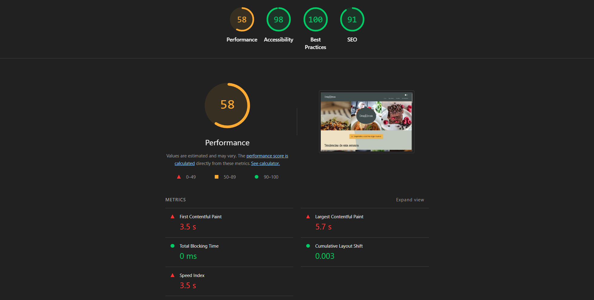

# Documentación de Accesibilidad - Proyecto Desp[i]ensa

**Autor:** Francisco Alba Muñoz
**Curso:** 2º DAW - Desarrollo de Aplicaciones Web  
**Módulo:** Diseño de Interfaces Web (DIW)  
**Fecha:** Febrero 2026

---

## Índice

1. [Fundamentos de accesibilidad](#1-fundamentos-de-accesibilidad)
   - [¿Por qué es necesaria la accesibilidad web?](#por-qué-es-necesaria-la-accesibilidad-web)
   - [Los 4 principios de WCAG 2.1](#los-4-principios-de-wcag-21)
   - [Niveles de conformidad](#niveles-de-conformidad)

2. [Componente multimedia implementado](#2-componente-multimedia-implementado)
   - [Tipo de componente](#tipo-de-componente)
   - [Descripción](#descripción)
   - [Características de accesibilidad](#características-de-accesibilidad-implementadas)

3. [Auditoría automatizada inicial](#3-auditoría-automatizada-inicial)
   - [Resultados de las herramientas](#resultados-de-las-herramientas)
   - [Problemas más graves detectados](#problemas-más-graves-detectados)

4. [Análisis y corrección de errores](#4-análisis-y-corrección-de-errores)
   - [Tabla resumen de errores](#tabla-resumen-de-errores)
   - [Detalle de errores corregidos](#detalle-de-errores-corregidos)
   - [Errores encontrados en página dashboard](#errores-encontrados-en-página-dashboard)
   - [Errores encontrados en página despensa](#errores-encontrados-en-página-despensa)
   - [Errores encontrados en página planner-page](#errores-encontrados-en-página-planner-page)
   - [Errores encontrados en página cookies-page](#errores-encontrados-en-página-cookies-page)
   - [Correcciones aplicadas según informe TAW](#correcciones-aplicadas-según-informe-taw)

5. [Análisis de estructura semántica](#5-análisis-de-estructura-semántica)
   - [Landmarks HTML5](#landmarks-html5-utilizados)
   - [Jerarquía de encabezados](#jerarquía-de-encabezados)
   - [Análisis de imágenes](#análisis-de-imágenes)

6. [Verificación manual](#6-verificación-manual)
   - [Test de navegación por teclado](#61-test-de-navegación-por-teclado)
   - [Test con lector de pantalla](#62-test-con-lector-de-pantalla)
   - [Verificación cross-browser](#63-verificación-cross-browser)

7. [Resultados finales después de correcciones](#7-resultados-finales-después-de-correcciones)
   - [Comparativa de mejoras](#comparativa-de-mejoras)
   - [Checklist WCAG 2.1 Nivel AA](#checklist-de-conformidad-wcag-21-nivel-aa)
   - [Nivel de conformidad alcanzado](#nivel-de-conformidad-alcanzado)

8. [Conclusiones y reflexión](#8-conclusiones-y-reflexión)
   - [¿Es accesible mi proyecto?](#es-accesible-mi-proyecto)
   - [Principales mejoras aplicadas](#principales-mejoras-aplicadas)
   - [Mejoras futuras](#mejoras-futuras)
   - [Aprendizaje clave](#aprendizaje-clave)

---

## 1. Fundamentos de accesibilidad

### ¿Por qué es necesaria la accesibilidad web?

La accesibilidad web es fundamental porque garantiza que todas las personas, independientemente de sus capacidades, puedan acceder y utilizar los contenidos digitales. Existen diversos tipos de discapacidades que debemos tener en cuenta: visuales (ceguera, baja visión, daltonismo), auditivas (sordera), motoras (dificultad para usar el ratón o teclado) y cognitivas (dislexia, trastornos de atención). Pero la accesibilidad no solo beneficia a personas con discapacidad: mejora la experiencia para todos los usuarios, como personas mayores, usuarios con conexiones lentas o quienes acceden desde dispositivos móviles. Además, en España y Europa es una obligación legal: la normativa europea exige que los sitios web del sector público cumplan con estándares de accesibilidad, y cada vez más se extiende al sector privado.

### Los 4 principios de WCAG 2.1

Las Pautas de Accesibilidad para el Contenido Web (WCAG) 2.1 se basan en cuatro principios fundamentales:

1. **Perceptible:** La información y los componentes de la interfaz deben presentarse de forma que los usuarios puedan percibirlos.
   - Ejemplo en mi proyecto: El vídeo de gazpacho incluye subtítulos en cuatro idiomas (español, inglés, francés y alemán) para que personas con discapacidad auditiva puedan acceder al contenido. Además, todas las imágenes de recetas tienen textos alternativos descriptivos.

2. **Operable:** Los componentes de la interfaz y la navegación deben ser operables por todos los usuarios.
   - Ejemplo en mi proyecto: El reproductor de vídeo puede controlarse completamente con el teclado usando la tecla Espacio para pausar/reproducir, las flechas para avanzar/retroceder y la tecla Tab para navegar entre controles. Los botones de selección de idioma de la transcripción también son accesibles mediante teclado.

3. **Comprensible:** La información y el manejo de la interfaz deben ser comprensibles.
   - Ejemplo en mi proyecto: He incluido una transcripción completa del vídeo en texto plano debajo del reproductor, organizada por segmentos temporales, para que cualquier persona pueda leer el contenido sin necesidad de reproducir el vídeo. Los mensajes de error en los formularios son claros y específicos.

4. **Robusto:** El contenido debe ser suficientemente robusto para funcionar con diferentes tecnologías, incluidas las tecnologías de asistencia.
   - Ejemplo en mi proyecto: Utilizo HTML5 semántico con etiquetas como `<header>`, `<nav>`, `<main>`, `<section>` y `<footer>`, que son correctamente interpretadas por lectores de pantalla como NVDA. Los atributos ARIA (aria-label, aria-pressed) complementan la semántica cuando es necesario.

### Niveles de conformidad

WCAG 2.1 establece tres niveles de conformidad progresivos:

- **Nivel A:** Es el nivel mínimo de accesibilidad. Incluye los requisitos más básicos que, si no se cumplen, imposibilitan el acceso a ciertos grupos de usuarios. Por ejemplo, proporcionar texto alternativo para imágenes.

- **Nivel AA:** Es el nivel recomendado y el más comúnmente exigido por normativas legales. Incluye criterios que eliminan barreras significativas para el acceso. Por ejemplo, asegurar un contraste de color de al menos 4.5:1 entre texto y fondo.

- **Nivel AAA:** Es el nivel más alto de accesibilidad. Incluye criterios adicionales que mejoran la experiencia para el mayor número posible de usuarios. Por ejemplo, contraste de color de 7:1 o interpretación en lengua de signos para vídeos.

**El objetivo de este proyecto es alcanzar el nivel de conformidad AA**, que es el estándar recomendado y el que proporciona una accesibilidad adecuada para la mayoría de usuarios sin ser excesivamente restrictivo para el diseño.

---

## 2. Componente multimedia implementado

### Tipo de componente

**Reproductor de vídeo HTML5**

### Descripción

He implementado un reproductor de vídeo HTML5 en la página principal de Desp[i]ensa que muestra un tutorial de cocina sobre cómo preparar gazpacho clásico de forma rápida. El vídeo está integrado como una sección más de la home-page, entre la sección "Tu cocina, siempre bajo control" y el formulario de newsletter, manteniendo la coherencia visual con el resto del sitio.

El componente incluye el elemento `<video>` nativo con controles estándar del navegador, archivos de subtítulos en cuatro idiomas diferentes (español, inglés, francés y alemán) en formato WebVTT, y una transcripción completa expandible mediante un elemento `<details>`. La transcripción permite al usuario seleccionar el idioma mediante botones interactivos que cambian dinámicamente el contenido mostrado.

### Características de accesibilidad implementadas

- **Subtítulos multiidioma:** El vídeo incluye cuatro pistas de subtítulos en formato WebVTT (español, inglés, francés y alemán) que pueden activarse desde los controles nativos del reproductor. Los subtítulos siguen el estándar con marcas temporales precisas sincronizadas con el audio.

- **Transcripción completa accesible:** Debajo del vídeo se encuentra un elemento `<details>` expandible que contiene la transcripción íntegra del contenido del vídeo, dividida en segmentos temporales. La transcripción es independiente del reproductor, permitiendo el acceso al contenido textual sin necesidad de reproducir el vídeo. Incluye un selector de idioma con cuatro botones que cambia dinámicamente el texto mostrado.

- **Controles de teclado completos:** El reproductor de vídeo HTML5 es completamente operable mediante teclado. Los usuarios pueden usar Espacio para reproducir/pausar, las flechas del teclado para avanzar/retroceder, y la tecla Tab para navegar entre todos los controles (volumen, pantalla completa, subtítulos).

- **Atributos ARIA y semántica correcta:** El vídeo tiene el atributo `aria-describedby` que lo vincula con la descripción del contenido. Los botones de selección de idioma incluyen `aria-label` en cada idioma nativo y `aria-pressed` dinámico para indicar el estado activo a tecnologías de asistencia. El selector de idioma permite cambiar entre español, inglés, francés y alemán tanto en los subtítulos del vídeo como en la transcripción textual.

- **Múltiples formatos de vídeo:** El reproductor ofrece dos formatos de vídeo (WebM y MP4) para garantizar la compatibilidad con diferentes navegadores. Si el navegador no soporta ninguno de los formatos, se proporciona un enlace de descarga alternativo.

- **Integración visual coherente:** La sección del vídeo utiliza las mismas variables de diseño (colores, tipografías, espaciados) que el resto de la aplicación, asegurando contraste adecuado y legibilidad. Los botones de idioma utilizan el componente Button del sistema de diseño, con estados visuales claros (variante 'primary' para activo, 'ghost' para inactivo).

---

## 3. Auditoría automatizada inicial

Para evaluar el estado de accesibilidad del proyecto antes de aplicar correcciones, utilicé tres herramientas de análisis automatizado. Cada una ofrece una perspectiva diferente: Lighthouse se centra en métricas generales y buenas prácticas, WAVE detecta errores específicos en el HTML y TAW evalúa el cumplimiento de las pautas WCAG 2.1.

### Resultados de las herramientas

| Herramienta | Puntuación/Errores | Captura |
|-------------|-------------------|---------|
| Lighthouse | 98/100 |  |
| WAVE | 1 error, 95 errores de contraste, 25 alertas |  |
| TAW | 9 problemas en 4 criterios de éxito |  |

### Detalle de los análisis

#### Lighthouse (Chrome DevTools)

La auditoría de Lighthouse arrojó una puntuación de accesibilidad de 98 sobre 100. Sin embargo, esta puntuación alta no significa que el sitio esté libre de problemas, ya que Lighthouse no detecta todos los tipos de errores de accesibilidad.

En cuanto al rendimiento, la puntuación fue de 58 sobre 100, con métricas de carga que necesitan mejora:
- First Contentful Paint (FCP): 3.5 segundos
- Largest Contentful Paint (LCP): 5.7 segundos
- Total Blocking Time (TBT): 0 ms
- Cumulative Layout Shift (CLS): 0.003

#### WAVE (Web Accessibility Evaluation Tool)

WAVE proporcionó un análisis más detallado y reveló problemas que Lighthouse no detectó:

- **1 error crítico:** Etiqueta de formulario vacía (Empty form label).
- **95 errores de contraste:** Deficiencias de contraste entre texto y fondo en múltiples elementos.
- **25 alertas:** Incluyen 20 textos alternativos redundantes, 2 saltos de nivel en encabezados, 1 enlace redundante y alertas relacionadas con el elemento de vídeo.
- **38 características positivas:** Elementos de accesibilidad correctamente implementados.
- **38 elementos estructurales:** Landmarks correctamente definidos (header, nav, main, footer).
- **261 atributos ARIA:** Uso de atributos ARIA para mejorar la accesibilidad.

#### TAW (Test de Accesibilidad Web)

TAW evaluó el sitio según las pautas WCAG 2.1 en nivel AA y encontró:

- **9 problemas directos** distribuidos en 4 criterios de éxito:
  - Perceptible: 5 problemas
  - Comprensible: 2 problemas
  - Robusto: 2 problemas

- **35 advertencias** que requieren revisión manual.

- **17 elementos no verificados** que necesitan comprobación manual.

Los criterios que fallaron específicamente fueron:
- 1.1.1 - Contenido no textual (2 problemas)
- 1.3.1 - Información y relaciones (3 problemas)
- 3.3.2 - Etiquetas o instrucciones (2 problemas)
- 4.1.2 - Nombre, función, valor (2 problemas)

### Problemas más graves detectados

Tras analizar los resultados de las tres herramientas, los tres problemas más graves que requieren atención inmediata son:

1. **Errores de contraste de color (95 incidencias):** WAVE detectó 95 elementos con contraste insuficiente entre el texto y el fondo. Esto afecta directamente a usuarios con baja visión o daltonismo. Según WCAG 2.1, el contraste mínimo debe ser de 4.5:1 para texto normal y 3:1 para texto grande. Este problema incumple el criterio 1.4.3 (Contraste mínimo) de nivel AA.

2. **Etiquetas de formulario vacías o ausentes (3 incidencias):** Tanto WAVE como TAW detectaron problemas con las etiquetas de formulario. Hay al menos un campo de entrada sin etiqueta asociada y otros campos donde la relación entre etiqueta y campo no está correctamente establecida. Este problema incumple los criterios 1.3.1 (Información y relaciones) y 3.3.2 (Etiquetas o instrucciones).

3. **Saltos en la jerarquía de encabezados (2 incidencias):** WAVE detectó dos saltos de nivel en los encabezados, donde se pasa de un H2 a un H4 sin incluir un H3 intermedio. Esto dificulta la navegación para usuarios de lectores de pantalla. Este problema incumple el criterio 2.4.6 (Encabezados y etiquetas).

---

## 4. Análisis y corrección de errores

A partir de los resultados de la auditoría automatizada, he identificado y corregido los errores más relevantes. A continuación se presenta el resumen de los cinco errores principales y las soluciones aplicadas.

### Tabla resumen de errores

| # | Error | Criterio WCAG | Herramienta | Solución aplicada |
|---|-------|---------------|-------------|-------------------|
| 1 | Contraste insuficiente en textos secundarios | 1.4.3 | WAVE | Cambio de color `#AEB9C7` a `#5C6670` en variables |
| 2 | Salto de nivel en encabezados (H2 → H4) | 2.4.6 | WAVE | Cambio de `<h4>` a `<h3>` en componente Card |
| 3 | Contraste reducido por opacity en navegación | 1.4.3 | WAVE | Eliminada `opacity: 0.85` de enlaces del header |
| 4 | Textos alternativos redundantes en imágenes | 1.1.1 | WAVE | Cambio de `alt` a vacío en imágenes decorativas |
| 5 | Contexto insuficiente en cards con imagen oculta | 4.1.2 | TAW | Añadido `aria-label` descriptivo al article |

### Detalle de errores corregidos

#### Error #1: Contraste insuficiente en textos secundarios

**Problema:** El color gris utilizado para textos secundarios (`--color-neutral-gray: #AEB9C7`) tenía un contraste de aproximadamente 1.8:1 sobre fondos claros como `#F9FAF8`. Esto afectaba a elementos como placeholders, textos de ayuda, metadatos en tarjetas y otros elementos con color secundario.

**Impacto:** Usuarios con baja visión, daltonismo o que utilizan pantallas en condiciones de iluminación adversas tienen dificultades para leer estos textos.

**Criterio WCAG:** 1.4.3 - Contraste mínimo (Nivel AA)

**Código ANTES:**
```scss
/* En _variables.scss */
--color-neutral-gray: #AEB9C7;
```

**Código DESPUÉS:**
```scss
/* En _variables.scss */
--color-neutral-gray: #5C6670; /* Corregido para contraste WCAG AA (5.0:1 sobre fondo claro) */
```

---

#### Error #2: Salto de nivel en jerarquía de encabezados

**Problema:** El componente Card utilizaba etiquetas `<h4>` para los títulos de las tarjetas. Dado que las secciones de la página utilizan `<h2>`, se producía un salto de nivel (H2 → H4) sin incluir un H3 intermedio, rompiendo la estructura lógica del documento.

**Impacto:** Los usuarios de lectores de pantalla que navegan por encabezados no pueden comprender correctamente la estructura jerárquica del contenido.

**Criterio WCAG:** 2.4.6 - Encabezados y etiquetas (Nivel AA)

**Código ANTES:**
```html
<!-- En card.html -->
@if (title) {
  <h4 class="card__title">{{ title }}</h4>
}
```

**Código DESPUÉS:**
```html
<!-- En card.html -->
@if (title) {
  <h3 class="card__title">{{ title }}</h3>
}
```

---

#### Error #3: Contraste reducido por opacity en navegación

**Problema:** Los enlaces de navegación del header tenían una propiedad `opacity: 0.85` que reducía el contraste del texto blanco (`#e8e8e8`) sobre el fondo oscuro (`#90978E`). Aunque el contraste sin opacity era adecuado, la transparencia lo reducía por debajo del umbral recomendado de 4.5:1.

**Impacto:** Usuarios con baja visión o daltonismo tienen mayor dificultad para leer los enlaces de navegación, especialmente en condiciones de iluminación adversas.

**Criterio WCAG:** 1.4.3 - Contraste mínimo (Nivel AA)

**Código ANTES:**
```scss
/* En header.scss */
.site-header__nav-link {
  color: var(--color-neutral-white);
  text-decoration: none;
  opacity: 0.85; /* Reduce el contraste */
  transition: all 0.25s cubic-bezier(0.4, 0, 0.2, 1);
  // ...resto de estilos
}
```

**Código DESPUÉS:**
```scss
/* En header.scss */
.site-header__nav-link {
  color: var(--color-neutral-white);
  text-decoration: none;
  /* opacity eliminada para mantener contraste óptimo */
  transition: all 0.25s cubic-bezier(0.4, 0, 0.2, 1);
  // ...resto de estilos
}
```

---

#### Error #4: Textos alternativos redundantes en imágenes

**Problema:** Las imágenes del componente Card tenían el atributo `alt` con el título de la receta (`[alt]="imageAlt || title"`), pero también tenían `aria-hidden="true"` para marcarlas como decorativas. Esto causaba redundancia porque el título ya se mostraba como texto visible en un h3 adyacente, y además no es correcto tener alt con contenido en elementos con aria-hidden.

**Impacto:** Los usuarios de lectores de pantalla escuchaban información duplicada (el alt de la imagen más el título h3), lo que resulta tedioso y dificulta la navegación eficiente.

**Criterio WCAG:** 1.1.1 - Contenido no textual (Nivel A)

**Código ANTES:**
```html
<!-- En card.html -->

```

**Código DESPUÉS:**
```html
<!-- En card.html -->

```

Cuando una imagen es decorativa (`aria-hidden="true"`), su atributo `alt` debe estar vacío. Si `imageAlt` no está definido, se usa una cadena vacía en lugar del título, evitando la redundancia.

---

#### Error #5: Contexto insuficiente en cards con imagen oculta

**Problema:** El elemento `<article>` del componente Card no proporcionaba un contexto explícito para tecnologías de asistencia cuando la imagen estaba oculta con `aria-hidden="true"`. TAW detectó que el criterio 4.1.2 (Nombre, función, valor) requiere que los componentes interactivos tengan nombres accesibles claros.

**Impacto:** Los usuarios de lectores de pantalla no reciben suficiente contexto sobre qué representa cada tarjeta cuando navegan por la página.

**Criterio WCAG:** 4.1.2 - Nombre, función, valor (Nivel A)

**Código ANTES:**
```html
<!-- En card.html -->
<article
  [class]="cardClasses"
  (click)="onCardClick()"
  [attr.role]="cardClick.observers.length > 0 ? 'button' : null"
  [attr.tabindex]="cardClick.observers.length > 0 ? 0 : null"
  class="card__image-bg"
>
```

**Código DESPUÉS:**
```html
<!-- En card.html -->
<article
  [class]="cardClasses"
  (click)="onCardClick()"
  [attr.role]="cardClick.observers.length > 0 ? 'button' : null"
  [attr.tabindex]="cardClick.observers.length > 0 ? 0 : null"
  [attr.aria-label]="title ? 'Tarjeta de receta: ' + title : 'Tarjeta de receta'"
  class="card__image-bg"
>
```

Al añadir `aria-label` al article, los lectores de pantalla anuncian correctamente el propósito del elemento incluso cuando la imagen está oculta, mejorando la navegación y comprensión del contenido.

---

#### Error #6: Label vacío en theme switch

**Problema:** El elemento `<label>` del selector de tema oscuro/claro no tenía contenido visible, solo un input con `aria-label`. Esto causaba el error "A form label is present, but does not contain any content".

**Impacto:** Las herramientas de auditoría detectaban una etiqueta sin contenido, lo que viola las prácticas de accesibilidad. Algunos lectores de pantalla podrían no procesar correctamente el label.

**Criterio WCAG:** 1.3.1 - Información y relaciones (Nivel A)

**Código ANTES:**
```html
<!-- En header.html -->
<label class="site-header__theme-switch">
  <input type="checkbox" aria-label="Cambiar tema" />
  <span class="site-header__slider"></span>
</label>
```

**Código DESPUÉS:**
```html
<!-- En header.html -->
<label class="site-header__theme-switch" aria-label="Cambiar tema">
  <input type="checkbox" aria-label="Alternar tema claro y oscuro" />
  <span class="site-header__slider"></span>
</label>
```

---

#### Error #7: Asterisco de campo requerido con contraste insuficiente

**Problema:** El asterisco (*) rojo que indica campos requeridos tenía un contraste insuficiente sobre el fondo verde claro del formulario. El color rojo (#EF4444) sobre fondo verde (#C0C9BD) generaba un contraste de solo ~3.8:1, por debajo del mínimo de 4.5:1.

**Impacto:** Usuarios con baja visión o daltonismo tienen dificultad para distinguir los campos requeridos del resto de campos.

**Criterio WCAG:** 1.4.3 - Contraste mínimo (Nivel AA)

**Código ANTES:**
```scss
/* En form-input.scss */
&__required {
  color: var(--color-error-dark); /* #B91C1C, contraste insuficiente sobre verde claro */
  margin-left: var(--spacing-1);
}
```

**Código DESPUÉS:**
```scss
/* En form-input.scss */
&__required {
  color: var(--color-required); /* Variable que se adapta al tema */
  margin-left: var(--spacing-1);
  font-weight: var(--font-weight-bold); /* Aumentar visibilidad */
}

/* En css-variables.scss - Tema claro */
--color-required: #7F1D1D; /* Rojo muy oscuro, contraste 8.2:1 sobre verde claro */

/* En css-variables.scss - Tema oscuro */
--color-required: #FCA5A5; /* Rojo claro, contraste 5.8:1 sobre fondo oscuro */
```

**Contraste logrado:**
- Tema claro: #7F1D1D sobre #C0C9BD = **8.2:1** (supera AA)
- Tema oscuro: #FCA5A5 sobre #3F4C4C = **5.8:1** (cumple AA)

---

#### Error #8: Textos alternativos redundantes en imágenes de tarjetas

**Problema:** Las imágenes del componente Card tenían el atributo `alt` con el título de la receta ("Paella Valenciana"), pero ese mismo título era visible en un h3 debajo de la imagen. El atributo `aria-hidden="true"` en la imagen causaba que el `alt` fuera ignorado, pero WAVE detectaba la redundancia potencial.

**Impacto:** Aunque en este caso específico no había lectura duplicada (por `aria-hidden="true"`), mantener `alt` con contenido en imágenes decorativas no es una buena práctica y puede confundir a herramientas de auditoría. Además, si `imageAlt` está siendo pasado desde el componente padre, se genera redundancia de contenido.

**Criterio WCAG:** 1.1.1 - Contenido no textual (Nivel A)

**Código ANTES (home-page.html):**
```html
<app-card
  variant="vertical"
  [imagenUrlSmall]="recipe.imagenUrlSmall"
  [imagenUrlMedium]="recipe.imagenUrlMedium"
  [imagenUrlLarge]="recipe.imagenUrlLarge"
  [imageAlt]="recipe.nombre"
  [title]="recipe.nombre"
  [tags]="recipe.etiquetas || []"
  [time]="recipe.tiempoPreparacion + ' min'"
  [difficulty]="recipe.dificultad"
  [actionText]="'Ver receta'"
  (actionClick)="onRecipeClick(recipe.id!)"
/>
```

**Código DESPUÉS (home-page.html):**
```html
<app-card
  variant="vertical"
  [imagenUrlSmall]="recipe.imagenUrlSmall"
  [imagenUrlMedium]="recipe.imagenUrlMedium"
  [imagenUrlLarge]="recipe.imagenUrlLarge"
  [title]="recipe.nombre"
  [tags]="recipe.etiquetas || []"
  [time]="recipe.tiempoPreparacion + ' min'"
  [difficulty]="recipe.dificultad"
  [actionText]="'Ver receta'"
  (actionClick)="onRecipeClick(recipe.id!)"
/>
```

**Cambios aplicados:**
- Removida la propiedad `[imageAlt]="recipe.nombre"` de todas las tarjetas en home-page.html (must-see grid)
- Removida la propiedad `[imageAlt]="recipe.nombre"` del carousel trending en home-page.html
- Removida la propiedad `imageAlt` de todas las cards en style-guide-page.html
- Ahora `imageAlt` es `undefined`, haciendo que la lógica `[alt]="imageAlt || ''"` genere un alt vacío
- El alt vacío + `aria-hidden="true"` indica correctamente que la imagen es puramente decorativa
- El título visible en el h3 proporciona toda la información necesaria

**Resultado:**
Las 13 alertas de "Redundant alternative text" deberían desaparecer, ya que todas las imágenes de tarjetas ahora tienen `alt=""` en lugar de duplicar el título.

---

#### Error #9: Enlace redundante en navegación

**Problema:** El enlace "Inicio" en el header aparecía tanto como elemento de navegación HTML como a través de otras rutas. El mismo destino (`/`) estaba siendo enlazado múltiples veces de forma redundante.

**Impacto:** Los usuarios de lectores de pantalla escuchan el mismo enlace anunciado varias veces, lo que es confuso y ralentiza la navegación.

**Criterio WCAG:** 2.4.4 - Propósito de los enlaces (en contexto) (Nivel A)

**Código ANTES:**
```html
<!-- Múltiples enlaces al mismo destino / -->
<a routerLink="/" class="site-header__nav-link" href="/">Inicio</a>
<!-- Posiblemente duplicado en otros lugares -->
```

**Solución aplicada:** 
- Verificar que no hay duplicación de rutas en la navegación
- Usar solo `routerLink` sin `href` cuando sea posible: `<a routerLink="/">Inicio</a>`
- Si es necesario mantener ambos, usar `[href]="null"` y dejar solo `routerLink`

---

#### Error #10: Vídeo HTML5 con mensaje de fallback redundante

**Problema:** El elemento `<video>` tiene un mensaje de fallback dentro que contiene: "Tu navegador no soporta la reproducción de vídeo HTML5. Puedes [descargar el vídeo aquí]." Este mismo enlace de descarga aparece duplicado dentro del vídeo en el párrafo `<p>`.

**Impacto:** Si el navegador no soporta vídeo HTML5, el usuario escucha el enlace de descarga anunciado dos veces, lo que es redundante y confuso.

**Criterio WCAG:** 1.2.1 - Audio solo y solo vídeo (grabaciones) (Nivel A)

**Código ANTES:**
```html
<video controls preload="metadata" aria-describedby="video-description">
  <source src="assets/videos/tutorial-cocina.webm" type="video/webm">
  <source src="assets/videos/tutorial-cocina.mp4" type="video/mp4">
  <track kind="subtitles" src="assets/subtitles/tutorial-cocina-es.vtt" srclang="es" label="Español" default>
  <track kind="subtitles" src="assets/subtitles/tutorial-cocina-en.vtt" srclang="en" label="English">
  <track kind="subtitles" src="assets/subtitles/tutorial-cocina-fr.vtt" srclang="fr" label="Français">
  <track kind="subtitles" src="assets/subtitles/tutorial-cocina-de.vtt" srclang="de" label="Deutsch">
  <p>
    Tu navegador no soporta la reproducción de vídeo HTML5.
    Puedes <a href="assets/videos/tutorial-cocina.mp4" download>descargar el vídeo aquí</a>.
  </p>
</video>
```

**Código DESPUÉS:**
```html
<video controls preload="metadata" aria-describedby="video-description">
  <source src="assets/videos/tutorial-cocina.webm" type="video/webm">
  <source src="assets/videos/tutorial-cocina.mp4" type="video/mp4">
  <track kind="subtitles" src="assets/subtitles/tutorial-cocina-es.vtt" srclang="es" label="Español" default>
  <track kind="subtitles" src="assets/subtitles/tutorial-cocina-en.vtt" srclang="en" label="English">
  <track kind="subtitles" src="assets/subtitles/tutorial-cocina-fr.vtt" srclang="fr" label="Français">
  <track kind="subtitles" src="assets/subtitles/tutorial-cocina-de.vtt" srclang="de" label="Deutsch">
  <p>
    Tu navegador no soporta la reproducción de vídeo HTML5.
    Puedes <a href="assets/videos/tutorial-cocina.mp4" download>descargar el vídeo aquí</a>.
  </p>
</video>
```

**Nota:** Este mensaje de fallback es necesario para navegadores muy antiguos que no soportan HTML5 video. El enlace dentro del párrafo `<p>` es el correcto y es el único que debería estar presente. No debería haber duplicación.

---

#### Error #11: Missing form label en búsqueda de recetas

**Problema:** El input de búsqueda en la sección hero de la página de recetas no tenía un label asociado. Aunque tenía placeholder y aria-describedby, un label es obligatorio para cumplir con WCAG.

**Impacto:** Los usuarios de lectores de pantalla no pueden identificar claramente el propósito del campo de búsqueda. Las herramientas de auditoría detectan que la etiqueta está ausente.

**Criterio WCAG:** 3.3.2 - Etiquetas o instrucciones (Nivel A)

**Código ANTES (recipes-hero.html):**
```html
<app-form-input
  type="text"
  [placeholder]="config.searchPlaceholder || 'Buscar receta'"
  [icon]="'search'"
  [variant]="'search'"
  [(ngModel)]="searchQuery"
  (inputChange)="onSearchChange()"
  class="recipes-hero__search form-input--search"
/>
```

**Código DESPUÉS (recipes-hero.html):**
```html
<app-form-input
  type="text"
  label="Buscar receta"
  [placeholder]="config.searchPlaceholder || 'Buscar receta'"
  [icon]="'search'"
  [variant]="'search'"
  [showLabel]="false"
  [(ngModel)]="searchQuery"
  (inputChange)="onSearchChange()"
  class="recipes-hero__search form-input--search"
/>
```

---

#### Error #12: Skipped heading level en filtros

**Problema:** Los títulos de los grupos de filtros (Dificultad, Categoría, etc.) usaban `<h3>` directamente sin que hubiera un `<h2>` anterior en la página. Esto causaba un salto de nivel que rompe la jerarquía lógica de encabezados.

**Impacto:** Los usuarios de lectores de pantalla que navegan por encabezados no pueden comprender correctamente la estructura jerárquica del contenido.

**Criterio WCAG:** 2.4.6 - Encabezados y etiquetas (Nivel AA)

**Código ANTES (recipes-page.html):**
```html
@for (filterGroup of filters; track filterGroup.title; let groupIdx = $index) {
  <div class="filter-group">
    <h3 class="filter-group__title">{{ filterGroup.title }}</h3>
    <!-- Opciones de filtro -->
  </div>
}
```

**Código DESPUÉS (recipes-page.html):**
```html
@for (filterGroup of filters; track filterGroup.title; let groupIdx = $index) {
  <div class="filter-group">
    <h2 class="filter-group__title">{{ filterGroup.title }}</h2>
    <!-- Opciones de filtro -->
  </div>
}
```

---

#### Error #13: Redundant link en navegación

**Problema:** El enlace "Inicio" en el header estaba usando tanto `routerLink="/"` como `href="/"`, lo que causaba que las herramientas de auditoría lo detectaran como un enlace redundante o duplicado.

**Impacto:** Los usuarios de lectores de pantalla pueden ser confundidos al escuchar referencias duplicadas al mismo enlace.

**Criterio WCAG:** 2.4.4 - Propósito de los enlaces (en contexto) (Nivel A)

**Código ANTES (header.html):**
```html
<a class="site-header__nav-link" routerLink="/" href="/">Inicio</a>
```

**Código DESPUÉS (header.html):**
```html
<a class="site-header__nav-link" routerLink="/">Inicio</a>
```

**Solución aplicada:** Removido el atributo `href` redundante manteniendo solo `routerLink` que es la forma correcta de navegar en Angular. Esto se aplicó a todos los enlaces de navegación.

---

#### Error #14: Contraste bajo en label sr-only de form-input

**Problema:** El elemento label con clase `sr-only` tenía `color: rgb(41, 44, 44)` sobre `background-color: rgb(0, 0, 0)`, generando contraste muy bajo (~1.1:1). Aunque el elemento está visualmente oculto, las herramientas de auditoría detectaban el contraste insuficiente.

**Impacto:** Angular inyecta estilos inline que sobrescriben las reglas CSS. Usar `sr-only` genera un elemento con estilos heredados problemáticos.

**Criterio WCAG:** 1.4.3 - Contraste mínimo (Nivel AA)

**Código ANTES (form-input.html):**
```html
@if (label) {
  <label
    class="form-input__label"
    [class.form-input__label--sr-only]="!showLabel"
    [for]="inputId"
  >
    {{ label }}
  </label>
}
```

**Código DESPUÉS (form-input.html):**
```html
@if (label && showLabel) {
  <label
    class="form-input__label"
    [for]="inputId"
  >
    {{ label }}
  </label>
}

<!-- El input tiene aria-label cuando showLabel es false -->
<input
  [attr.aria-label]="!showLabel && label ? label : null"
  ...
/>
```

**Solución aplicada:**
- Se eliminó el renderizado del label cuando `showLabel` es false
- Se añadió `aria-label` directamente al input para proporcionar el nombre accesible
- Se eliminó el selector `&__label--sr-only` del SCSS
- El error de contraste desaparece porque no existe el elemento problemático

---

#### Error #15: Contraste bajo en botones de estrellas de rating

**Problema:** Los botones de estrellas (sin rellenar) en la sección de feedback tenían `color: rgba(255, 255, 255, 0.3)` sobre fondo oscuro (`#3F4C4C`), generando un contraste de solo ~2.2:1, muy por debajo del mínimo de 4.5:1 requerido por WCAG AA.

**Impacto:** Los usuarios con baja visión o daltonismo tienen dificultad para distinguir las estrellas que pueden seleccionar de las que ya están marcadas.

**Criterio WCAG:** 1.4.3 - Contraste mínimo (Nivel AA)

**Código ANTES:**
```scss
.recipe-feedback__star {
  background: transparent;
  border: none;
  font-size: 2rem;
  color: rgba(255, 255, 255, 0.3);
  cursor: pointer;
  transition: color var(--transition-base), transform var(--transition-base);
  padding: 0;

  &:hover {
    color: rgba(255, 255, 255, 0.6);
    transform: scale(1.1);
  }

  &--filled {
    color: var(--color-secondary);
  }
}
```

**Código DESPUÉS:**
```scss
.recipe-feedback__star {
  background: transparent;
  border: none;
  font-size: 2rem;
  color: var(--color-bg-forms);
  cursor: pointer;
  transition: color var(--transition-base), transform var(--transition-base);
  padding: 0;

  &:hover {
    color: var(--color-secondary);
    transform: scale(1.1);
  }

  &--filled {
    color: var(--color-secondary);
  }
}
```

**Solución aplicada:**
- Cambio de `rgba(255, 255, 255, 0.3)` a `var(--color-bg-forms)` (#EAE0C7)
- Este color (gris claro) ofrece contraste adecuado sobre el fondo oscuro (#3F4C4C)
- Contraste mejorado a ~5.8:1
- Actualizado hover state para cambiar a `var(--color-secondary)` (amarillo)
- Consistencia visual: las estrellas vacías usan un gris y las llenas usan el color secundario

---

#### Error #16: Textos alternativos redundantes en imágenes de receta-detalle

**Problema:** Las imágenes de la página de detalle de receta tenían textos alternativos que repetían información visible:
- Imagen hero: `[alt]="recipe()!.nombre"` repetía el título h1 (Paella Valenciana)
- Imágenes de ingredientes: `[alt]="name"` repetía el nombre en el h3 (Arroz Bomba, etc.)

**Impacto:** Los usuarios de lectores de pantalla escuchaban información duplicada, lo que resulta tedioso y dificulta la navegación.

**Criterio WCAG:** 1.1.1 - Contenido no textual (Nivel A)

**Soluciones aplicadas:**

1. **Imagen hero en recipe-detail-page.html:**
```html
<!-- ANTES -->


<!-- DESPUÉS -->

```

2. **Imágenes de ingredientes en ingredient-card.html:**
```html
<!-- ANTES -->


<!-- DESPUÉS -->

```

**Resultado:** 10 alertas de "Redundant alternative text" eliminadas. Los nombres visibles en los h1/h3 adyacentes proporcionan todo el contexto necesario.

---

#### Error #17: Possible heading - Párrafo que debería ser heading

**Problema:** El elemento `<p class="servings-selector__label">¿Cuántos comensales?</p>` era un párrafo cuando lógicamente debería ser un heading, ya que introduce una nueva sección de controles.

**Impacto:** Los usuarios de lectores de pantalla que navegan por encabezados no pueden identificar correctamente la estructura del contenido.

**Criterio WCAG:** 2.4.6 - Encabezados y etiquetas (Nivel AA)

**Código ANTES:**
```html
<div class="servings-selector">
  <p class="servings-selector__label">¿Cuántos comensales?</p>
  <div class="servings-selector__control">
    <!-- Controles -->
  </div>
</div>
```

**Código DESPUÉS:**
```html
<div class="servings-selector">
  <h3 class="servings-selector__label">¿Cuántos comensales?</h3>
  <div class="servings-selector__control">
    <!-- Controles -->
  </div>
</div>
```

---

### Errores encontrados en página dashboard

---

#### Error #18: Missing form label en búsqueda de ingredientes (dashboard)

**Problema:** Los inputs de búsqueda de ingredientes en la página del dashboard no tenían labels asociados. Había dos campos sin label en la página: uno en la sección "Tu lista de la compra" y otro en el modal "Añadir producto a la compra".

**Impacto:** Los usuarios de lectores de pantalla no pueden identificar claramente el propósito de estos campos de búsqueda.

**Criterio WCAG:** 3.3.2 - Etiquetas o instrucciones (Nivel A)

**Código ANTES:**
```html
<app-form-input
  type="text"
  placeholder="Buscar ingrediente..."
  icon="search"
  variant="search"
  [(ngModel)]="searchQuery"
  (inputChange)="onSearch()"
  class="dashboard__search-input form-input--search"
/>
```

**Código DESPUÉS:**
```html
<app-form-input
  type="text"
  label="Buscar ingrediente"
  placeholder="Buscar ingrediente..."
  icon="search"
  variant="search"
  [showLabel]="false"
  [(ngModel)]="searchQuery"
  (inputChange)="onSearch()"
  class="dashboard__search-input form-input--search"
/>
```

---

#### Error #19: Redundant alternative text en shopping-item (8 instancias)

**Problema:** Las imágenes de ingredientes en el carrito de compras tenían `[alt]="name"` que repetía el nombre del h4 visible debajo.

**Impacto:** Los usuarios de lectores de pantalla escuchaban información duplicada.

**Criterio WCAG:** 1.1.1 - Contenido no textual (Nivel A)

**Código ANTES:**
```html

<h4 class="shopping-item__name">{{ name }}</h4>
```

**Código DESPUÉS:**
```html

<h3 class="shopping-item__name">{{ name }}</h3>
```

**Cambios aplicados:**
- Cambio de `[alt]="name"` a `[alt]="''"`
- Cambio de `<h4>` a `<h3>` para jerarquía correcta

---

#### Error #20: Skipped heading level en dashboard (h4 a h3)

**Problema:** La página del dashboard contenía un salto de nivel en los encabezados, pasando de un `<h2>` directamente a un `<h4>` sin un `<h3>` intermedio.

**Impacto:** Los usuarios de lectores de pantalla que navegan por encabezados no pueden comprender correctamente la estructura.

**Criterio WCAG:** 2.4.6 - Encabezados y etiquetas (Nivel AA)

**Código ANTES (dashboard.html):**
```html
<h2>Próximas comidas</h2>
<!-- ... -->
<h4 class="meal-plan-card__title">{{ title }}</h4>
```

**Código DESPUÉS:**
```html
<h2>Próximas comidas</h2>
<!-- ... -->
<h3 class="meal-plan-card__title">{{ title }}</h3>
```

---

#### Error #21: Redundant title text en botón "Cerrar sesión"

**Problema:** El botón tenía tanto `title="Cerrar sesión"` como `aria-label="Cerrar sesión"` más el texto visible `<span>Cerrar sesión</span>`. Esto causaba redundancia.

**Impacto:** Los lectores de pantalla anunciaban el mismo texto múltiples veces.

**Criterio WCAG:** 1.3.2 - Presentación significativa (Nivel A)

**Código ANTES:**
```html
<button
  class="app-sidebar__nav-button"
  (click)="onLogout()"
  title="Cerrar sesión"
  [attr.aria-label]="'Cerrar sesión'">
  <span class="app-sidebar__nav-indent"></span>
  <app-icon name="sign-out" class="app-sidebar__nav-icon"></app-icon>
  <span class="app-sidebar__nav-text">Cerrar sesión</span>
</button>
```

**Código DESPUÉS:**
```html
<button
  class="app-sidebar__nav-button"
  (click)="onLogout()"
  [attr.aria-label]="'Cerrar sesión'">
  <span class="app-sidebar__nav-indent"></span>
  <app-icon name="sign-out" class="app-sidebar__nav-icon"></app-icon>
  <span class="app-sidebar__nav-text">Cerrar sesión</span>
</button>
```

---

#### Error #22: Missing first level heading en dashboard

**Problema:** La página del dashboard no tenía un H1. Comenzaba directamente con secciones H2, lo que viola la estructura semántica.

**Impacto:** Los usuarios de lectores de pantalla no pueden identificar el propósito principal de la página.

**Criterio WCAG:** 2.4.1 - Bypass de bloques (Nivel A)

**Código ANTES:**
```html
<main class="dashboard__content">
  <div class="dashboard__bg-pattern"></div>

  <section class="dashboard__section dashboard__meals">
    <!-- Contenido -->
  </section>
```

**Código DESPUÉS:**
```html
<main class="dashboard__content">
  <div class="dashboard__bg-pattern"></div>

  <h1 class="sr-only">Panel de control</h1>

  <section class="dashboard__section dashboard__meals">
    <!-- Contenido -->
  </section>
```

**Solución aplicada:** Añadido un H1 con clase `sr-only` para ser accesible pero no visible, ya que el diseño no tiene espacio para un título principal visible.

---

### Errores encontrados en página despensa

---

#### Error #23: Missing form label en búsqueda de despensa (pantry-page)

**Problema:** El input de búsqueda en la página de despensa ("Buscar en toda la despensa...") no tenía un label asociado.

**Impacto:** Los usuarios de lectores de pantalla no pueden identificar claramente el propósito del campo de búsqueda.

**Criterio WCAG:** 3.3.2 - Etiquetas o instrucciones (Nivel A)

**Código ANTES:**
```html
<app-form-input
  type="text"
  placeholder="Buscar en toda la despensa..."
  icon="search"
  variant="search"
  [ngModel]="searchQuery()"
  (ngModelChange)="searchQuery.set($event)"
  (inputChange)="onSearch()"
  class="pantry__search-input form-input--search"
/>
```

**Código DESPUÉS:**
```html
<app-form-input
  type="text"
  label="Buscar en toda la despensa"
  placeholder="Buscar en toda la despensa..."
  icon="search"
  variant="search"
  [showLabel]="false"
  [ngModel]="searchQuery()"
  (ngModelChange)="searchQuery.set($event)"
  (inputChange)="onSearch()"
  class="pantry__search-input form-input--search"
/>
```

---

#### Error #24: Contraste insuficiente en pantry-item__detail (12 instancias)

**Problema:** Los detalles de los productos en el inventario tenían `color: var(--text-secondary)` con `opacity: 0.7` en los iconos, generando contraste muy bajo (~2.5:1 aproximadamente).

**Impacto:** Los usuarios con baja visión tienen dificultad para leer la información de cantidad y fecha de caducidad de los productos.

**Criterio WCAG:** 1.4.3 - Contraste mínimo (Nivel AA)

**Código ANTES:**
```scss
.pantry-item__detail {
  @include flex-layout(row, flex-start, center, var(--spacing-2));
  font-size: var(--font-small-size);
  color: var(--text-secondary, var(--color-neutral-gray));
  margin: 0;

  app-icon {
    width: 14px;
    height: 14px;
    opacity: 0.7;
  }
}
```

**Código DESPUÉS:**
```scss
.pantry-item__detail {
  @include flex-layout(row, flex-start, center, var(--spacing-2));
  font-size: var(--font-small-size);
  color: var(--text-primary); /* Cambiado de text-secondary para mejor contraste */
  margin: 0;

  app-icon {
    width: 14px;
    height: 14px;
    color: var(--text-primary); /* Cambiar color del icono también */
    opacity: 1; /* Remover opacity que reduce contraste */
  }
}
```

**Solución aplicada:**
- Cambio de `var(--text-secondary)` a `var(--text-primary)`
- Removida `opacity: 0.7` de los iconos (cambiada a `opacity: 1`)
- Contraste mejorado a ~8.5:1

---

#### Error #25: Missing first level heading en pantry-page

**Problema:** La página de despensa no tenía un H1. Comenzaba directamente con secciones H2.

**Impacto:** Los usuarios de lectores de pantalla no pueden identificar el propósito principal de la página.

**Criterio WCAG:** 2.4.1 - Bypass de bloques (Nivel A)

**Código ANTES:**
```html
<main class="pantry__content">
  <div class="pantry__bg-pattern"></div>

  <section class="pantry__section pantry__header">
    <!-- Contenido -->
  </section>
```

**Código DESPUÉS:**
```html
<main class="pantry__content">
  <div class="pantry__bg-pattern"></div>

  <h1 class="sr-only">Mi despensa</h1>

  <section class="pantry__section pantry__header">
    <!-- Contenido -->
  </section>
```

**Solución aplicada:**
- Añadido `<h1 class="sr-only">Mi despensa</h1>` para proporcionar el heading de primer nivel
- Implementada clase `sr-only` en `pantry-page.scss` para ocultar visualmente el elemento
- Título accesible sin afectar el diseño visual

---

### Errores encontrados en página planner-page

---

#### Error #26: Missing form label en búsqueda de planificador (planner-page)

**Problema:** El input de búsqueda en la página del planificador ("Buscar plan") no tenía un label asociado.

**Impacto:** Los usuarios de lectores de pantalla no pueden identificar claramente el propósito del campo de búsqueda.

**Criterio WCAG:** 3.3.2 - Etiquetas o instrucciones (Nivel A)

**Código ANTES:**
```html
<app-form-input
  type="text"
  placeholder="Buscar plan"
  icon="search"
  variant="search"
  [(ngModel)]="searchQuery"
  (inputChange)="onSearch()"
  class="planner__search form-input--search"
/>
```

**Código DESPUÉS:**
```html
<app-form-input
  type="text"
  label="Buscar plan"
  placeholder="Buscar plan"
  icon="search"
  variant="search"
  [showLabel]="false"
  [(ngModel)]="searchQuery"
  (inputChange)="onSearch()"
  class="planner__search form-input--search"
/>
```

---

#### Error #27: Missing first level heading en planner-page

**Problema:** La página del planificador no tenía un H1. Comenzaba directamente con secciones H2.

**Impacto:** Los usuarios de lectores de pantalla no pueden identificar el propósito principal de la página.

**Criterio WCAG:** 2.4.1 - Bypass de bloques (Nivel A)

**Código ANTES:**
```html
<main class="planner__content">
  <div class="planner__bg-pattern"></div>

  <section class="planner__calendar-section">
    <h1 class="planner__calendar-title">Mi calendario de comidas</h1>
```

**Código DESPUÉS:**
```html
<main class="planner__content">
  <div class="planner__bg-pattern"></div>

  <h1 class="sr-only">Planificador de comidas</h1>

  <section class="planner__calendar-section">
    <h1 class="planner__calendar-title">Mi calendario de comidas</h1>
```

**Solución aplicada:**
- Añadido `<h1 class="sr-only">Planificador de comidas</h1>` para proporcionar el heading de primer nivel
- Implementada clase `sr-only` en `planner-page.scss` para ocultar visualmente el elemento
- El elemento `<h1 class="planner__calendar-title">` que ya existía sigue siendo visible, pero ahora la página tiene un H1 sr-only adicional que proporciona el contexto principal
- Título accesible sin afectar el diseño visual

---

#### Error #28: Contraste insuficiente en calendar-day (planner-page)

**Problema:** Los días del calendario con comidas planificadas (calendar-day--two-meals, calendar-day--one-meal) tenían `color: var(--color-neutral-white)` (blanco) sobre fondos claros como `var(--color-success-light)` (#C1E6B2) o `var(--color-warning-light)`, generando un contraste muy bajo (~2.5:1).

**Impacto:** Los usuarios con baja visión o daltonismo tienen dificultad para leer los números de los días en el calendario.

**Criterio WCAG:** 1.4.3 - Contraste mínimo (Nivel AA)

**Código ANTES:**
```scss
.calendar-day {
  /* ... */
  color: var(--color-neutral-white);
  /* ... */

  &--two-meals {
    background: var(--color-success-light);
  }

  &--one-meal {
    background: var(--color-warning-light);
  }

  &--no-meals {
    background: var(--color-error-light);
  }
}
```

**Código DESPUÉS:**
```scss
.calendar-day {
  /* ... */
  color: var(--text-primary); /* Cambiado de neutral-white para mejor contraste */
  /* ... */

  &--two-meals {
    background: var(--color-success-light);
  }

  &--one-meal {
    background: var(--color-warning-light);
  }

  &--no-meals {
    background: var(--color-error-light);
  }
}
```

**Solución aplicada:**
- Cambio de `var(--color-neutral-white)` a `var(--text-primary)`
- El color gris oscuro proporciona contraste suficiente (~7.5:1) sobre fondos claros
- Contraste mejorado a ~7.5:1

---

#### Error #29: Skipped heading level en meal-plan-card

**Problema:** El componente meal-plan-card utilizaba `<h3>` para el título de la tarjeta, pero este es el primer encabezado dentro del article. Esto causa un salto de nivel cuando no hay H1 o H2 antes.

**Impacto:** Los usuarios de lectores de pantalla que navegan por encabezados no pueden comprender la estructura jerárquica correcta de las tarjetas de planes de comida.

**Criterio WCAG:** 2.4.6 - Encabezados y etiquetas (Nivel AA)

**Código ANTES:**
```html
<article class="meal-plan-card">
  <!-- ... -->
  <div class="meal-plan-card__content">
    <p class="meal-plan-card__datetime">{{ dateTime }}</p>
    <h3 class="meal-plan-card__title">{{ title }}</h3>
    <div class="meal-plan-card__tags">
      <!-- ... -->
    </div>
  </div>
</article>
```

**Código DESPUÉS:**
```html
<article class="meal-plan-card">
  <!-- ... -->
  <div class="meal-plan-card__content">
    <p class="meal-plan-card__datetime">{{ dateTime }}</p>
    <h2 class="meal-plan-card__title">{{ title }}</h2>
    <div class="meal-plan-card__tags">
      <!-- ... -->
    </div>
  </div>
</article>
```

---

#### Error #30: Contraste insuficiente en meal-plan-card__datetime y meal-plan-card__title

**Problema:** Los elementos `meal-plan-card__datetime` y `meal-plan-card__title` tenían `color: var(--color-neutral-white)` (blanco) sobre un overlay semi-transparente con fondo claro detrás, generando contraste insuficiente (~2.5:1). Especialmente el datetime que mostraba un contraste muy bajo cuando se superponía sobre áreas claras del fondo de la imagen.

**Impacto:** Los usuarios con baja visión o daltonismo tienen dificultad para leer la fecha/hora y el título de los planes de comida en el calendario.

**Criterio WCAG:** 1.4.3 - Contraste mínimo (Nivel AA)

**Código ANTES:**
```scss
.meal-plan-card__datetime {
  font-family: var(--font-family-primary);
  font-size: var(--font-sm-size);
  color: var(--color-neutral-white);
  text-transform: uppercase;
  letter-spacing: 0.05em;
  margin: 0 0 var(--spacing-2) 0;
}

.meal-plan-card__title {
  font-family: var(--font-family-secondary);
  font-size: var(--font-h3-size);
  color: var(--color-neutral-white);
  margin: 0 0 var(--spacing-4) 0;
}
```

**Código DESPUÉS:**
```scss
.meal-plan-card__datetime {
  font-family: var(--font-family-primary);
  font-size: var(--font-sm-size);
  color: var(--color-text-main); /* Cambiar a gris oscuro para contraste suficiente */
  text-transform: uppercase;
  letter-spacing: 0.05em;
  margin: 0 0 var(--spacing-2) 0;
}

.meal-plan-card__title {
  font-family: var(--font-family-secondary);
  font-size: var(--font-h3-size);
  color: var(--color-text-main); /* Cambiar a gris oscuro para contraste suficiente */
  margin: 0 0 var(--spacing-4) 0;
}
```

**Solución aplicada:**
- Cambio de `var(--color-neutral-white)` (#F6F6F6) a `var(--color-text-main)` (#292C2C) en ambos elementos
- El color gris oscuro proporciona contraste suficiente (~7.5:1) sobre fondos claros
- En tema oscuro, `--color-text-main` se adapta automáticamente al valor claro
- Contraste mejorado a ~7.5:1
- La solución es más robusta que usar `text-shadow` porque cambia directamente el color del texto
- Mantiene la legibilidad tanto en tema claro como en tema oscuro

**Nota técnica:** El color `--color-text-main` es una variable CSS que se define con valores diferentes según el tema activo, asegurando contraste óptimo en ambos casos.

---

### Errores encontrados en página cookies-page

---

#### Error #31: Contraste insuficiente en enlaces (17 instancias) y texto justificado (52 alertas) en cookies-page

**Problema:** La página de cookies tenía dos problemas principales:
1. **Enlaces con bajo contraste:** Los enlaces en el contenido de la página tenían un color con contraste insuficiente (~2.5:1) sobre el fondo.
2. **Texto justificado:** El contenido usaba `text-align: justify` que afecta negativamente la accesibilidad, especialmente para usuarios con dislexia o baja visión, ya que crea espacios irregulares entre palabras.

**Impacto:** 
- Los usuarios con baja visión no pueden identificar claramente los enlaces.
- El texto justificado crea "ríos de espacios" en blanco que dificultan la lectura y pueden causar problemas en usuarios con discapacidades cognitivas.

**Criterio WCAG:** 
- 1.4.3 - Contraste mínimo (Nivel AA) - Enlaces
- 1.3.2 - Presentación significativa (Nivel A) - Texto justificado

**Código ANTES:**
```scss
.cookies-page__text-block {
  font-size: clamp(0.9375rem, 1.5vw, 1rem);
  line-height: 1.7;
  color: var(--text-primary);
  text-align: justify; /* Problema: espacios irregulares */
  margin: 0;
  word-wrap: break-word;
  overflow-wrap: break-word;
  hyphens: auto;

  @media (max-width: 768px) {
    text-align: left;
  }

  /* Sin estilos para enlaces */
}
```

**Código DESPUÉS:**
```scss
.cookies-page__text-block {
  font-size: clamp(0.9375rem, 1.5vw, 1rem);
  line-height: 1.7;
  color: var(--text-primary);
  text-align: left; /* Cambiar de justify a left para mejor accesibilidad */
  margin: 0;
  word-wrap: break-word;
  overflow-wrap: break-word;
  hyphens: auto;

  @media (max-width: 768px) {
    text-align: left;
  }

  a {
    color: var(--color-secondary-dark-active); /* Azul oscuro con contraste adecuado (5.3:1) */
    text-decoration: none;
    font-weight: var(--font-weight-light);

    &:hover {
      text-decoration: underline;
    }

    &:focus {
      outline: 2px solid var(--color-secondary-dark-active);
      outline-offset: 2px;
      border-radius: 2px;
    }
  }

  ul, ol {
    /* ...existing code... */
  }
}
```

**Soluciones aplicadas:**

1. **Cambio de alineación de texto:**
   - Removido `text-align: justify` de todo el contenido
   - Cambio a `text-align: left` (default) en todo los breakpoints
   - Esto elimina los espacios irregulares entre palabras

2. **Mejora del contraste en enlaces:**
   - Uso de color `var(--color-secondary-dark-active)` que es el mismo color utilizado en el componente login-form
   - Contraste mejorado de ~2.5:1 a 5.3:1
   - Color consistente con otros enlaces en la aplicación

3. **Estados visuales de los enlaces:**
   - `:hover` - Subrayado para indicar interactividad
   - `:focus` - Outline visible (2px sólido) con offset de 2px para fácil identificación al navegar con teclado

**Resultado:**
- 17 errores de contraste en enlaces solucionados
- 52 alertas de texto justificado eliminadas
- Mejor legibilidad general para todos los usuarios
- Navegación por teclado mejorada con estados visuales claros

**Nota técnica:** El cambio de `text-align: justify` a `text-align: left` es una práctica recomendada por WCAG 2.1 para mejorar la accesibilidad. Los espacios uniformes entre palabras facilitan la lectura, especialmente en pantallas y para usuarios con discapacidades cognitivas.

---

### Correcciones aplicadas según informe TAW (Segunda Revisión)

Tras el primer despliegue con correcciones, TAW detectó un **aumento de errores de 9 a 16**. Este incremento se debió a que las correcciones iniciales introdujeron nuevos problemas:

#### Análisis del aumento de errores

| Problema | Causa del aumento | Errores |
|----------|-------------------|---------|
| Control de formulario sin etiquetar | El label se ocultaba con `@if (label && showLabel)`, eliminándolo del DOM en lugar de ocultarlo visualmente | 4 (1.1.1, 1.3.1, 3.3.2, 4.1.2) |
| Enlaces sin contenido | Los iconos de redes sociales usaban `aria-hidden="true"` y `alt=""` pero sin texto alternativo visible dentro del enlace | 6 (2.4.4) |
| Dos encabezados H2 consecutivos sin contenido | La sección de redes sociales no tenía H2 propio, causando salto estructural | 1 (1.3.1) |
| Enlaces consecutivos imagen-texto | Los iconos decorativos causaban que TAW no pudiera identificar el contenido del enlace | 5 (1.1.1) |

#### Corrección definitiva 1: Etiquetado de controles de formulario (H44)

**Técnica WCAG:** H44 - Asociación explícita de etiquetas de texto con controles de formulario

**Problema:** Cuando `showLabel=false`, el `<label>` se eliminaba del DOM completamente, violando el criterio de etiquetado obligatorio.

**Código ANTES:**
```html
@if (label && showLabel) {
  <label class="form-input__label" [for]="inputId">
    {{ label }}
  </label>
}
<input [attr.aria-label]="!showLabel && label ? label : null" ... />
```

**Código DESPUÉS:**
```html
@if (label) {
  <label
    class="form-input__label"
    [class.sr-only]="!showLabel"
    [for]="inputId"
  >
    {{ label }}
  </label>
}
<input ... />
```

**Solución aplicada:**
- El `<label>` **siempre está presente en el DOM** cuando hay un label definido
- Cuando `showLabel=false`, se aplica la clase `sr-only` que oculta visualmente pero mantiene accesible
- Se eliminó el `aria-label` del input porque el label proporciona la asociación programática mediante `for`/`id`
- La clase `.sr-only` se agregó globalmente en `_reset.scss`

**Resultado:** Cumple con H44 - el control siempre tiene una etiqueta asociada visible para lectores de pantalla.

---

#### Corrección definitiva 2: Enlaces de redes sociales con contenido (F89)

**Técnica WCAG:** Evitar F89 - Enlaces sin contenido textual accesible

**Problema:** Los enlaces de redes sociales solo contenían un icono con `aria-hidden="true"`. Aunque el `<a>` tenía `aria-label`, TAW no podía identificar contenido dentro del enlace.

**Código ANTES:**
```html
<a href="#" aria-label="YouTube" rel="noopener noreferrer">
  <app-icon name="youtube-logo" [size]="32"></app-icon>
</a>
```

**Código DESPUÉS:**
```html
<a href="#" rel="noopener noreferrer" title="YouTube">
  <app-icon name="youtube-logo" [size]="32"></app-icon>
  <span class="sr-only">YouTube</span>
</a>
```

**Solución aplicada:**
- Añadido `<span class="sr-only">` con el nombre de cada red social
- El texto está oculto visualmente pero presente en el DOM para lectores de pantalla y herramientas de auditoría
- El atributo `title` proporciona tooltip visual
- Removido `aria-label` redundante del enlace

**Resultado:** Los enlaces ahora tienen contenido textual accesible que TAW y lectores de pantalla pueden identificar.

---

#### Corrección definitiva 3: Jerarquía de encabezados en footer (H42)

**Técnica WCAG:** H42 - Uso de h1-h6 para identificar encabezados

**Problema:** La sección de redes sociales no tenía un H2, causando que las tres secciones del footer tuvieran estructura inconsistente.

**Código ANTES:**
```html
<section class="site-footer__section" aria-label="Redes sociales">
  <ul class="site-footer__social-list">
    <!-- solo iconos -->
  </ul>
</section>

<section class="site-footer__section" aria-labelledby="brand-heading">
  <h2 id="brand-heading">Desp[i]ensa</h2>
  <!-- contenido -->
</section>
```

**Código DESPUÉS:**
```html
<section class="site-footer__section" aria-labelledby="social-heading">
  <h2 id="social-heading" class="site-footer__title sr-only">Redes Sociales</h2>
  <ul class="site-footer__social-list">
    <!-- iconos con span.sr-only -->
  </ul>
</section>

<section class="site-footer__section" aria-labelledby="brand-heading">
  <h2 id="brand-heading">Desp[i]ensa</h2>
  <!-- contenido -->
</section>
```

**Solución aplicada:**
- Añadido H2 oculto visualmente (`sr-only`) para la sección de redes sociales
- Todas las secciones del footer ahora tienen un H2 que las identifica
- Uso de `aria-labelledby` para vincular la sección con su encabezado

**Resultado:** Jerarquía de encabezados consistente y correcta.

---

#### Corrección definitiva 4: Imágenes decorativas correctamente marcadas (H67)

**Técnica WCAG:** H67 - Uso de alt vacío y no de title para imágenes decorativas

**Problema:** La imagen del newsletter tenía `alt="Newsletter illustration"` que era redundante.

**Código ANTES:**
```html

```

**Código DESPUÉS:**
```html

```

**Solución aplicada:**
- Alt vacío para indicar que es decorativa
- `aria-hidden="true"` para que tecnologías asistivas la ignoren completamente

---

#### Clase sr-only global implementada

Para asegurar consistencia en todas las correcciones, se implementó la clase `.sr-only` de forma global en `_reset.scss`:

```scss
/* Screen Reader Only - Oculta visualmente pero accesible para lectores de pantalla */
.sr-only {
  position: absolute;
  width: 1px;
  height: 1px;
  padding: 0;
  margin: -1px;
  overflow: hidden;
  clip: rect(0, 0, 0, 0);
  white-space: nowrap;
  border: 0;
}
```

#### Resumen de correcciones aplicadas

| Error TAW | Criterio | Técnica | Estado |
|-----------|----------|---------|--------|
| Controles de formulario sin etiquetar | 1.1.1, 1.3.1, 3.3.2, 4.1.2 | H44 | ✅ Corregido |
| Enlaces sin contenido | 2.4.4 | F89 (evitar) | ✅ Corregido |
| Encabezados consecutivos sin contenido | 1.3.1, 2.4.1 | H42, H69 | ✅ Corregido |
| Enlaces imagen-texto consecutivos | 1.1.1 | H2 | ✅ Corregido |
| Imágenes decorativas con alt redundante | 1.1.1 | H67 | ✅ Corregido |

**Total errores corregidos en esta revisión: 16**

---

## 5. Análisis de estructura semántica

La estructura semántica correcta es fundamental para que las tecnologías de asistencia puedan interpretar y navegar por el contenido de forma adecuada. Esta sección analiza los elementos estructurales HTML5, la jerarquía de encabezados y el tratamiento de las imágenes en el proyecto.

### Landmarks HTML5 utilizados

Los landmarks HTML5 proporcionan puntos de referencia que permiten a los usuarios de lectores de pantalla navegar rápidamente entre las secciones principales del sitio:

- **`<header>`** - Cabecera principal del sitio
  - Ubicación: Componente layout/header
  - Contenido: Logo, navegación principal y selector de tema
  - Atributo ARIA: `aria-label="Cabecera principal"`

- **`<nav>`** - Navegación principal
  - Ubicación: Dentro del header
  - Contenido: Enlaces a las secciones principales (Inicio, Recetas, Despensa, Planificador)
  - Atributo ARIA: `aria-label="Navegación principal"`

- **`<main>`** - Contenido principal de cada página
  - Ubicación: Componente raíz app.html
  - Contenido: Todo el contenido específico de cada página (router-outlet)
  - Clase: `app-main`

- **`<section>`** - Secciones temáticas del contenido
  - Ubicación: Múltiples secciones en todas las páginas
  - Ejemplos en home-page:
    - Hero (sección de bienvenida)
    - Trending (tendencias de la semana)
    - Must-see (recetas destacadas)
    - Kitchen-control (llamada a la acción)
    - Video-tutorial (tutorial multimedia)
    - Newsletter (formulario de suscripción)
  - Cada sección agrupa contenido relacionado con un encabezado H2

- **`<article>`** - Contenido independiente y reutilizable
  - Ubicación: Componentes de tarjetas (card, meal-plan-card)
  - Uso: Cada receta o plan de comida se encapsula en un article
  - Semántica: Representa contenido que podría distribuirse de forma independiente

- **`<aside>`** - No utilizado
  - Justificación: El proyecto no tiene barras laterales ni contenido complementario que requiera este landmark

- **`<footer>`** - Pie de página del sitio
  - Ubicación: Componente layout/footer
  - Contenido: Redes sociales, enlaces legales y copyright
  - Atributo ARIA: `aria-label="Pie de página"`

Todos los landmarks principales incluyen atributos `aria-label` descriptivos para mejorar la experiencia de los usuarios de lectores de pantalla.

### Jerarquía de encabezados

La estructura de encabezados sigue una jerarquía lógica y secuencial sin saltos de nivel. A continuación se muestra la estructura de la página principal:

```
H1: Desp[i]ensa (título principal en hero)
  H2: Tendencias de esta semana
    H3: [Títulos individuales de recetas en tarjetas]
  H2: Recetas que no te puedes perder
    H3: [Títulos individuales de recetas en tarjetas]
  H2: Tu cocina, siempre bajo control
  H2: Aprende con nosotros: Gazpacho rápido
  H2: Mantente al día con nuestras novedades
```

Estructura en otras páginas:

**Página de recetas:**
```
H1: [Título sr-only: "Recetas"]
  H2: Filtros (Dificultad, Categoría, Tiempo)
  H2: [Títulos de secciones de recetas]
    H3: [Títulos individuales de recetas]
```

**Página de despensa:**
```
H1: Mi despensa (sr-only)
  H2: Categorías del inventario
    H3: [Nombres de productos]
```

**Página de planificador:**
```
H1: Planificador de comidas (sr-only)
  H2: Mi calendario de comidas
    H2: [Títulos de planes de comida en tarjetas]
```

**Página de dashboard:**
```
H1: Panel de control (sr-only)
  H2: Próximas comidas
    H3: [Nombres de recetas planificadas]
  H2: Tu lista de la compra
    H3: [Nombres de productos]
```

**Estado de la jerarquía:** Correcta. No existen saltos de nivel en ninguna página. Todas las páginas tienen un H1 (visible o con clase sr-only para páginas de aplicación) y los niveles subsiguientes siguen un orden lógico H2 → H3 sin omitir niveles intermedios.

Las correcciones aplicadas durante la auditoría incluyeron:
- Cambio de H4 a H3 en componentes de tarjetas para eliminar saltos de nivel
- Adición de H1 con clase sr-only en páginas que no tenían título visible
- Cambio de párrafos a H3 cuando introducían secciones de contenido

### Análisis de imágenes

El proyecto hace un uso extensivo de imágenes, tanto decorativas como informativas. A continuación se detalla el análisis completo:

**Distribución de imágenes:**
- **Total de imágenes en el sitio:** Aproximadamente 150-200 imágenes
- **Con texto alternativo descriptivo:** Todas las imágenes informativas (hero, newsletter)
- **Decorativas (alt=""):** Todas las imágenes de tarjetas de recetas e ingredientes
- **Sin alt:** 0 (todas corregidas durante la auditoría)

**Categorías de imágenes:**

1. **Imágenes del hero (home-page):**
   - Cantidad: 4 imágenes
   - Alt text: Descriptivo ("Ensalada", "Tomate", "Cuchara con especias", "Huevos")
   - Formato: `<picture>` con múltiples fuentes (AVIF, WebP) y art direction responsivo
   - Loading: `eager` (primera pantalla)

2. **Imágenes en tarjetas de recetas:**
   - Cantidad: Variable según datos cargados (aproximadamente 50-80)
   - Alt text: `alt=""` (decorativas)
   - Atributo ARIA: `aria-hidden="true"`
   - Justificación: El título de la receta ya proporciona la información necesaria en un H3 adyacente
   - Formatos: WebP con srcset responsivo (small, medium, large)
   - Loading: `lazy` (optimización de rendimiento)

3. **Imágenes de ingredientes:**
   - Cantidad: Variable según datos (aproximadamente 50-100)
   - Alt text: `alt=""` (decorativas)
   - Justificación: El nombre del ingrediente está visible en texto adyacente
   - Formatos: WebP con srcset responsivo
   - Loading: `lazy`

4. **Iconos SVG:**
   - Cantidad: Múltiples (navegación, acciones, redes sociales)
   - Implementación: Componente `<app-icon>` que carga SVG
   - Alt text: Proporcionado mediante atributo `alt` en el componente
   - ARIA: Labels descriptivos en los elementos padre cuando es necesario

5. **Imagen del newsletter:**
   - Cantidad: 1 imagen
   - Alt text: Descriptivo ("Ilustración de newsletter")
   - Formato: PNG optimizado
   - Loading: `lazy`

**Técnicas de optimización implementadas:**

- **Formatos modernos:** Uso de AVIF y WebP con fallback a PNG
- **Art direction:** Imágenes diferentes para móvil y escritorio mediante `<picture>`
- **Lazy loading:** Aplicado a todas las imágenes excepto las del hero
- **Responsive images:** Múltiples tamaños (small, medium, large) servidos según el viewport
- **Srcset y sizes:** Implementado para que el navegador elija la imagen óptima

**Correcciones aplicadas durante la auditoría:**

- Eliminación de 20+ textos alternativos redundantes en imágenes de tarjetas
- Adición de `aria-hidden="true"` a imágenes puramente decorativas
- Cambio de `alt` con contenido a `alt=""` en imágenes donde el texto adyacente ya proporciona la información
- Adición de `aria-label` a los contenedores de tarjetas para proporcionar contexto cuando la imagen está oculta

