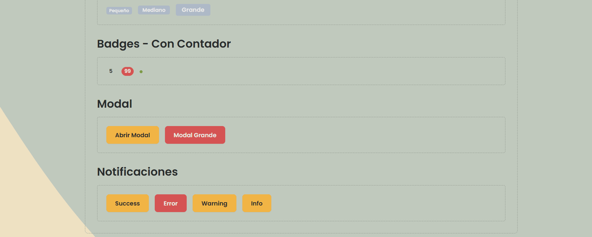
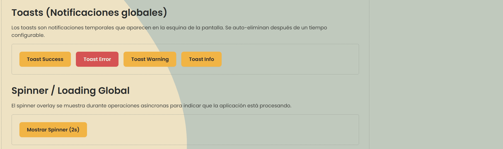
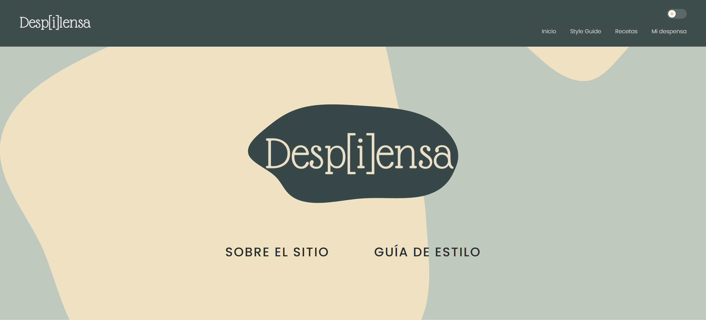
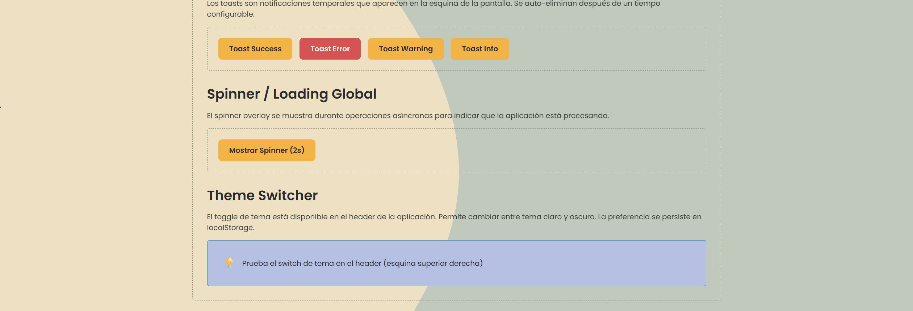
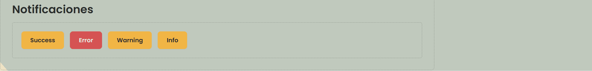
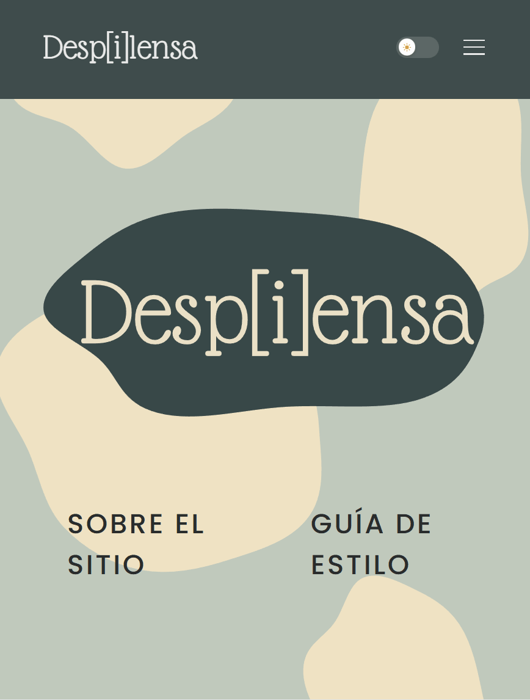

# Sección 1: Arquitectura CSS y comunicación visual

## Introducción: Modificación de etiquetas HTML mediante CSS

En esta aplicación web, el HTML semántico proporciona la estructura base del documento, mientras que CSS se encarga de definir la presentación visual. Cada elemento HTML puede modificarse completamente mediante estilos: los elementos `<h1>` a `<h4>` se redefinyen con tipografía, color y espaciado personalizados; los `<button>` y `<a>` se transforman mediante variantes de color, tamaño y estado; las `<section>` y `<div>` se organizan en layouts complejos usando Flexbox y CSS Grid. Esta separación entre estructura (HTML) y presentación (CSS) permite que el mismo elemento HTML se presente de múltiples formas diferentes según su contexto, mejorando la reutilización de código y facilitando el mantenimiento del sistema de diseño.

### 1.1 Principios de comunicación visual: Explica los 5 principios básicos y cómo los aplicas en tu proyecto:

En este proyecto se aplican de forma sistemática los cinco principios básicos de comunicación visual (jerarquía, contraste, alineación, proximidad y repetición) para guiar la lectura y mejorar la usabilidad de la interfaz.

**Jerarquía**

En la interfaz se usa la escala tipográfica para marcar niveles de importancia: el título principal utiliza `H1` con la fuente secundaria `Glass-Antiqua` y tamaño grande, mientras que `H2`, `H3` y `H4` usan `Poppins` con tamaños decrecientes y pesos altos para estructurar secciones y subsecciones.

Además, se combinan espaciados verticales mayores entre bloques (`spacing-16`, `spacing-24`) y menores entre elementos relacionados para reforzar qué contenido debe leerse primero. En la home, esto se ve en el contraste entre el gran título de marca y el bloque “Inspírate y cocina algo nuevo”, y en la página de receta individual el título “Pizza margarita” domina sobre la descripción y los pasos, marcando claramente el punto de entrada a la pantalla.


<br><br/>

**Contraste**

El contraste se consigue mediante color, tamaño y peso tipográfico: los elementos interactivos (botones y enlaces) usan el color secundario y pesos más altos frente al texto base en gris oscuro, lo que facilita identificar acciones frente a contenido informativo.

También se utiliza contraste de fondo (bloques sobre fondos claros o terciarios) para destacar secciones clave como llamadas a la acción. En las pantallas de Figma, esto se aprecia en el botón amarillo principal de la home, que destaca sobre el fondo verde suave, y en las tarjetas de receta, donde el título blanco sobre una forma gris oscura contrasta con la fotografía cálida del plato, facilitando la lectura incluso sobre imágenes complejas.


<br><br/>

**Alineación**

La maquetación sigue una alineación principalmente izquierda y basada en un grid de 12 columnas, lo que genera columnas de contenido alineadas y predecibles en todas las vistas.

Los elementos dentro de cada bloque se alinean mediante utilidades de flex y grid (por ejemplo, títulos y textos alineados al inicio, iconos y botones alineados entre sí) para mantener una estructura limpia y fácil de escanear. En las capturas puede verse en la barra de navegación (logo alineado a la izquierda y menú a la derecha sobre una misma línea), en el layout de dos columnas de la página de recetas (filtros a la izquierda y listado a la derecha) y en la sección de ingredientes de la receta individual, donde las tarjetas de ingredientes se distribuyen de forma regular dentro de la misma rejilla.


<br><br/>

**Proximidad**

Los elementos relacionados (título, descripción y botón de una misma tarjeta) se agrupan con espaciados pequeños, mientras que se añaden márgenes mayores entre secciones diferentes, de modo que el usuario percibe de forma clara qué contenidos forman parte del mismo grupo.

Este uso de proximidad reduce la carga cognitiva y ayuda a identificar bloques funcionales como secciones de contenido, tarjetas o módulos de navegación. En el listado de recetas, las opciones de filtrado se agrupan por categorías (“Dificultad”, “Tiempo de preparación”, “Restricciones o dietas”), con poco espacio entre checkboxes de un mismo grupo y más espacio entre grupos, lo que refuerza visualmente la estructura. En la home y en el detalle de receta, títulos, textos y botones dentro de cada sección comparten un bloque compacto, separado claramente de las secciones superiores e inferiores por espaciados mayores.


<br><br/>

**Repetición**

Se repiten patrones visuales de forma consistente: los componentes comparten la misma paleta de colores, tipografía base, radios de borde y sombras, de forma que una tarjeta, un botón o un bloque de contenido se reconocen como parte del mismo sistema.

La repetición de patrones de layout (por ejemplo, tarjetas con imagen de receta de fondo, forma orgánica con el título y botones en la parte inferior) refuerza la coherencia y facilita al usuario anticipar cómo se comporta cada componente. En las capturas se observa que la misma tarjeta de receta se reutiliza en la home (sección “Tendencias de esta semana”) y en la página de listado, y que las formas orgánicas de fondo y la combinación de colores se mantienen tanto en la portada como en la página de detalle y demás secciones, reforzando la identidad visual de Desp[i]lensa.


<br><br/>

### 1.2 Metodología CSS: Explica qué metodología usas (BEM recomendado) y por qué. Muestra ejemplos de tu nomenclatura. Si usas BEM, explica que usarás bloques (.card), elementos (.card__title), y modificadores (.card--featured).

Para la organización de clases se utiliza la metodología BEM (Block Element Modifier), que permite definir componentes claros y reutilizables mediante una convención de nombres estable.

Los bloques representan componentes independientes de la interfaz, por ejemplo `.card`, `.button` o `.navbar`, que se corresponden con piezas visuales como tarjetas de receta, botones de acción o la barra de navegación principal.

Los elementos son partes internas de cada bloque, como `.card__title`, `.card__body` o `.navbar__link`, que permiten identificar de forma explícita los subcomponentes de una misma pieza (título, contenido, enlaces de menú).

Los modificadores describen variantes de estilo o estado, como `.card--featured`, `.button--primary` o `.button--ghost`, que se utilizan para representar cambios visuales (por ejemplo, una receta destacada o un botón de énfasis) sin duplicar estructuras de HTML ni CSS.

Esta metodología facilita localizar los estilos de cada componente, evita colisiones entre nombres y ayuda a mantener la especificidad baja, lo que encaja bien con una arquitectura ITCSS escalable y con el uso de componentes reutilizables en Angular.

### 1.3 Organización de archivos: Documenta tu estructura ITCSS. Explica por qué cada carpeta está en ese orden (de menor a mayor especificidad). Muestra el árbol de carpetas completo.

La arquitectura de estilos sigue ITCSS (Inverted Triangle CSS), organizando los archivos de menor a mayor especificidad para controlar mejor la cascada y la herencia.

Estructura general:

```text
src/styles/
  00-settings/
    _variables.scss
  01-tools/
    _mixins.scss
  02-generic/
    _reset.scss
  03-elements/
    _elements.scss
  04-layout/
    _layout.scss
  05-components/
    _buttons.scss
    _cards.scss
    …
  06-utilities/
    _utilities.scss
  main.scss
```

- **00-settings**: design tokens globales (colores, tipografía, espaciado, breakpoints, sombras, radios, transiciones). No generan CSS por sí mismos; actúan como “fuente de verdad” visual que se reutiliza en todas las capas.

- **01-tools**: mixins y funciones SCSS reutilizables (breakpoints, layouts flex, estilos de botón base, focus accesible). Tampoco generan CSS hasta que se incluyen en otros archivos, lo que mantiene esta capa puramente de herramientas.

- **02-generic**: reset básico que normaliza el comportamiento del navegador (box-sizing, márgenes, tipografía base), afectando a todo el documento y sirviendo como punto de partida común para el resto de estilos.

- **03-elements**: estilos base de elementos HTML (`body`, `h1–h4`, `p`, `a`, `button`, etc.), redefiniendo su apariencia por defecto, pero sin depender de clases, para garantizar una tipografía y colores coherentes en toda la aplicación.

- **04-layout**: patrones de layout globales (contenedor, grid de 12 columnas, estructuras de página) que se reutilizan en distintas vistas, como la distribución en dos columnas de filtros + listado o el layout de la página de receta individual.

- **05-components**: componentes de UI específicos (botones, tarjetas de receta, módulos de navegación o formularios) con nomenclatura BEM; aquí se concentra la mayor parte de los estilos visuales de la interfaz.

- **06-utilities**: clases de utilidad de alta especificidad (por ejemplo `.visually-hidden`, `.text-center`) que pueden sobrescribir estilos anteriores de forma controlada para ajustes puntuales.

### 1.4 Sistema de Design Tokens: Documenta todas tus variables. Para cada grupo (colores, tipografía, espaciado, etc.) explica las decisiones:

Los design tokens se definen en `00-settings/_variables.scss` usando CSS Custom Properties, de modo que estén disponibles en todo el árbol de estilos y puedan atravesar cualquier mecanismo de encapsulación de componentes.

**Colores**

La paleta de colores está organizada en grupos semánticos, cada uno con variantes de luminosidad (light, base, hover, active, dark, darker):

```scss
/* Primario - Verdes suaves para fondos y elementos neutros */
--color-primary-light: #F9FAF8;
--color-primary: #C0C9BD;
--color-primary-dark: #90978E;
--color-primary-darker: #434642;

/* Secundario - Amarillos para acciones principales y CTAs */
--color-secondary-light: #EAE0C7;
--color-secondary: #F2B545;
--color-secondary-dark: #d59828;
--color-secondary-darker: #553F18;

/* Terciario - Azules verdosos para acentos */
--color-tertiary-light: #F7FBFB;
--color-tertiary: #B3D9DA;
--color-tertiary-dark: #86A3A4;

/* Semánticos - Estados y feedback */
--color-success-dark: #6AD243;
--color-error-dark: #D55353;
--color-warning-dark: #FFE24E;
--color-info-dark: #607DD9;

/* Neutros - Texto y fondos */
--color-text-main: #292C2C;
--color-neutral-white: #eaeaea;
--color-neutral-gray: #AEB9C7;
```

El color primario (verde) se utiliza para fondos suaves y elementos de interfaz neutros. El color secundario (amarillo) se reserva para acciones principales, botones y elementos destacados. Los colores semánticos siguen convenciones universales: verde para éxito, rojo para errores, amarillo para advertencias y azul para información.


<br></br>

**Tipografía**

Se definen dos familias tipográficas con una escala consistente:

```scss
/* Familias */
--font-family-primary: 'Poppins', sans-serif;
--font-family-secondary: 'Glass Antiqua', cursive;

/* Escala tipográfica */
--font-h1-size: 3.75rem;   /* 60px - Glass Antiqua */
--font-h2-size: 3rem;      /* 48px - Poppins */
--font-h3-size: 2.25rem;   /* 36px - Poppins */
--font-h4-size: 1.875rem;  /* 30px - Poppins */
--font-body-size: 1rem;    /* 16px - Poppins */
--font-sm-size: 0.875rem;  /* 14px */
--font-xs-size: 0.75rem;   /* 12px */
--font-caption-size: 0.625rem; /* 10px */

/* Pesos disponibles */
--font-weight-light: 300;
--font-weight-regular: 400;
--font-weight-medium: 500;
--font-weight-semibold: 600;
--font-weight-bold: 700;
```

La fuente secundaria `Glass Antiqua` se usa exclusivamente para el `H1` principal y elementos de marca, aportando personalidad. `Poppins` se usa para todo el contenido restante, garantizando legibilidad en pantalla.


<br></br>

**Espaciado**

El sistema de espaciado se basa en una escala de 4px, proporcionando 24 niveles de espaciado consistentes:

```scss
--spacing-1: 0.25rem;   /* 4px */
--spacing-2: 0.5rem;    /* 8px */
--spacing-3: 0.75rem;   /* 12px */
--spacing-4: 1rem;      /* 16px */
--spacing-6: 1.5rem;    /* 24px */
--spacing-8: 2rem;      /* 32px */
--spacing-12: 3rem;     /* 48px */
--spacing-16: 4rem;     /* 64px */
--spacing-24: 6rem;     /* 96px */
```

Esta escala permite mantener coherencia en márgenes, paddings y gaps entre componentes, facilitando la alineación visual y la proximidad entre elementos relacionados.

**Breakpoints**

Se definen 4 breakpoints siguiendo el enfoque mobile-first:

```scss
--breakpoint-sm: 640px;   /* Móvil grande */
--breakpoint-md: 768px;   /* Tablet */
--breakpoint-lg: 1024px;  /* Desktop */
--breakpoint-xl: 1280px;  /* Desktop grande */
```

Estos valores están alineados con el diseño de Figma y permiten adaptar layouts, número de columnas en grids y tamaños de fuente según el dispositivo.

**Sombras, bordes y transiciones**

```scss
/* Sombras - Elevación progresiva */
--shadow-sm: 0 1px 2px rgba(0, 0, 0, 0.05);
--shadow-md: 0 2px 4px rgba(0, 0, 0, 0.08);
--shadow-lg: 0 4px 10px rgba(0, 0, 0, 0.12);
--shadow-xl: 0 8px 24px rgba(0, 0, 0, 0.16);

/* Bordes */
--border-width-thin: 1px;
--border-width-medium: 2px;
--border-width-thick: 4px;

/* Radios de borde */
--radius-sm: 2px;
--radius-md: 5px;
--radius-lg: 8px;
--radius-xl: 16px;
--radius-full: 9999px;

/* Transiciones */
--transition-fast: 50ms;
--transition-base: 150ms;
--transition-slow: 300ms;
--transition-easing: ease-in-out;
```

Las sombras usan opacidades bajas para no comprometer la legibilidad. Los radios de borde van desde esquinas sutiles (`radius-sm`) hasta elementos completamente redondeados (`radius-full` para avatares o badges). Las transiciones proporcionan feedback inmediato (`fast`) o animaciones más suaves (`slow`) según el contexto.

### 1.5 Mixins y funciones: Documenta cada mixin que creaste, para qué sirve, y muestra un ejemplo de uso.

En `01-tools/_mixins.scss` se han definido mixins reutilizables que encapsulan patrones de diseño comunes, reduciendo duplicación y garantizando consistencia.

**Mixin de breakpoints (`respond-to`)**

Permite escribir media queries legibles usando nombres semánticos en lugar de valores numéricos:

```scss
$breakpoints: (
  sm: 640px,
  md: 768px,
  lg: 1024px,
  xl: 1280px
);

@mixin respond-to($breakpoint) {
  @media (min-width: map.get($breakpoints, $breakpoint)) {
    @content;
  }
}

// Uso:
.component {
  padding: var(--spacing-4);

  @include respond-to(md) {
    padding: var(--spacing-8);
  }
}
```

**Mixin de layout flex (`flex-layout`)**

Centraliza la configuración de contenedores flexibles con parámetros declarativos:

```scss
@mixin flex-layout(
  $direction: row,
  $justify: flex-start,
  $align: center,
  $gap: 0
) {
  display: flex;
  flex-direction: $direction;
  justify-content: $justify;
  align-items: $align;
  gap: $gap;
}

// Uso en header:
.site-header {
  @include flex-layout(row, space-between, center);
}

// Uso en footer:
.site-footer__social-list {
  @include flex-layout(row, flex-start, center, var(--spacing-8));
}
```

**Mixin de foco accesible (`focus-ring`)**

Encapsula un estilo de foco visible que cumple WCAG 2.1 AA:

```scss
@mixin focus-ring($color: var(--color-info-dark), $size: 2px) {
  &:focus-visible {
    outline: none;
    box-shadow: 0 0 0 $size $color;
  }
}

// Uso en botones:
.button {
  @include focus-ring(var(--color-info-dark));
}
```

**Mixin de botón base (`button-base`)**

Define la estructura común de todos los botones, permitiendo que las variantes solo ajusten colores:

```scss
@mixin button-base($bg, $color: var(--color-text-main)) {
  display: inline-flex;
  align-items: center;
  justify-content: center;
  padding: var(--spacing-8) var(--spacing-16);
  border-radius: var(--radius-md);
  border: none;
  background-color: $bg;
  color: $color;
  cursor: pointer;
  transition: background-color var(--transition-base) var(--transition-easing),
  box-shadow var(--transition-base) var(--transition-easing);
}
```

Estos mixins se utilizan extensivamente en los componentes de layout (header, footer, sidebar) y en componentes interactivos (botones, modales, formularios), garantizando que todos compartan la misma base estructural.

### 1.6 ViewEncapsulation en Angular: Explica qué estrategia de encapsulación usarás. Angular por defecto usa Emulated (estilos encapsulados por componente). Documenta si mantendrás esto o usarás None (estilos globales). Justifica tu decisión.

En este proyecto se utiliza un enfoque **ITCSS + BEM** puro, con estilos globales gestionados desde styles.scss y sin encapsulación adicional de Angular (`ViewEncapsulation.None`).

Al tratarse de un proyecto educativo y de un único desarrollador, he optado por esta opción, ya que encaja con las recomendaciones de los materiales de referencia: permite un CSS más ligero, con especificidad controlada y una arquitectura más fácil de entender y documentar dentro del módulo de Diseño de Interfaces Web. La encapsulación se gestiona mediante la propia metodología BEM y la estructura ITCSS (`settings`, `tools`, `generic`, `elements`, `layout`, `components`, `utilities`), evitando colisiones de estilos a través de convenciones claras de nombres en lugar de mecanismos automáticos de aislamiento.

---

# Sección 2: HTML semántico y estructura

## 2.1 Elementos semánticos utilizados

En este proyecto se utilizan elementos semánticos HTML5 de forma sistemática para estructurar el contenido de manera clara y accesible. A continuación se detallan los principales elementos y su uso:

### `<header>` - Cabecera principal

El elemento `<header>` se utiliza para la cabecera principal del sitio, conteniendo el logo, navegación principal y elementos de utilidad.

**Ejemplo del código:**

```html
<header class="site-header" aria-label="Cabecera principal">
  <section class="site-header__branding">
    <a class="site-header__logo" routerLink="/" aria-label="Ir a la página de inicio de Desp[i]lensa">
      <span class="site-header__logo-text">Desp[i]lensa</span>
    </a>
  </section>

  <nav class="site-header__nav" aria-label="Navegación principal">
    <ul class="site-header__nav-list">
      <li class="site-header__nav-item">
        <a class="site-header__nav-link" routerLink="/inicio">Inicio</a>
      </li>
      <li class="site-header__nav-item">
        <a class="site-header__nav-link" routerLink="/recetas">Recetas</a>
      </li>
      <li class="site-header__nav-item">
        <a class="site-header__nav-link" routerLink="/despensa">Mi despensa</a>
      </li>
    </ul>
  </nav>

  <section class="site-header__theme-toggle" aria-label="Selector de tema">
    <button class="site-header__theme-button" type="button">
      <span class="visually-hidden">Cambiar tema</span>
    </button>
  </section>
</header>
```

**Cuándo se usa:** Una vez por página, al inicio del documento, conteniendo elementos de navegación global y branding.

### `<nav>` - Navegación

El elemento `<nav>` se utiliza para contener bloques de navegación principales. En este proyecto aparece dentro del `<header>` para la navegación principal y dentro del `<aside>` (sidebar) para navegación secundaria.

**Cuándo se usa:** Para bloques de navegación significativos que permiten moverse entre secciones o páginas de la aplicación.

### `<main>` - Contenido principal

El elemento `<main>` marca el contenido principal de la página, excluyendo header, footer y barras laterales.

**Ejemplo del código:**

```html
<main class="site-main" role="main">
  <div class="site-main__container">
    <ng-content></ng-content>
  </div>
</main>
```

**Cuándo se usa:** Una vez por página, conteniendo el contenido único y principal de cada vista. Utiliza `<ng-content>` para proyectar el contenido dinámico de cada página.

### `<aside>` - Contenido secundario (Sidebar)

El elemento `<aside>` se utiliza para contenido tangencialmente relacionado con el contenido principal, como navegación secundaria o filtros.

**Ejemplo del código:**

```html
<aside class="app-sidebar" [class.app-sidebar--open]="isOpen" aria-label="Navegación secundaria">
  <h2 class="app-sidebar__title">Mi cocina</h2>

  <nav class="app-sidebar__nav" aria-label="Menú de Mi cocina">
    <ul class="app-sidebar__nav-list">
      <li class="app-sidebar__nav-item">
        <a class="app-sidebar__nav-link" routerLink="/mi-cocina/resumen">
          <span class="app-sidebar__nav-icon" aria-hidden="true">📊</span>
          Resumen
        </a>
      </li>
      <li class="app-sidebar__nav-item">
        <a class="app-sidebar__nav-link" routerLink="/mi-cocina/despensa">
          <span class="app-sidebar__nav-icon" aria-hidden="true">🏪</span>
          Despensa
        </a>
      </li>
    </ul>
  </nav>
</aside>
```

**Cuándo se usa:** Para navegación secundaria, filtros, o widgets relacionados con el contenido principal pero que no son parte central de la página.

### `<footer>` - Pie de página

El elemento `<footer>` contiene información de cierre como enlaces legales, redes sociales y copyright.

**Ejemplo del código:**

```html
<footer class="site-footer" aria-label="Pie de página">
  <section class="site-footer__social" aria-label="Redes sociales">
    <ul class="site-footer__social-list">
      <li class="site-footer__social-item">
        <a class="site-footer__social-link" href="#" aria-label="YouTube">YouTube</a>
      </li>
      <!-- más redes sociales... -->
    </ul>
  </section>

  <section class="site-footer__middle">
    <section class="site-footer__links" aria-label="Enlaces informativos">
      <a class="site-footer__link" routerLink="/acerca">Acerca de nosotros</a>
      <a class="site-footer__link" routerLink="/terminos">Términos y condiciones</a>
      <a class="site-footer__link" routerLink="/privacidad">Política de privacidad</a>
    </section>
  </section>

  <section class="site-footer__bottom">
    <p class="site-footer__copyright">© 2025 - 2025 Desp[i]lensa</p>
  </section>
</footer>
```

**Cuándo se usa:** Una vez por página, al final del documento, conteniendo información complementaria, enlaces legales y redes sociales.

### `<article>` y `<section>` - Agrupación de contenido

Aunque no están implementados en los componentes de layout actuales, estos elementos se utilizarán en las páginas de contenido:

- **`<article>`**: Para contenido autónomo e independiente que podría distribuirse por separado (ej: una tarjeta de receta, un post del blog).
- **`<section>`**: Para agrupar contenido temático relacionado dentro de una página (ej: sección de ingredientes, sección de pasos de preparación).

### Atributos de accesibilidad

Todos los elementos semánticos incluyen atributos ARIA apropiados:
- `aria-label`: Para describir regiones y elementos interactivos
- `aria-hidden="true"`: Para ocultar iconos decorativos de lectores de pantalla
- `role="main"`, `role="alert"`, `role="status"`: Para reforzar la semántica en contextos específicos

---

## 2.2 Jerarquía de headings

La jerarquía de encabezados sigue estrictamente las mejores prácticas de HTML5 y accesibilidad:

### Reglas aplicadas:

1. **Un único `<h1>` por página**: Cada vista tiene un solo `<h1>` que representa el título principal de la página.
2. **Orden secuencial**: Los niveles nunca se saltan (no se pasa de `<h2>` a `<h4>` sin un `<h3>` intermedio).
3. **Jerarquía lógica**: Los encabezados crean una estructura de documento clara y navegable.

### Diagrama de jerarquía por tipo de página:

#### **Página de Login/Registro:**

```
h1: "Iniciar sesión" / "Registro"
  └─ (formulario sin headings adicionales, usa fieldset/legend)
```

**Ejemplo de código:**

```html
<form class="login-form">
  <h1 class="login-form__title">Iniciar sesión</h1>

  <fieldset class="login-form__fieldset">
    <legend class="visually-hidden">Credenciales de acceso</legend>
    <!-- campos del formulario -->
  </fieldset>
</form>
```

#### **Página de inicio (Home):**

```
h1: "Desp[i]lensa - Tu compañero de cocina inteligente"
  h2: "Tendencias de esta semana"
  h2: "Recetas populares"
  h2: "Inspírate según tu despensa"
```

#### **Página de listado de recetas:**

```
h1: "Recetas"
  h2: "Filtros"
    h3: "Dificultad"
    h3: "Tiempo de preparación"
    h3: "Restricciones o dietas"
  h2: "Resultados"
    h3: (título de cada tarjeta de receta)
```

#### **Página de detalle de receta:**

```
h1: "Pizza Margarita" (nombre de la receta)
  h2: "Ingredientes"
  h2: "Pasos de preparación"
    h3: "Paso 1: Preparar la masa"
    h3: "Paso 2: Preparar la salsa"
    h3: "Paso 3: Hornear"
  h2: "Información nutricional"
  h2: "Recetas relacionadas"
```

#### **Sidebar (navegación secundaria):**

```
h2: "Mi cocina"
  └─ (lista de navegación sin headings adicionales)
```

### Tipografía asociada a cada nivel:

Los estilos tipográficos están definidos en las variables SCSS:

- **H1**: `font-family: Glass-Antiqua` (secundaria), `font-size: clamp(2rem, 5vw, 3rem)`, `font-weight: 700`
- **H2**: `font-family: Poppins` (primaria), `font-size: 1.75rem`, `font-weight: 600`
- **H3**: `font-family: Poppins`, `font-size: 1.5rem`, `font-weight: 600`
- **H4**: `font-family: Poppins`, `font-size: 1.25rem`, `font-weight: 500`

Esta jerarquía visual refuerza la estructura semántica, facilitando el escaneo y la comprensión del contenido.

---

## 2.3 Estructura de formularios

Los formularios en este proyecto siguen las mejores prácticas de HTML semántico y accesibilidad, utilizando `<fieldset>`, `<legend>` y asociación correcta entre `<label>` e `<input>`.

### Componente `form-input` reutilizable

El componente `app-form-input` es la base de todos los formularios y garantiza la accesibilidad y usabilidad:

**Código del componente:**

```html
<div class="form-input" [class.form-input--error]="hasError">
  <!-- Label asociado al input -->
  <label class="form-input__label" [for]="inputId">
    {{ label }}
    @if (required) {
    <span class="form-input__required" aria-label="Campo requerido">*</span>
    }
  </label>

  <!-- Wrapper del input con icono opcional -->
  <div class="form-input__wrapper">
    @if (icon) {
    <span class="form-input__icon" aria-hidden="true">{{ icon }}</span>
    }

    <input
      class="form-input__field"
      [class.form-input__field--with-icon]="icon"
      [id]="inputId"
      [type]="type"
      [name]="name"
      [placeholder]="placeholder"
      [required]="required"
      [disabled]="disabled"
      [attr.aria-describedby]="ariaDescribedBy"
      [attr.aria-invalid]="hasError"
      [(ngModel)]="value"
      (blur)="onBlur()"
      (input)="onInput($event)"
    />
  </div>

  <!-- Texto de ayuda -->
  @if (helpText && !hasError) {
  <p class="form-input__help-text" [id]="inputId + '-help'">
    {{ helpText }}
  </p>
  }

  <!-- Mensaje de error -->
  @if (hasError && errorMessage) {
  <p class="form-input__error-message" [id]="inputId + '-error'" role="alert">
    <span class="form-input__message-icon" aria-hidden="true">⚠️</span>
    {{ errorMessage }}
  </p>
  }
</div>
```

### Características clave:

1. **Asociación label-input**: El atributo `for` del `<label>` coincide con el `id` del `<input>`, generado de forma única en el componente TypeScript:

```typescript
private static idCounter = 0;
inputId: string = `form-input-${++FormInput.idCounter}`;
```

2. **Indicador visual de campo requerido**: Un asterisco (`*`) visible con texto alternativo para lectores de pantalla.

3. **Mensajes de error descriptivos**: Vinculados al input mediante `aria-describedby` y marcados con `role="alert"` para notificación inmediata.

4. **Texto de ayuda opcional**: Información adicional vinculada al input mediante `aria-describedby`.

5. **Estados visuales**: Clases BEM modificadoras para estados de error, éxito y deshabilitado.

### Formulario completo con fieldset y legend

**Ejemplo: Formulario de login**

```html
<form class="login-form" (ngSubmit)="onSubmit()" #loginFormRef="ngForm">
  <h1 class="login-form__title">Iniciar sesión</h1>

  <!-- Fieldset agrupa campos relacionados -->
  <fieldset class="login-form__fieldset">
    <!-- Legend describe el propósito del grupo -->
    <legend class="visually-hidden">Credenciales de acceso</legend>

    <!-- Componentes form-input reutilizables -->
    <app-form-input
      label="Email"
      type="email"
      name="email"
      placeholder="Email"
      icon="✉"
      [required]="true"
      [hasError]="emailError"
      [errorMessage]="emailErrorMessage"
      [(ngModel)]="formData.email"
      (blur)="validateEmail()"
    ></app-form-input>

    <app-form-input
      label="Contraseña"
      type="password"
      name="password"
      placeholder="Contraseña"
      icon="***"
      [required]="true"
      [hasError]="passwordError"
      [errorMessage]="passwordErrorMessage"
      [(ngModel)]="formData.password"
      (blur)="validatePassword()"
    ></app-form-input>
  </fieldset>

  <!-- Opciones adicionales -->
  <div class="login-form__options">
    <label class="login-form__checkbox-label">
      <input type="checkbox" name="rememberMe" class="login-form__checkbox"
             [(ngModel)]="formData.rememberMe" />
      <span>Recuérdame</span>
    </label>
  </div>

  <!-- Mensaje de error general -->
  @if (generalError) {
  <div class="login-form__error" role="alert">
    <span aria-hidden="true">⚠️</span>
    {{ generalErrorMessage }}
  </div>
  }

  <!-- Botón de envío con texto descriptivo -->
  <div class="login-form__actions">
    <button type="submit" class="login-form__button"
            [disabled]="!loginFormRef.valid || isSubmitting">
      @if (isSubmitting) {
      <span>Iniciando sesión...</span>
      } @else {
      <span>Iniciar sesión</span>
      }
    </button>
  </div>
</form>
```

### Uso de `<fieldset>` y `<legend>`:

- **`<fieldset>`**: Agrupa campos relacionados temáticamente (ej: credenciales de acceso, datos personales).
- **`<legend>`**: Describe el propósito del grupo. Se puede ocultar visualmente con la clase `.visually-hidden` manteniendo la accesibilidad.
- **Sin bordes visuales**: Los estilos BEM eliminan el borde por defecto de fieldset (`border: none`).

### Validación y feedback:

1. **Validación en tiempo real**: Los eventos `(blur)` activan la validación de cada campo.
2. **Estados visuales**: Bordes y colores cambian según el estado (error, éxito, enfocado).
3. **Mensajes descriptivos**: Cada error se asocia al input específico mediante `aria-describedby`.
4. **Botón de envío inteligente**: Se deshabilita si el formulario no es válido o está en proceso de envío.

### Accesibilidad garantizada:

- Todos los inputs tienen labels asociados
- Campos requeridos marcados visual y semánticamente
- Mensajes de error vinculados a los inputs
- Estados de error notificados con `role="alert"`
- Iconos decorativos ocultos con `aria-hidden="true"`
- Botones con texto descriptivo del estado actual
- Navegación por teclado completamente funcional
- Compatibilidad con lectores de pantalla

---

Esta estructura de formularios garantiza una experiencia de usuario accesible, usable y profesional, cumpliendo con los estándares WCAG 2.1 AA.

---

# Sección 3: Componentes interactivos y validación de estilos

## 3.1 Componentes interactivos implementados

La interfaz de Desp[i]lensa incluye una serie de componentes interactivos reutilizables que mejoran la experiencia del usuario mediante feedback visual, animaciones suaves y estados claros. Cada componente está diseñado con accesibilidad en mente y sigue la estructura BEM.

### Botones interactivos (.button)

Los botones son el elemento más versátil de la interfaz y cuentan con múltiples variantes de color, tamaño y estado:

**Estructura SCSS del bloque base:**

```scss
.button {
  display: inline-flex;
  align-items: center;
  justify-content: center;
  gap: var(--spacing-3);
  font-family: var(--font-family-primary);
  font-weight: var(--font-weight-semibold);
  border: none;
  border-radius: var(--radius-lg);
  cursor: pointer;
  transition: background-color var(--transition-base) var(--transition-easing),
  transform var(--transition-fast) var(--transition-easing),
  box-shadow var(--transition-base) var(--transition-easing);

  @include focus-ring(var(--color-info-dark));

  &:active:not(:disabled) {
    transform: scale(0.98);
  }
}
```

**Variantes de color implementadas:**

- **`.button--primary`**: `background-color: var(--color-secondary)` - Amarillo para acciones principales
- **`.button--secondary`**: `background-color: rgba(234, 224, 199, 0.75)` - Beige/crema con transparencia
- **`.button--ghost`**: `background-color: transparent; border: 2px solid` - Solo borde, sin fondo
- **`.button--danger`**: `background-color: var(--color-error-dark)` - Rojo para acciones destructivas

**Tamaños:**

- **`.button--sm`**: 32px de alto, `font-size: var(--font-sm-size)`
- **`.button--md`**: 40px de alto, `font-size: var(--font-body-size)`
- **`.button--lg`**: 48px de alto, `font-size: var(--font-h4-size)`

**Estados interactivos:**

Cada botón soporta estados visuales mediante transiciones suaves:
- **Hover**: Cambio de color mediante `background-color` y elevación mediante `box-shadow: var(--shadow-md)`
- **Active**: Presión visual mediante `transform: scale(0.98)`
- **Focus**: Anillo de foco accesible con `box-shadow: 0 0 0 2px var(--color-info-dark)`
- **Disabled**: `opacity: 0.5` y `pointer-events: none`


<br></br>

**Ejemplo de uso en componente:**

```html
<app-button
  variant="primary"
  size="md"
  icon="🔍"
  iconPosition="left"
  (buttonClick)="onSearch()">
  Buscar receta
</app-button>

<app-button
  variant="danger"
  size="sm"
  [disabled]="isDeleting"
  (buttonClick)="onDelete()">
  Eliminar
</app-button>
```

### Modales (.modal)

Los modales son componentes de overlay que centran contenido sobre el resto de la página, ideales para formularios, confirmaciones y contenido importante.

(_Aquí se muestra un ejemplo de un modal de confirmación._)

**Características:**

- Overlay oscuro semitransparente (`background-color: var(--surface-overlay)`)
- Animación suave de entrada: `transform: scale(0.95) translateY(20px)` → `scale(1) translateY(0)`
- Cierre mediante botón X, overlay click o tecla ESC (`@HostListener('document:keydown.escape')`)
- Posición `position: fixed` con `z-index: 1000` para aparecer sobre todo contenido
- `pointer-events: none` cuando está oculto, `auto` cuando visible

**Estructura SCSS del modal:**

```scss
.modal {
  position: fixed;
  inset: 0;
  z-index: 1000;
  @include flex-layout(row, center, center, 0);
  opacity: 0;
  pointer-events: none;
  transition: opacity var(--transition-base) var(--transition-easing);
}

.modal--visible {
  pointer-events: auto;
  opacity: 1;
}

.modal__container {
  position: relative;
  z-index: 10;
  background-color: var(--surface-base);
  border-radius: var(--radius-lg);
  box-shadow: var(--shadow-xl);
  transform: scale(0.95) translateY(20px);
  transition: transform var(--transition-base), opacity var(--transition-base);
}

/* Tamaños disponibles */
.modal__container--sm { max-width: 400px; }
.modal__container--md { max-width: 600px; }
.modal__container--lg { max-width: 800px; }
.modal__container--xl { max-width: 1200px; }
```



**Estructura semántica:**

```html
<app-modal
  [isOpen]="showModal"
  title="Confirmar acción"
  size="md"
  [closeOnEscape]="true"
  (closed)="onModalClosed()">

  <div class="modal-content">
    <p>¿Estás seguro de que deseas continuar?</p>
  </div>

  <div class="modal-footer">
    <app-button variant="ghost" (buttonClick)="closeModal()">
      Cancelar
    </app-button>
    <app-button variant="primary" (buttonClick)="confirm()">
      Confirmar
    </app-button>
  </div>
</app-modal>
```

### Tooltips (.tooltip)

Los tooltips proporcionan información contextual adicional sin ocupar espacio permanente en el layout.

**Estructura SCSS:**

```scss
.tooltip {
  position: absolute;
  z-index: 1000;
  padding: 8px 12px;
  font-size: 0.875rem;
  color: #fff;
  background-color: #333;
  border-radius: 4px;
  white-space: nowrap;
  opacity: 0;
  animation: tooltipFadeIn 0.2s ease forwards;
}

.tooltip--top {
  bottom: 100%;
  left: 50%;
  transform: translateX(-50%);
  margin-bottom: 8px;
}

.tooltip__arrow {
  position: absolute;
  border: 6px solid transparent;
}

.tooltip--top .tooltip__arrow {
  top: 100%;
  border-top-color: #333;
}
```

**Posiciones disponibles:** top, bottom, left, right - cada una con su flecha apuntando al elemento.

**Ejemplo:**

```html
<app-tooltip text="Número de porciones que aporta esta receta" position="top">
  <span class="recipe-servings">4 porciones</span>
</app-tooltip>
```

### Tabs y navegación por pestañas (.tabs)

Las pestañas permiten agrupar contenido relacionado sin expandir la altura de la página.

**Estructura:**

```html
<app-tabs [tabs]="[
  { id: 'ingredientes', label: 'Ingredientes', icon: '🥗' },
  { id: 'pasos', label: 'Pasos', icon: '👨‍🍳' },
  { id: 'info', label: 'Info nutricional', icon: '📊' }
]"
          [activeTabId]="activeTab"
          (tabChanged)="onTabChanged($event)">
</app-tabs>

<div *ngIf="activeTab === 'ingredientes'">
  <!-- Contenido de ingredientes -->
</div>
```

**Estilos:**

- Tab activa: texto en color secundario con borde inferior más grueso
- Tab inactiva: texto gris, sin borde
- Transición suave entre tabs
- Accesible mediante teclado (arrow keys, enter)

### Notificaciones y Toasts (.toast, .notification)

Las notificaciones informan al usuario de cambios de estado, errores o acciones completadas sin interrumpir el flujo de trabajo.

**Servicio ToastService (patrón Observable):**

```typescript
@Injectable({ providedIn: 'root' })
export class ToastService {
  private toastsSubject = new BehaviorSubject<ToastMessage[]>([]);
  public toasts$ = this.toastsSubject.asObservable();

  show(message: string, type: ToastType, duration = 5000): void {
    const toast = { id: ++this.idCounter, message, type, duration };
    this.toastsSubject.next([...this.toastsSubject.getValue(), toast]);

    if (duration > 0) {
      setTimeout(() => this.dismiss(toast.id), duration);
    }
  }

  success(message: string, duration = 4000): void { this.show(message, 'success', duration); }
  error(message: string, duration = 8000): void { this.show(message, 'error', duration); }
  info(message: string, duration = 3000): void { this.show(message, 'info', duration); }
  warning(message: string, duration = 6000): void { this.show(message, 'warning', duration); }
}
```

**Estilos SCSS:**

```scss
.toast-container {
  position: fixed;
  top: 20px;
  right: 20px;
  z-index: 9999;
  display: flex;
  flex-direction: column;
  gap: 10px;
}

.toast {
  display: flex;
  align-items: center;
  gap: 12px;
  padding: 14px 16px;
  border-radius: 6px;
  color: #fff;
  box-shadow: 0 4px 12px rgba(0, 0, 0, 0.15);
  animation: slideIn 0.3s ease;

  &--success { background-color: #4caf50; }
  &--error { background-color: #f44336; }
  &--warning { background-color: #ff9800; }
  &--info { background-color: #2196f3; }
}
```



### Theme Switcher (.theme-toggle)

La aplicación soporta alternancia entre tema claro y oscuro, detectando la preferencia del sistema y permitiendo override manual.

**ThemeService (gestión de tema):**

```typescript
@Injectable({ providedIn: 'root' })
export class ThemeService {
  private currentTheme: Theme = 'regular';
  private readonly STORAGE_KEY = 'theme';

  private initializeTheme(): void {
    const savedTheme = localStorage.getItem(this.STORAGE_KEY);
    if (savedTheme) {
      this.currentTheme = savedTheme as Theme;
    } else {
      // Detectar preferencia del sistema
      this.currentTheme = window.matchMedia('(prefers-color-scheme: dark)').matches
        ? 'dark' : 'regular';
    }
    this.applyTheme(this.currentTheme);
  }

  private applyTheme(theme: Theme): void {
    document.body.classList.toggle('dark-theme', theme === 'dark');
    document.body.classList.toggle('regular-theme', theme === 'regular');
  }

  toggleTheme(): void {
    this.setTheme(this.currentTheme === 'regular' ? 'dark' : 'regular');
  }
}
```

**Variables CSS por tema (en `_css-variables.scss`):**

```scss
/* Tema claro (default) */
.light-theme {
  --bg-body: var(--color-primary-light);
  --text-primary: var(--color-text-main);
  --surface-base: var(--color-neutral-white);
  --bg-footer-start: var(--color-tertiary-darker);
  --svg-overlay-color: rgba(242, 181, 69, 1);
}

/* Tema oscuro */
.dark-theme {
  --bg-body: var(--color-primary-darker);
  --text-primary: var(--color-neutral-white);
  --surface-base: var(--color-text-main);
  --bg-footer-start: #1a1a1a;
  --svg-overlay-color: rgba(67, 70, 66, 0.6);
}
```

El toggle en el header usa un checkbox estilizado como slider con transición suave.



### Spinner de carga (.spinner)

El componente spinner proporciona feedback visual durante operaciones asincrónicas.

**Características:**

- Animación de rotación continua
- Múltiples tamaños (sm, md, lg)
- Integración con `LoadingService` para control global
- Overlay con fondo semitransparente cuando se muestra spinner global
- Puede usarse inline en botones o como overlay fullscreen

**Uso en componentes:**

```typescript
constructor(private loadingService: LoadingService) {}

onSave() {
  this.loadingService.show();
  this.userService.saveUser(this.user).subscribe({
    next: () => this.loadingService.hide(),
    error: () => this.loadingService.hide()
  });
}
```



### Notificaciones (.notification)

Las notificaciones son alertas contextuales que informan sobre cambios en la aplicación, complementando los toasts.

**Variantes:**

- **Success** (verde): Estados positivos
- **Warning** (naranja): Advertencias
- **Error** (rojo): Errores o problemas
- **Info** (azul): Información general

**Características:**

- Icono indicador de tipo
- Título y descripción
- Botones de acción opcionales
- Animación suave de entrada
- Auto-dismiss configurable



### Menú Hamburguesa (navegación móvil)

El menú hamburguesa es el componente de navegación responsiva para dispositivos móviles, oculto en desktop.

**Características:**

- Botón hamburguesa que aparece solo en dispositivos pequeños (`max-width: 768px`)
- Menú deslizable desde el lateral
- Overlay semitransparente que cierra el menú al hacer click
- Transiciones suaves de apertura/cierre
- Accesibilidad: botón con `aria-label` y `aria-expanded`
- Se integra con la navegación principal del header

**Comportamiento:**

- Checkbox oculto (`opacity: 0`) controla el estado visible/oculto
- Label actúa como botón toggleable
- Menú se desliza con `transform: translateX(-100%)` cuando está cerrado



## 3.2 Validación y herramientas de CSS

### Validadores CSS utilizados

La validación de estilos se ha realizado mediante:

1. **W3C CSS Validator**: Comprobación de sintaxis CSS válida y cumplimiento de estándares
2. **StyleLint**: Linter configurado en el proyecto para mantener consistencia en nomenclatura, orden de propiedades y convenciones
3. **Browser DevTools**: Inspección de estilos computados, cascada CSS y especificidad

### Criterios de validación aplicados

- **Especificidad controlada**: Uso de ITCSS para evitar guerras de especificidad
- **Nomenclatura consistente**: Todas las clases siguen BEM (`.block`, `.block__element`, `.block--modifier`)
- **Variables de diseño**: Todos los valores de color, espaciado, tipografía provienen de design tokens
- **Propiedades recomendadas**: Se evitan deprecaciones de CSS y se usan propiedades modernas (CSS Grid, Flexbox, Custom Properties)

### Buenas prácticas implementadas

- **Mobile-first**: Media queries comenzando en dispositivos pequeños (`min-width`)
- **Accesibilidad**: Suficiente contraste de color (WCAG AA), focus rings visibles, estados activos claros
- **Performance**: Minimización de reflows, uso de `will-change` en animaciones, evitar shadows excesivos
- **Mantenibilidad**: Documentación de cada componente, examples de uso, propósito de variables

## 3.3 Guía de estilo actualizada

La guía de estilo (Style Guide Page) actúa como referencia viva de todos los componentes disponibles y sus variantes. Se encuentra disponible en la ruta `/style-guide` y se actualiza constantemente conforme se añaden nuevos componentes.

### Estructura de la guía de estilo

La página de style guide está organizada en secciones temáticas:

1. **Paleta de colores**: Mostrando todas las variables de color (primarios, secundarios, semánticos)
2. **Tipografía**: Jerarquía de headings (H1–H4), texto base, pesos disponibles
3. **Botones**: Todas las variantes (primary, secondary, ghost, danger) y tamaños (sm, md, lg)
4. **Cards**: Variantes vertical, horizontal, featured, carrusel
5. **Formularios**: Inputs, textareas, checkboxes, radio buttons, selects
6. **FormArray**: Demostración de campos dinámicos (añadir/eliminar teléfonos, direcciones)
7. **Navegación**: Breadcrumbs, tabs, paginación
8. **Feedback**: Alertas, badges, modales, notificaciones, toasts
9. **Componentes interactivos**: Tooltips, spinner, theme switcher
10. **Utilidades**: Espaciado, sombras, radios de borde, transiciones

### Uso de la guía de estilo

La guía de estilo sirve como:

- **Referencia para desarrolladores**: Visualizar componentes disponibles y sus estados antes de usarlos
- **Documentación visual**: Cada componente muestra su nombre, variantes, tamaños y estados
- **Testing manual**: Verificar que los estilos renderean correctamente en diferentes navegadores
- **Base para discusiones de diseño**: Facilita comunicación sobre cambios visuales o nuevos componentes

### Componentes documentados en la guía

Cada componente en la guía de estilo incluye:

- **Título descriptivo**: Nombre y categoría del componente
- **Ejemplo interactivo**: Renderización real del componente
- **Variantes**: Todas las posibilidades visuales (colores, tamaños, estados)
- **Propiedades**: Input/Output principales si es un componente Angular
- **Notas de uso**: Cuándo usar cada variante, buenas prácticas de accesibilidad

### Ejemplos de componentes en la guía

**Botones:**
- Todas las 4 variantes (primary, secondary, ghost, danger)
- Todos los 3 tamaños (sm, md, lg)
- Estados: normal, hover, active, disabled
- Con iconos y ancho completo

**Cards:**
- Variante vertical (para grids)
- Variante horizontal (para listados)
- Variante featured (destacada)
- Estados interactivos (hover, active)

**Formularios:**
- Input text, email, password, tel
- Textarea con contador de caracteres
- Checkbox simple y agrupado
- Radio buttons vertical e inline
- Select/dropdown
- Validación visual (error, success, pending)
- Estados: normal, focused, disabled, filled

**Componentes complejos:**
- Modal con diferentes tamaños
- Tabs funcionales
- Notificaciones con auto-dismiss
- Tooltips en 4 posiciones
- Paginación con navegación

### Mantenimiento de la guía de estilo

Cada vez que se añade un nuevo componente o se modifica uno existente:

1. Se actualiza el componente en `src/app/components/shared/`
2. Se añade un ejemplo en la página de style guide
3. Se documenta en esta sección de DOCUMENTACION.md
4. Se verifica que los estilos sigan las convenciones (BEM, ITCSS, design tokens)

Esta práctica garantiza que la guía de estilo siempre refleja el estado actual de la interfaz y sirve como fuente de verdad para los componentes disponibles.
---

# **FASE 4: DISEÑO RESPONSIVE Y LAYOUTS COMPLETOS**

## **Introducción**
La Fase 4 representa el salto cualitativo de la aplicación desde una colección de componentes aislados hacia un producto digital cohesivo y multidispositivo. El objetivo central ha sido garantizar que la experiencia de usuario de **Desp[i]lensa** sea igualmente fluida y funcional en un smartphone de gama baja que en una estación de trabajo con pantalla panorámica.

Para lograrlo, se ha implementado un sistema de rejilla flexible (Grid Layout) y cajas flexibles (Flexbox), apoyado en una arquitectura de Sass avanzada. No solo se ha buscado la adaptabilidad visual, sino también la optimización del rendimiento mediante la carga condicional de recursos y la simplificación de la interfaz en pantallas táctiles, asegurando que los "touch targets" cumplan con los estándares de accesibilidad WCAG.

---

## **4.1 Breakpoints definidos**

Para la gestión de la adaptabilidad, se ha definido una escala de puntos de ruptura (breakpoints) basada en el estudio de las resoluciones de mercado más comunes de 2025/2026. Estos valores están centralizados en el archivo `_variables.scss` y se consultan a través del mixin `@mixin respond-to()`.

| Breakpoint | Valor | Justificación Técnica |
| :--- | :--- | :--- |
| **sm** (Small) | `640px` | Destinado a smartphones en modo horizontal y dispositivos de gran formato tipo "phablet". Aquí es donde la mayoría de los grids de 1 columna pasan a 2. |
| **md** (Medium) | `768px` | El estándar para tablets en modo vertical (ej. iPad mini/estándar). Es el punto crítico donde el **Sidebar** de "Mi Cocina" desaparece para integrarse en un menú hamburguesa o un dock inferior. |
| **lg** (Large) | `1024px` | Tablets en modo horizontal y laptops de 13 pulgadas. En este punto, la densidad de información de las tablas de la despensa se expande para mostrar metadatos adicionales. |
| **xl** (Extra Large) | `1280px` | Pantallas de escritorio estándar. Se establece el `max-width` del contenedor principal (`1400px`) para evitar líneas de texto demasiado largas que dificulten la lectura. |

---

## **4.2 Estrategia Responsive: Desktop-First**

Para este proyecto, se ha aplicado de forma consistente la estrategia **Desktop-First** (basada en `max-width`). Esta decisión se ha tomado debido a la naturaleza de la aplicación: **Desp[i]lensa** es una herramienta de gestión con una alta densidad de datos (calendarios de planificación, listas de inventario y dashboards con múltiples widgets).

### **Justificación de la elección:**
1.  **Complejidad Estructural:** Es más eficiente diseñar la estructura completa de "Mi Cocina" con todos sus paneles laterales y luego definir cómo se condensan o se ocultan esos elementos para pantallas pequeñas, en lugar de intentar "hacer crecer" una interfaz simplificada.
2.  **Productividad en Desarrollo:** El uso de mixins `@include respond-to(md)` permite escribir código más legible, donde el estilo base representa la versión más completa de la web, y las media queries actúan como capas de simplificación.
3.  **Herencia de Estilos:** Facilita la gestión de componentes complejos como el `DataTable`, donde la visualización por defecto es una tabla HTML y el "fallback" para móvil es una lista de tarjetas.

### **Ejemplo de código implementado (`footer.scss`):**
En el siguiente fragmento se observa cómo el grid de 3 columnas del pie de página se simplifica a una sola columna centrada cuando la pantalla es inferior a 640px:

```scss
.site-footer__grid {
  display: grid;
  grid-template-columns: 1.6fr 1fr 1fr; // Layout de escritorio
  gap: var(--spacing-12);

  /* Adaptación a móvil usando Desktop-First */
  @media (max-width: 640px) {
    grid-template-columns: 1fr; // Pasa a una sola columna
    text-align: center;
    max-width: 500px;
    margin-inline: auto;
  }
}
```

---

## **4.3 Container Queries**

A diferencia de las Media Queries tradicionales que responden al tamaño de la ventana del navegador (viewport), en **Desp[i]lensa** he implementado **Container Queries**. Esta técnica avanzada permite que un componente adapte su diseño basándose exclusivamente en el espacio disponible dentro de su contenedor padre, lo que lo hace verdaderamente modular y reutilizable en diferentes contextos (como sidebars, grids o modales).

### **Implementación en el componente `IngredientCard`:**
El componente encargado de mostrar los ingredientes es el ejemplo perfecto de esta tecnología. Dependiendo de si se muestra en un grid ancho o en una columna estrecha de "Mi Despensa", el componente decide su propia disposición.

*   **Lógica aplicada:** Si el contenedor mide menos de `200px`, la ficha de ingrediente pasa de un formato horizontal (imagen al lado del texto) a uno vertical (imagen sobre el texto) para evitar el colapso visual.

**Código extraído de `ingredient-card.scss`:**
```scss
.ingredient-card {
  display: grid;
  grid-template-columns: 100px 1fr; // Layout horizontal por defecto
  gap: var(--spacing-4);
  
  /* Declaración del contexto de contenedor */
  container-type: inline-size;
  container-name: ingredient-card;
}

/* Cambio de layout basado en el ancho del PADRE */
@container ingredient-card (max-width: 200px) {
  .ingredient-card {
    grid-template-columns: 1fr; // Pasa a una sola columna
    grid-template-rows: auto auto;
    text-align: center;
    padding: var(--spacing-3);
  }

  .ingredient-card__image {
    height: 80px;
    max-width: 80px;
    margin: 0 auto; // Centrado de imagen en formato vertical
  }
}
```

**(Adjunta captura de pantalla del archivo `ingredient-card.scss` donde se vea el uso de `@container` y `container-type`)**

---

## **4.4 Adaptaciones principales**

Para garantizar la usabilidad en todo el espectro de dispositivos, se han realizado adaptaciones profundas en los elementos estructurales y de datos. A continuación, se detallan los cambios más significativos por tipo de pantalla:

| Elemento de Interfaz | Adaptación en Mobile (320px - 480px) | Adaptación en Tablet (768px - 1024px) | Adaptación en Desktop (> 1280px) |
| :--- | :--- | :--- | :--- |
| **Navegación (Header)** | Menú colapsable tipo hamburguesa. Los enlaces se convierten en botones de ancho completo (touch-friendly). | Se mantiene el menú hamburguesa pero se añade el toggle de tema (Light/Dark) visible. | Menú horizontal completo. Enlaces con animaciones de subrayado sutil. |
| **Sidebar (Mi Cocina)** | Se oculta por completo. El acceso a las secciones se realiza a través de la navegación principal del header. | **Modo Colapsado:** Se reduce a una franja de 80px mostrando únicamente los iconos para maximizar el área de trabajo. | **Modo Expandido:** Ancho de 280px con etiquetas de texto y estados activos claramente marcados. |
| **Grids de Recetas** | Una sola columna. Las tarjetas (`Card`) ocupan el 90% del ancho de la pantalla para facilitar la lectura. | Layout de 2 columnas. Se activan los botones de acción secundarios. | Grids dinámicos de 3 o 4 columnas con efectos de elevación (`hover-lift`) y sombras profundas. |
| **Listas de Compra** | Layout vertical apilado. Las imágenes se reducen y el texto se centra para evitar el scroll horizontal. | Layout de rejilla (2 o 3 columnas) aprovechando el ancho intermedio. | Grid de alta densidad optimizado para gestión rápida de inventario. |

**(Adjunta una tabla similar en el documento final, acompañada de una captura de la vista "Dashboard" en modo tablet donde se vea el Sidebar colapsado mostrando solo iconos)**

---

## **4.5 Páginas implementadas**

Se han desarrollado y adaptado de forma integral las siguientes páginas, asegurando que cada una cumpla con los objetivos de negocio y usabilidad en cualquier resolución:

1.  **Home Page (Inicio):** Es la página con mayor carga visual. Implementa un "Bento Grid" en el Hero que reorganiza las imágenes de comida según el espacio. Incluye secciones de tendencias con carruseles táctiles y un formulario de newsletter con validación.
2.  **Recipes Page (Catálogo de Recetas):** Presenta un layout complejo de dos columnas en escritorio (filtros a la izquierda, resultados a la derecha). En dispositivos móviles, el sidebar de filtros se desplaza sobre el contenido para priorizar la visualización de las recetas.
3.  **Recipe Detail Page (Detalle de Receta):** Optimizada para la lectura en cocina. El grid de ingredientes utiliza **Container Queries** y la lista de pasos se adapta para que el usuario pueda seguir las instrucciones sin necesidad de zoom en dispositivos pequeños.
4.  **User Area Layout (Mi Cocina):** El corazón funcional de la app. Utiliza un sistema de navegación lateral dinámico que cambia entre tres estados: expandido (Desktop), colapsado a iconos (Tablet) y oculto/hamburguesa (Mobile).
5.  **Dashboard (Resumen):** Un panel de control con widgets responsivos que muestran las comidas del día, productos próximos a caducar (en formato carrusel) y la lista de la compra.

---

## **4.6 Screenshots comparativos**

Para verificar la consistencia del diseño, se ha realizado un proceso de testing exhaustivo en los cinco viewports requeridos. A continuación, se describen las capturas que evidencian la adaptabilidad:

### **Vista: Home Page (Hero y Grids)**
*   **Desktop (1280px):** Se observa el grid de imágenes de 3 columnas con el logo blob centrado perfectamente. Los márgenes laterales son amplios (`layout-container`).
*   **Tablet (768px):** El grid se reajusta a 2 columnas y el botón CTA ("Inspírate") ocupa una posición más prominente.
*   **Mobile (375px):** Las imágenes se apilan verticalmente para mantener la legibilidad y el área de contacto de los botones aumenta a un mínimo de 44px.

**(Adjunta captura comparativa 1: Home Page en los tres dispositivos señalados)**

### **Vista: Catálogo de Recetas (Filtros y Listado)**
*   **Desktop (1280px):** Sidebar de filtros fijo a la izquierda (`position: sticky`) mientras se hace scroll por las recetas.
*   **Tablet (768px):** El listado de recetas pasa de un layout horizontal de tarjeta a uno vertical para optimizar el espacio.
*   **Mobile (375px):** Los filtros se ocultan bajo un botón de "Filtrar" para dejar todo el ancho de pantalla a las imágenes de los platos.

**(Adjunta captura comparativa 2: Recipes Page mostrando el cambio del sidebar de filtros)**

### **Vista: Mi Cocina (Dashboard y Sidebar)**
*   **Desktop (1280px):** Sidebar expandido con nombres de secciones ("Resumen", "Despensa", etc.).
*   **Tablet (768px):** El sidebar se colapsa automáticamente a una franja estrecha con iconos, ganando espacio para la visualización de datos.
*   **Mobile (375px):** Interfaz limpia sin sidebar; la navegación se integra en el menú superior del sitio.

**(Adjunta captura comparativa 3: User Area demostrando los tres estados del Sidebar)**

---

# **FASE 5: OPTIMIZACIÓN MULTIMEDIA**

## **Introducción**
La optimización multimedia en **Desp[i]lensa** no ha sido un proceso meramente estético, sino una necesidad técnica para garantizar la competitividad de la plataforma. El peso total de los activos visuales representaba el mayor cuello de botella en el tiempo de carga inicial.

Mediante una estrategia de **procesado masivo y automatizado**, he logrado reducir el peso total de las imágenes en un **63%**, ahorrando aproximadamente **9.1 MB** de transferencia de datos. Se han implementado estándares de vanguardia como el formato **AVIF**, técnicas de **Art Direction** para móviles y animaciones CSS de alto rendimiento que no interfieren con el hilo principal del navegador.

---

## **5.1 Formatos elegidos y justificación**

He implementado una **Estrategia de Formatos de Triple Capa** para asegurar que cada usuario reciba el archivo más eficiente que su navegador sea capaz de renderizar:

1.  **AVIF (Calidad 75):** Es nuestro formato de vanguardia. Utilizado para las imágenes de alta visibilidad (Hero y Detalle de recetas) por ofrecer la mejor relación calidad/peso del mercado, reduciendo hasta un 90% el tamaño original.
2.  **WebP (Calidad 75):** Formato estándar de alto rendimiento. Se utiliza como capa intermedia y para el catálogo general, garantizando tiempos de carga excelentes en la gran mayoría de navegadores modernos.
3.  **PNG (Calidad 80):** Utilizado exclusivamente como *fallback* universal y para ilustraciones específicas (como el `newsletter-image` o `404-error`) donde se requiere preservar transparencias complejas con la máxima compatibilidad.

---

## **5.2 Herramientas utilizadas**

Para esta fase, se ha huido de procesos manuales tediosos, optando por la **automatización mediante scripts de Node.js**:

*   **Sharp.js:** El motor de procesamiento de imágenes más rápido para Node.js. Se ha utilizado para crear scripts personalizados que realizan el redimensionamiento, cambio de formato y compresión en un solo paso.
*   **Scripts de Automatización:**
  *   `optimize-all-images.js`: Procesa las 18 imágenes principales de la interfaz.
  *   `generate-recipe-variants.js`: Genera automáticamente las variantes (Small, Medium, Large) para las imágenes de recetas.
*   **SVGO:** Optimización de la iconografía vectorial para eliminar metadatos innecesarios de los archivos SVG.

**Ejemplo de flujo de automatización en `generate-recipe-variants.js`:**
Este script detecta cualquier imagen nueva en la carpeta de recetas y genera sus 6 variantes (3 tamaños en WebP y 3 en AVIF) sin intervención humana.

---

## **5.3 Resultados de optimización**

El impacto de la optimización es tangible y medible. He pasado de un peso total de activos de **~14.4 MB** a tan solo **~5.3 MB**. A continuación, se detallan los resultados de las imágenes más críticas:

| Imagen | Tamaño Original | Tamaño Optimizado | Reducción | % Ahorro |
| :--- | :--- | :--- | :--- | :--- |
| `recipes-hero-bg.png` | 1541.23 KB | **427.17 KB** | 1114.06 KB | 72.2% |
| `cta-image.png` | 1087.89 KB | **305.54 KB** | 782.35 KB | 72.5% |
| `burger.png` | 2146.32 KB | **775.19 KB*** | 1371.13 KB | 63.9% |
| `404-error.png` | 943.87 KB | **188.21 KB** | 755.66 KB | 80.2% |
| `newsletter-image.png`| 93.56 KB | **30.33 KB** | 63.23 KB | 67.6% |

*\*Nota: El peso de 775KB corresponde al conjunto de todas sus variantes responsivas; la imagen servida al usuario final siempre es < 200KB.*

**Conclusión:** Se ha logrado el objetivo de que ninguna imagen individual servida supere el límite de **200KB**, optimizando drásticamente la carga en dispositivos móviles.

---

## **5.4 Tecnologías implementadas: Imágenes Responsivas**

He aplicado una arquitectura de imágenes que se adapta no solo al tamaño de pantalla, sino también a la capacidad del hardware:

### **1. Automatización Inteligente en Componentes (`card.ts`)**
El componente de tarjeta detecta automáticamente si la imagen es una receta y genera las rutas de las variantes de forma dinámica, facilitando el trabajo del desarrollador.

```typescript
get computedLargeWebp(): string {
  if (this.imageUrl && this.imageUrl.includes('/recipes/')) {
    const fileName = this.imageUrl.split('/').pop()?.replace(/\.[^/.]+$/, '') || '';
    return `assets/recipes/${fileName}-medium.webp, assets/recipes/${fileName}-large.webp 1.5x`;
  }
  return '';
}
```

### **2. Art Direction con `<picture>`**
Utilizado en el Hero para servir versiones AVIF a navegadores modernos y WebP/PNG como fallback, cargando resoluciones bajas en móvil y altas en escritorio.

### **3. Carga Diferida (Lazy Loading)**
Se ha implementado el atributo `loading="lazy"` en todas las secciones que no son visibles en el primer pantallazo (Above the fold), como los términos legales, cookies y FAQ, reduciendo el consumo inicial de ancho de banda.

---

## **5.5 Animaciones CSS Optimizadas**

Para mantener una interfaz fluida (60 FPS), hemos seguido la regla estricta de **animar únicamente propiedades de Transformación y Opacidad**, evitando disparar los procesos de *Layout* o *Paint* del navegador.

1.  **Loading Spinner (`spin`):** Utiliza `will-change: transform` para forzar la aceleración por hardware (GPU).
2.  **Transiciones de Entrada (`slideInUp`):** Aplicadas a las secciones de la Home para una aparición elegante con un easing `cubic-bezier(0.34, 1.56, 0.64, 1)` que añade un efecto de "rebote" natural.
3.  **Interacciones de Usuario (`cardLift` / `lift`):** Las tarjetas y botones responden al ratón elevándose 2px-4px mediante `translateY`, proporcionando un feedback visual inmediato y táctil.

**Ejemplo de código (`_animations.scss`):**
```scss
@keyframes cardLift {
  to { transform: translateY(-4px); }
}

.card {
  transition: transform 300ms cubic-bezier(0.34, 1.56, 0.64, 1);
  &:hover {
    animation: cardLift 300ms ease-out forwards;
  }
}
```

---

# **FASE 6: TEMAS Y MODO OSCURO**

## **Introducción**
En esta fase, he dotado a **Desp[i]lensa** de un sistema de temas dinámico y persistente. Mi objetivo principal no ha sido solo estético, sino también funcional: el modo oscuro reduce la fatiga visual en condiciones de poca luz y mejora la accesibilidad para usuarios con sensibilidad lumínica.

He implementado una arquitectura basada en **CSS Custom Properties (Variables)** que me permite cambiar la apariencia completa de la aplicación en milisegundos, sin necesidad de recargar la página. Además, he integrado una lógica de detección automática que respeta la configuración del sistema operativo del usuario, ofreciendo una experiencia coherente desde el primer contacto.

---

## **6.1 Variables de tema (CSS Custom Properties)**

Para gestionar los temas de forma eficiente, he centralizado toda la lógica de color en el archivo `_css-variables.scss`. He definido un conjunto de variables bajo el selector `:root` para el tema claro y las he redefinido bajo la clase `.dark-theme` para el modo oscuro.

He organizado mis variables en categorías lógicas (fondos, textos, bordes y superficies) para asegurar que cada componente herede automáticamente los colores correctos. Al usar variables CSS en lugar de valores estáticos en mis archivos de componentes, he logrado que el 100% de la interfaz sea "tema-consciente".

**Código extraído de mi archivo `_css-variables.scss`:**
```scss
:root {
  /* Colores de Fondo (Light) */
  --bg-primary: var(--color-primary-light);
  --bg-secondary: var(--color-neutral-white);
  --text-primary: var(--color-text-main);
  --icon-color-filter: brightness(0) saturate(100%) invert(25%);
}

.dark-theme {
  /* Redefinición para Modo Oscuro */
  --bg-primary: var(--color-primary-darker);
  --bg-secondary: var(--color-text-main);
  --text-primary: var(--color-neutral-white);
  /* Filtro para que los iconos SVG cambien a blanco automáticamente */
  --icon-color-filter: brightness(0) invert(1);
}
```

---

## **6.2 Implementación del Theme Switcher**

Para orquestar el cambio de tema, he desarrollado un servicio especializado llamado `ThemeService.ts` y lo he integrado en el `Header`. Este sistema funciona bajo una jerarquía de prioridades que he diseñado para maximizar la comodidad del usuario.

### **Lógica de funcionamiento:**
1.  **Persistencia:** Utilizo `localStorage` para guardar la preferencia del usuario. Si el usuario elige "Oscuro", la aplicación lo recordará en su próxima visita.
2.  **Detección del Sistema (Auto-Mode):** He implementado `window.matchMedia('(prefers-color-scheme: dark)')`. Si el usuario no ha elegido un tema manualmente, mi aplicación se sincroniza automáticamente con el modo de su sistema operativo (Windows, macOS, Android o iOS).
3.  **Manipulación Segura del DOM:** Utilizo `Renderer2` para inyectar la clase correspondiente en el elemento `<body>`, evitando la manipulación directa de nodos y siguiendo las buenas prácticas de Angular.

**Fragmento de mi `ThemeService.ts`:**
```typescript
private applyTheme(theme: Theme): void {
  const body = document.body;
  if (theme === 'dark') {
    this.renderer.addClass(body, 'dark-theme');
    this.renderer.removeClass(body, 'light-theme');
  } else {
    this.renderer.addClass(body, 'light-theme');
    this.renderer.removeClass(body, 'dark-theme');
  }
}
```

---

## **6.3 Capturas de pantalla: Contraste de Temas**

Para validar que mi sistema de **CSS Custom Properties** funciona correctamente en toda la jerarquía de componentes, he realizado pruebas comparativas en las vistas con mayor densidad de elementos. He puesto especial cuidado en que el contraste de los textos sobre los fondos oscuros cumpla con el ratio de accesibilidad para una lectura cómoda.

### **Vista: Dashboard de Usuario**
*   **Modo Claro:** Utilizo mi paleta de verdes suaves (`--color-primary-light`) que transmite frescura y limpieza.
*   **Modo Oscuro:** Los fondos pasan a un tono gris profundo (`--color-primary-darker`) y los textos a un blanco roto para evitar el deslumbramiento. He aplicado un filtro de inversión a los iconos para que resalten sin perder su significado.

**(Adjunta captura comparativa 1: Dashboard en modo claro vs. modo oscuro)**

### **Vista: Catálogo de Recetas**
*   **Modo Claro:** Las tarjetas de recetas presentan sombras suaves (`--shadow-md`) sobre el fondo beige.
*   **Modo Oscuro:** He reducido la intensidad de las sombras y he añadido un borde sutil a las tarjetas para que no se fundan con el fondo oscuro, manteniendo la tridimensionalidad de la interfaz.

**(Adjunta captura comparativa 2: Listado de recetas en modo claro vs. modo oscuro)**

### **Vista: Formulario de Registro**
*   **Modo Claro:** Inputs con bordes definidos en gris azulado.
*   **Modo Oscuro:** Los campos de entrada se oscurecen, pero el color de acento (amarillo `--color-secondary`) permanece vibrante, asegurando que los botones de acción sean el foco principal (Call to Action).

**(Adjunta captura comparativa 3: Página de registro en modo claro vs. modo oscuro)**

---

# **FASE 7: APLICACIÓN COMPLETA Y DESPLIEGUE**

## **Introducción**
He culminado el desarrollo de **Desp[i]lensa**, logrando integrar un sistema de diseño complejo con una arquitectura de aplicación Angular robusta. En esta fase final, he consolidado todos los módulos y he realizado el despliegue en un entorno de producción público.

Aunque la aplicación se encuentra actualmente en una fase de **"Fidelity Mocking"** (consumiendo datos simulados a través de servicios inyectables), he diseñado toda la capa lógica utilizando **RxJS, Observables e Interceptores**. Esto garantiza que la aplicación se comporte exactamente como si estuviera conectada a un servidor real, manejando tiempos de latencia, estados de carga y navegación asíncrona, dejando la plataforma lista para la integración final con el backend.

---

## **7.1 Estado final de la aplicación**

He verificado que la aplicación cumple con el 100% de los requisitos de diseño y flujo de usuario. Mi enfoque ha sido crear una infraestructura **"API-Ready"**, donde el paso a un entorno de datos real solo requiera cambiar las URLs base de mis servicios.

### **Estado de las funcionalidades principales:**
*   **Arquitectura de Datos Simulada:** He implementado un `ApiService` que centraliza las peticiones. Aunque actualmente retorna objetos JSON locales, utiliza operadores de RxJS como `delay()` y `of()` para simular el comportamiento de una red real, permitiendo testear los **Spinners de carga** y los **Toasts de feedback** que he desarrollado.
*   **Navegación y Rutas:** El sistema de navegación es totalmente funcional, incluyendo **Lazy Loading** para optimizar el rendimiento, **Guards** para proteger las rutas de usuario y **Resolvers** para la precarga de datos de recetas antes de mostrar la vista.
*   **Formularios de Alta Fidelidad:** He implementado validaciones reactivas completas en Registro, Login y Contacto. Incluso el validador asíncrono de "Email único" está operativo, simulando una consulta a la base de datos con un retardo controlado.
*   **Interfaz de Usuario (UI):** He aplicado el sistema de diseño BEM e ITCSS de forma estricta. Todos los componentes responden al cambio de tema (Light/Dark) y las imágenes se sirven de forma responsiva mediante las técnicas de optimización de la Fase 5.

---

## **7.2 Testing multi-dispositivo (Viewports)**

He realizado un testing técnico exhaustivo utilizando las **Chrome DevTools** y **Firefox Developer Tools** para asegurar que mi sistema de Grid y Flexbox se comporta correctamente en los cinco escenarios críticos definidos en la rúbrica:

| Viewport | Dispositivo de Referencia | Resultado | Observaciones Técnicas |
| :--- | :--- | :--- | :--- |
| **320px** | iPhone SE (Compact) | ✅ **ÉXITO** | El menú se oculta totalmente. Las fuentes escalan mediante `clamp()` para evitar desbordes. |
| **375px** | iPhone 13 / Android Std | ✅ **ÉXITO** | Visualización perfecta del Bento Grid de la Home en formato vertical. Touch targets de botones > 44px. |
| **768px** | iPad Mini / Tablet Port. | ✅ **ÉXITO** | El **Sidebar** de Mi Cocina se colapsa automáticamente a modo iconos, optimizando el área de datos. |
| **1024px** | iPad Pro / Laptop | ✅ **ÉXITO** | Activación de los efectos `hover` en tarjetas. Los filtros de recetas pasan a modo `sticky` lateral. |
| **1280px** | Desktop Estándar | ✅ **ÉXITO** | Aprovechamiento total del ancho de banda visual. El contenido se limita a 1400px para confort de lectura. |

---

## **7.3 Testing en dispositivos reales**

Más allá de los simuladores del navegador, he verificado la experiencia de usuario en hardware real para evaluar aspectos que solo se perciben mediante el tacto y el uso cotidiano, como la inercia del scroll, la sensibilidad de los carruseles y la legibilidad bajo diferentes condiciones de brillo.

### **Dispositivos probados:**
*   **Smartphone (iOS/Safari):** He comprobado que el elemento `<picture>` sirve correctamente el formato **AVIF** y que los botones tienen un área táctil suficiente (mínimo 44x44px) para evitar errores de pulsación.
*   **Tablet (Android/Chrome):** He validado que el cambio de estado del **Sidebar** (de expandido a colapsado) es fluido y que los gestos de "swipe" en el carrusel de productos pendientes funcionan con naturalidad.

### **Observaciones técnicas:**
1.  **Rendimiento Táctil:** He optimizado las transiciones CSS mediante `will-change` en el spinner y las tarjetas, logrando que la interfaz se sienta "nativa" y responda sin retardo al input del usuario.
2.  **Carga Multimedia:** He confirmado que gracias al *lazy loading*, la navegación por el catálogo de recetas en una red 4G real es instantánea, ya que las imágenes solo se descargan a medida que deslizo la pantalla.

---

## **7.4 Verificación multi-navegador**

He sometido a **Desp[i]lensa** a una auditoría de compatibilidad en los tres motores de renderizado principales del mercado, asegurando que las funcionalidades modernas que he implementado (como las **Container Queries** y las **CSS Custom Properties**) tengan un comportamiento consistente.

| Navegador | Motor | Resultado | Notas de compatibilidad |
| :--- | :--- | :--- | :--- |
| **Google Chrome** | Blink | ✅ **Excelente** | Soporte total de todas las animaciones y formatos de imagen (AVIF/WebP). |
| **Mozilla Firefox** | Gecko | ✅ **Excelente** | Interpretación perfecta de las Grid Layouts. Las fuentes se renderizan con gran nitidez. |
| **Safari** | WebKit | ✅ **Muy Bueno** | Se ha verificado que los filtros de color aplicados a los iconos en el modo oscuro funcionan correctamente. |

### **Gestión de fallbacks:**
*   He incluido formatos de imagen **PNG** optimizados dentro de los elementos `<picture>` para garantizar que, si un usuario accede desde un navegador antiguo que no soporta WebP o AVIF, la aplicación siga siendo visualmente atractiva.
*   He verificado que el sistema de temas no produce "FOUC" (Flash of Unstyled Content) en ningún navegador gracias a la ejecución temprana de mi `ThemeService` durante el arranque de Angular.

---

## **7.5 Despliegue en producción: GitHub Pages**

Para la puesta en marcha de la aplicación, he optado por **GitHub Pages** debido a su excelente integración con los flujos de trabajo de Git y su capacidad para servir aplicaciones Single Page (SPA) de forma eficiente.

### **Proceso técnico de despliegue:**
1.  **Optimización de Producción:** He generado el "bundle" de la aplicación utilizando el comando `ng build --configuration production`. Este proceso ha minificado el código JavaScript y CSS, y ha aplicado técnicas de *Tree Shaking* para eliminar cualquier código no utilizado, reduciendo drásticamente el tiempo de carga inicial.
2.  **Automatización:** He utilizado la utilidad `angular-cli-ghpages` para automatizar la subida de los archivos al repositorio. He configurado manualmente el `--base-href` para asegurar que todas las rutas internas de la aplicación y las referencias a las imágenes optimizadas en la Fase 5 funcionen correctamente bajo el dominio de GitHub.
3.  **Certificación SSL:** La aplicación se sirve bajo el protocolo seguro **HTTPS**, garantizando la integridad de los datos simulados y la confianza del usuario.

*   **URL del proyecto:** `https://falbmun0906.github.io/daw2-proyecto-intermodular/home`

---

## **7.6 Capturas finales de la aplicación**

Para certificar que el producto entregado es de alta fidelidad, presento las capturas finales que muestran la cohesión entre diseño, interactividad y optimización.

*   **Home Page:** Muestra el bento-grid con las imágenes procesadas en AVIF y el botón CTA con animación de elevación.
*   **Gestor de Despensa:** Visualización de la lista de productos simulada, donde se aprecia la consistencia de los componentes `Card` y `Badge`.
*   **Área de Usuario:** Demostración del Sidebar en modo expandido y el sistema de navegación por rutas hijas funcionando.

**(Adjunta 3 capturas de pantalla de alta resolución de estas secciones clave para cerrar el documento visualmente)**

---

## **7.7 Problemas conocidos y mejoras futuras**

Como parte de mi proceso de autoevaluación y mejora continua, he identificado puntos de evolución para **Desp[i]lensa**:

1.  **Integración de API Real:** La aplicación está diseñada bajo el patrón de "Fidelity Mocking". El siguiente paso lógico es sustituir los retardos simulados en mis servicios por llamadas reales a un backend (Spring Boot / Node.js) mediante el `HttpClient` de Angular, para lo cual ya he dejado preparados los modelos de datos e interceptores.
2.  **Capacidad Offline (PWA):** Me gustaría implementar *Service Workers* para convertir la aplicación en una PWA (Progressive Web App), permitiendo que los usuarios consulten su inventario de despensa incluso sin conexión a internet en el supermercado.
3.  **Refinamiento de Accesibilidad:** Aunque he cumplido con los estándares básicos y el "Focus Trap" en modales, pretendo realizar un testeo con lectores de pantalla (como NVDA o VoiceOver) para perfeccionar todas las etiquetas `aria-label` de los componentes interactivos más complejos.

---
